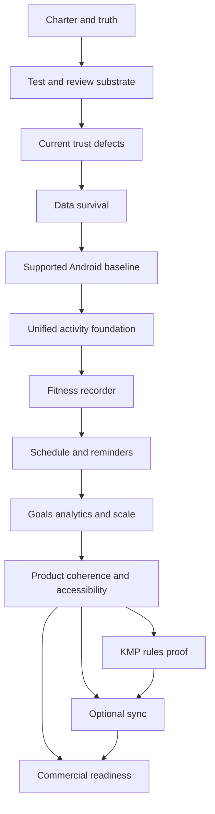

# Temper Foundation Program

**Status:** Accepted — current program  
**Signed:** 24 August 2026  
**Authority:** [docs/architecture/](architecture/README.md)  
**Baseline audit:** [foundation-audit/README.md](foundation-audit/README.md)  
**Audited revision this program starts from:** `trunk` at `508c4b8`

This file is the executable program. Accepted ADRs are the decisions it
may not violate. Historical [ROADMAP.md](ROADMAP.md), Jobs 1–6, and
`docs/archive/` explain how the strength logger was built. They are not
instructions for what to build next.

## 1. Mission

Convert Temper from a coherent strength logger into an offline-first
strength-and-cardio fitness platform: record live and backdated work,
keep a schedule that can hold morning cardio and evening lifting, remind
without nagging, and show day / week / month / year / all-time progress.

Commercialization is optional and later. The local core must remain
complete without an account.

## 2. Twelve non-negotiable decisions

Each line is unambiguous. The ADR is the full text.

| # | Decision | ADR |
|---|---|---|
| 1 | One developer or agent; one implementation packet open at a time | [ADR-002](architecture/ADR-002-execution-protocol.md) |
| 2 | Android + Jetpack Compose is the shipping client until the local product is accepted | [ADR-003](architecture/ADR-003-shipping-platform.md) |
| 3 | Recording, history, templates, schedules, reminders, goals, rules, backup, and recovery work offline without an account | [ADR-004](architecture/ADR-004-offline-core-and-entitlements.md) |
| 4 | Those capabilities are never subscription-gated | [ADR-004](architecture/ADR-004-offline-core-and-entitlements.md) |
| 5 | Instrument is the only visual direction: dark, semantic color, tabular numerals, one Volt act | [ADR-005](architecture/ADR-005-instrument-identity.md) |
| 6 | Starting IA is Home · Body · Plan · History, Library pushed; no fifth tab is planned | [ADR-006](architecture/ADR-006-information-architecture.md) |
| 7 | Multiple scheduled and completed activities per day; **one live activity at a time** | [ADR-007](architecture/ADR-007-activity-model.md) |
| 8 | Cardio is a first-class typed activity, never a fake exercise or a metric bag | [ADR-007](architecture/ADR-007-activity-model.md) |
| 9 | Recommendations stay local and deterministic; a future API may explain a `RuleTrace` only | [ADR-008](architecture/ADR-008-deterministic-rules.md) |
| 10 | Drive is whole-file **backup** until incremental sync is separately delivered and proven | [ADR-009](architecture/ADR-009-backup-privacy-sync.md) |
| 11 | One pre-public development reset is authorized; after foundation freeze, reset authority expires | [ADR-010](architecture/ADR-010-schema-reset-migrations.md) |
| 12 | `fallbackToDestructiveMigration` remains prohibited | [ADR-010](architecture/ADR-010-schema-reset-migrations.md) |

Supporting decisions that later packets also treat as closed:

- Exact rest uses `SCHEDULE_EXACT_ALARM`, typed outcomes, honest fallback, reboot-clears-short-rest ([ADR-012](architecture/ADR-012-rest-and-reminders.md)).
- Durable rows capture local date, IANA zone, and UTC offset ([ADR-011](architecture/ADR-011-time-semantics.md)).
- Implicit OS backup will be disabled; user-controlled backup is authoritative ([ADR-009](architecture/ADR-009-backup-privacy-sync.md)).
- Missed work keeps recurrence unchanged and asks once ([ADR-012](architecture/ADR-012-rest-and-reminders.md)).
- KMP and cloud sync have start gates and do not begin because they are interesting ([ADR-003](architecture/ADR-003-shipping-platform.md), [ADR-009](architecture/ADR-009-backup-privacy-sync.md)).
- FND-037 is a numbering gap, not a finding ([ADR-013](architecture/ADR-013-finding-dispositions.md)).

There is **no remaining TBD** that would change schema, scheduling, privacy,
or entitlement design. Implementation packets refine mechanisms inside
these decisions. They do not reopen them.

## 3. Superseded historical constraints

Do not “honor” these as current law. Bannered historical files may still
contain the original sentences.

- **Room v3 won’t** — superseded for the one Phase 5 cutover. Still forbidden
  as an opportunistic polish bump. `fallbackToDestructiveMigration` still
  banned.
- **No backdated session creation** — superseded. Backdating is required.
- **Job 6 as the current program** — superseded by this file.
- **ROADMAP / AUDIT as what is being built** — superseded.
- **D2 silent missed-day shift as the product policy** — superseded as the
  target; current v2 code may still shift until P7.3.
- **Drive as sync** — superseded as vocabulary and as architecture.

Permanent refusals that remain: fifth tab without a new ADR, LLM-as-author,
package/Drive-folder rename, GitHub runners as the test lane, auto-scaled
deload sets, overlay rest clock, subscription-gating the local core.

## 4. Universal packet protocol

Every packet is one throwaway `cursor/<slug>-b87f` branch and one PR into
`trunk`, except the Phase 0 documentation train (this phase) and the
uninterrupted Phase 5 cutover train ([ADR-002](architecture/ADR-002-execution-protocol.md)).

### Development evidence before review

- Targeted tests named by the packet.
- `tools/preflight.sh`.
- `./gradlew testDebugUnitTest`.
- `./gradlew assembleDebug`.
- `./gradlew lintDebug` for manifest, permissions, Compose, Room, backup,
  dependency, privacy, and release packets; after P4.6 it runs for every
  packet.
- `connectedDebugAndroidTest` for database, restore, migration, critical
  Compose journey, and Android-platform packets, always against
  `com.sinura.personaltrainer.debug` on an emulator.
- Physical-device checks for Doze, notifications, OAuth, haptics/sound,
  TalkBack, release upgrade, and performance where named.
- Changed UI states at 360 dp, 412 dp, and 600 dp; font scales 1.0, 1.6,
  and 2.0; relevant RTL, IME, rotation, and reduced-motion evidence.
- A short evidence manifest: commit SHA, Android/API/device profile,
  commands, results, screenshots, known limitations, fixtures.

### Independent review

A clean-context reviewer maps every exit criterion to code and executed
evidence and inspects correctness, cancellation, data ownership,
transactions, migrations, rollback, architecture boundaries, error /
loading / empty / success / permission-denied / process-death / offline
states, adjacent regressions, privacy, accessibility, performance shape,
and copy accuracy.

### Adversarial audit

A second clean-context pass tries to falsify the packet: corrupt or
partial input, disk/network/permission failure, process kill, rotation,
duplicate tap, clock and zone change, reboot, stale worker, concurrent
start/restore, 360 dp / font 2.0, TalkBack, RTL, IME, disabled motion,
multi-year data. Critical and high findings block merge. A medium finding
may move only to an already named dependent packet with owner-visible
rationale. After fixes, both reviews rerun.

### Post-merge

From clean `trunk`, rerun the packet gate and the shortest complete
journey the packet touched. Delete the feature branch.

### Whole-app phase audit

After every phase, from clean `trunk`:

- fresh install and the supported upgrade or reset path;
- guided and custom setup;
- Home, Body, Plan, History, Library, Settings, Routine Editor, Active
  Workout, Summary, Session Detail, Exercise Detail;
- start → log → rest → finish → History → detail → repair;
- leave/resume, process kill, airplane mode;
- export, incoming preview, restore, record-count reconciliation;
- primary empty/loading/error/degraded states;
- 360 dp / font 2.0 and the phase-specific accessibility or performance
  checks.

No phase closes with an unresolved critical or high regression.

## 5. Dependency map

Phases 10 and 11 are optional and gated. Phase 12 can proceed without them
if those gates have not fired; it must not pretend sync exists.

## 6. Phases and packets

Status legend: **done** · **next** · pending · gated · skipped

### Phase 0 — Charter, authority, and evidence rules · **done**

#### P0.1 — Supersede obsolete doctrine and sign the target · **done**

- Files: this document, [ROADMAP.md](ROADMAP.md),
  [docs/architecture/](architecture/README.md).
- Sign the twelve decisions, reset boundary, one-live-activity rule,
  exact-rest strategy, time-zone policy, privacy posture, entitlement
  boundary, reminder policy, and KMP/cloud start gates.
- Mark historical won’ts as superseded rather than silently violating them.
- Record FND-037 as no finding issued.
- Exit: zero unresolved architectural TBD that would change schema,
  scheduling, privacy, or entitlement design.

#### P0.2 — Documentation authority and drift checks · **done**

- Authority order is [ADR-001](architecture/ADR-001-documentation-authority.md).
- Correct active root documentation that calls Drive backup “sync”,
  describes stale heat windows or package paths, implies Auto Backup is
  the recovery path, or uses `main` as the sitting branch.
- Correct stale migration comments that claim schema `2.json` is absent.
  `2.json` is committed.
- Add `tools/check-doc-authority.py` to preflight. Do not rewrite archives
  as current truth.
- Exit: FND-041 and FND-042 closed; active docs match runtime vocabulary.

#### P0.3 — Baseline IA and future validation protocol · **done**

- Preserve Home · Body · Plan · History and pushed Library.
- Canonical tasks and the 80% / no-majority-first-click reconsideration
  gate are [ADR-006](architecture/ADR-006-information-architecture.md).
- No route or tab code changes.
- Exit: FND-045 and FND-046 are explicit permanent defaults with a
  measurable reconsideration gate.

#### Phase 0 critical audit

- Search current-voice docs and rules for conflicting reset, schema, IA,
  cloud, and subscription instructions.
- Verify every FND ID has a planned disposition.
- Stop if any data-model decision remains ambiguous.

### Phase 1 — Truthful test, review, and visual evidence substrate · **done**

#### P1.1 — Repair the device lane and one local verification command · **done**

- Fix `InstrumentationSmokeTest` so it validates the generated debug
  target instead of hardcoding the release package.
- Normalize Compose UI-test dependencies, deterministic clocks/IDs/timer
  fakes, and a single local verification script.
- Add coverage reporting as a risk indicator; ratchet packages; do not
  game generated/framework code.
- Prove the gate by deliberately breaking a test, a lint warning, and a
  coverage threshold, then restoring.
- Exit: existing instrumented tests pass on the stable API 29+ emulator
  lane; FND-004 closed.
- Landed: `BuildConfig.APPLICATION_ID` + `.debug` suffix assertions;
  Compose UI-test deps; `AppClock` / `IdFactory` + sharedTest fakes;
  `tools/verify.sh`; JaCoCo floors; lint baseline with new-warning-as-error.
  Gate probes: broken test, 99% domain floor, unused string resource — all
  failed as required, then discarded. The full API 29
  `connectedDebugAndroidTest` lane ran 15/15 with the generated `.debug`
  target after booting the emulator without unusable nested acceleration.
  FND-004 is closed in code and executed evidence.

#### P1.2 — Page/state preview and screenshot infrastructure · **done**

- Reusable fixtures: loading, empty, populated, error, long identity,
  large metrics, active/resting, permission-denied.
- Preview profiles: 360/412/600 dp, font 2.0, RTL, reduced motion.
- Deterministic compatible golden/screenshot tool; record why it was
  chosen. Two unchanged runs stably equivalent; a token change diffs.
- Exit: later UI packets can attach deterministic visual evidence;
  foundation for FND-043 exists.
- Landed: debug-only state fixtures for all nine required state classes;
  reusable 360/412/600 dp, font-2.0, RTL, and reduced-motion profiles;
  `LocalReducedMotion`; a Compose `captureToImage` golden harness; and an
  API 29 baseline. Two captures in one run and a second fresh install were
  pixel-identical. Changing the gallery accent from Volt to Warn produced
  a bounded, located diff rather than repainting the page.

#### P1.3 — Characterize Active Workout before refactoring · **done**

- Dedicated tests around `ActiveWorkoutViewModel`: load/missing, draft
  precedence, selection, validation, write failure, PR, rest start,
  edit/delete/undo, notes debounce, add/swap/remove lift, leave, finish,
  discard, process recreation, one-shot navigation.
- Device/Compose journey: seed session → type weight → log → rest →
  finish → Summary.
- Assert durable outcomes and visible states, not private coroutine order.
- Exit: every FND-003 transition has a named test; critical journey green.
- Landed: 23 direct behavior tests over real in-memory Room, SavedState,
  draft cache, a deterministic timer gateway, and public state/effects.
  The API 29 real-app journey seeds a routine, types 100 kg, logs 5 reps,
  observes a 120-second rest, finishes, and verifies the 500 kg Summary plus
  durable history. Characterization exposed and fixed three orchestration
  defects: a final prescribed set could double-count itself and start rest;
  swap/remove refusals were hidden behind generic copy; and late Room
  emissions could recreate a cleared finish/discard draft. Full device lane:
  20/20.

#### P1.4 — Session lifecycle and repair ViewModels · **done**

- Suites for Start Options, Live Session Bar, Session Detail, Workout
  Summary: blocked start, free/routine/suggested start, staleness,
  finish/discard, repair/add/delete/undo, notes, repeat, missing, one-shot
  effects.
- Physical smoke: leave/resume, finish from bar, repair/undo, rotate
  summary.
- Exit: these orchestration surfaces have direct contracts.
- Landed: `StartSessionOutcome` makes a second start `Blocked` instead of
  silently resuming. Start Options, `StartTrainingDay`, and the live bar
  consume that outcome. Session Detail flushes notes on back. Direct
  contracts: Start Options 10, Live Session Bar 7, Session Detail 14,
  Workout Summary 5, plus start-day, finish/discard, and repository
  start/repair suites. Device smoke leaves, resumes from the bar, finishes
  from the bar, recreates Summary, then deletes and undoes a set with the
  original id and `completedAt` restored. Full device lane: 22/22.

#### P1.5 — Routine, library, onboarding, and exercise ViewModels · **done**

- Dedicated tests for Routine Editor, Custom Week, Exercise Library,
  Exercise Detail, Onboarding Gate.
- Inventory `*ViewModel.kt` against dedicated tests; every omission needs
  an explicit rationale.
- Exit: FND-025 has no unexplained screen ViewModel gaps.
- Landed: 41 Room/DataStore-backed contracts across the five named
  surfaces. `AppViewModel` is the only `*ViewModel.kt` without a suite,
  as the shared base class. Inventory:
  [P1.5 evidence](foundation-program/evidence/P1.5-viewmodel-inventory.md).

#### P1.6 — `TrainingInsightsSource` as a runtime publisher · **done**

- Shared collectors execute one upstream pipeline; replay/grace;
  with/without-week; refresh; latest-input; cancellation; independent
  failure isolation. Calculation stays off main. Cancellation never
  becomes fallback data.
- Exit: FND-040 closed.
- Landed: 10 runtime-source contracts. Two `observeShared` collectors
  run one compute and replay the same instance; with-plan and
  without-plan stay independent; grace expiry restarts the pipeline;
  refresh recomputes unchanged inputs; `mapLatest` drops an in-flight
  pass; cancelled hint loads never become `PROGRESSION` fallback;
  a hint exception isolates to that failure; compute runs on the
  injected dispatcher. Evidence:
  [P1.6 evidence](foundation-program/evidence/P1.6-insights-source.md).

### Phase 2 — Current strength-product trust defects · **done**

#### P2.1 — Identity-safe rest completion · **done**

- Unique timer ID through state, persistence, alarm, service, completion.
- Atomic claim only on matching ID and due elapsed realtime.
- Tests: stale/early/current, extend near deadline, replace, skip race,
  duplicate receiver, same-boot recovery, reboot clear, concurrency.
- Exit: exactly one cue per timer ID; no stale delivery can end a current
  rest.
- Landed: `RestTimerClaimLedger` claims only a matching, due, unclaimed
  id. Start and adjust mint a new id; restore keeps the persisted one.
  A different boot clears a short rest instead of rebasing it. Alarm
  extras carry the id. Coverage floor timer 14→17. Evidence:
  [P2.1 evidence](foundation-program/evidence/P2.1-rest-timer-identity.md).

#### P2.2 — Policy-compliant exact-alarm capability · **done**

- Declare/check `SCHEDULE_EXACT_ALARM`. Do not use `USE_EXACT_ALARM`.
- Typed `Exact` / `BestEffort` / `Failed`. Honest inexact fallback.
- Physical gate on fresh API 31/34/35: grant/deny/revoke, notification
  grant/deny, screen off, forced Doze, extend/replace.
- Exit: FND-001 closed; lint has no exact-alarm defect.
- Landed: manifest declares `SCHEDULE_EXACT_ALARM` only. Exact APIs run
  only when the policy grant is true. Denied or failed exact becomes
  `BEST_EFFORT` via `setAndAllowWhileIdle`, never called reliable.
  Settings offers the special-access screen only after rest is used or
  configured. Resume rechecks and reschedules a live timer. Lint has no
  exact-alarm defect. Coverage floor timer 17→18. Evidence:
  [P2.2 evidence](foundation-program/evidence/P2.2-exact-alarm.md).

#### P2.3 — Compact notification-denial state · **done**

- One full explanation before the OS prompt; compact persistent recovery
  row after. Current lift, wells, and Log stay discoverable at 360 dp;
  at font 2.0 Log remains visible and names its payload.
- Exit: FND-015 closed without hiding recovery.
- Landed: the why-dialog still runs once before `POST_NOTIFICATIONS`.
  After that, recovery is a one-line `Rest alerts off` / `Turn on` row
  above RestDock, not a viewport-dominating banner. Constrained
  360 dp / font 2.0 device test: Log stays visible and names the set.
  Evidence:
  [P2.3 evidence](foundation-program/evidence/P2.3-notification-denial.md).

#### P2.4 — Unify aggregate volume presentation · **done**

- One formatter in `WeightFormat.kt` for Summary, History, Session Detail,
  Exercise Detail, animation target, and accessibility copy.
- Property tests for both units, `.5` boundaries, grouping, large values,
  and the verified 100 lb × 5 case.
- Exit: FND-005 closed; surfaces display byte-identical aggregate labels.
- Landed: `volumeDisplayWhole` is the only rounding. Summary count-up
  and TalkBack use it; `SetCopy` and Exercise Detail lifetime volume
  print `formatVolumeNumber`. 100 lb × 5 is 500 lbs, not 501.
  Evidence:
  [P2.4 evidence](foundation-program/evidence/P2.4-volume-format.md).

#### P2.5 — Identity before metrics · **done**

- `SessionLogRow` and `CompactLiftRow` protect title/date; metrics wrap
  first; target weight is the label with kg/lbs as suffix.
- Constrained Compose tests at 360 dp / font 1.0–2.0.
- Exit: FND-006 and FND-016 closed.
- Landed: History rows put title and date on the first line; sets /
  volume / duration wrap below with fixed columns. Routine rows give
  the lift name two lines and move reorder to a second line. The load
  field is labeled Target weight with the unit as suffix. Evidence:
  [P2.5 evidence](foundation-program/evidence/P2.5-identity-before-metrics.md).

#### P2.6 — Explicit data health · **done**

- Replace `orLogAndFallback` with typed data health. Last successful value
  where safe; empty ≠ unavailable; fail start/restore closed when required
  invariants are unreadable. Preference failure cannot masquerade as first
  install. No “continue anyway” or reset from the fault screen.
- Exit: FND-013 closed.
- Landed: `DataHealth` + `observeHealth` replace the empty-list fallback.
  History shows a Retry fault, not “No sessions yet”. Settings unread is
  `OnboardingGate.UNAVAILABLE`, not setup. Start and restore refuse when
  the live-session read fails. Evidence:
  [P2.6 evidence](foundation-program/evidence/P2.6-data-health.md).

### Phase 3 — Data survival, restore, backup privacy, and scale · **packets done**

Packets P3.1–P3.7 implement [ADR-009](architecture/ADR-009-backup-privacy-sync.md)
and close FND-011, FND-014A–C, and the measurement half of FND-038.

#### P3.1 — Threat-model inventory · **done**

- Policy is already decided: disable implicit OS backup; user-controlled
  backup is authoritative.
- Landed: [backup-threat-model.md](architecture/backup-threat-model.md)
  inventories every store and channel, covers device theft, Auto Backup,
  file leak, and Drive, and maps T3–T10 to P3.2–P3.7. Auto Backup stays
  enabled in the shipping manifest until P3.5. Evidence:
  [P3.1 evidence](foundation-program/evidence/P3.1-threat-model.md).

#### P3.2 — Authored-data restore preview · **done**

- Split restore preparation from commit; authored-data counts;
  catalog-only files cannot wipe history.
- Exit: FND-014B closed.
- Landed: `prepareRestore` decodes and compares authored inventories
  without writing. Confirm names incoming vs local sessions, sets,
  routines, custom exercises, schedule, weigh-ins, and blocks. A
  catalog-only or empty file is refused when the phone has authored
  data, including DataStore-only bodyweight or blocks. Evidence:
  [P3.2 evidence](foundation-program/evidence/P3.2-restore-preview.md).

#### P3.3 — Verified safety snapshots · **done**

- A verified safety snapshot is required before teardown. Snapshot
  failure aborts restore. Retained copies are listable, exportable,
  restorable through preview, and deletable from Settings. Raw private
  paths are not shown.
- Exit: FND-014A closed.
- Landed: `commitRestore` writes a verified copy, re-reads it, and
  refuses unless authored counts match. Settings lists those copies by
  counts and date. Evidence:
  [P3.3 evidence](foundation-program/evidence/P3.3-safety-snapshots.md).

#### P3.4 — Serialized start and journaled restore · **done**

- Session start/repeat and restore share one coordinator. Restore is
  journaled and recoverable across process death. Success means the
  committed state.
- Exit: FND-014C closed.
- Landed: start, repeat, and `commitRestore` take the maintenance lock.
  A restore journal records staged / wiping / room / prefs. Process
  start finishes an interrupted restore before catalog seed. A live
  start is refused while that journal is open. Evidence:
  [P3.4 evidence](foundation-program/evidence/P3.4-restore-journal.md).

#### P3.5 — Disable implicit OS backup · **done**

- `allowBackup=false` plus explicit legacy and API-31+ exclusion rules
  covering databases, files, shared preferences, safety snapshots,
  journal, and migration snapshots. Upgrade-in-place must not erase
  data. Existing OS copies are not recalled.
- Landed: shipping manifest disables Auto Backup and points at
  `backup_rules.xml` and `data_extraction_rules.xml`. Both exclude
  every store in the threat-model inventory, including device-transfer.
  File-backed Room close/reopen keeps the session. `FLAG_ALLOW_BACKUP`
  is unset on the debug package. Evidence:
  [P3.5 evidence](foundation-program/evidence/P3.5-auto-backup.md).

#### P3.6 — Portable authenticated encrypted envelope · **done**

- Versioned envelope using reviewed platform cryptography, random
  salt/nonce, and a password-based KDF. Device-bound keys are
  forbidden. Custom crypto is forbidden.
- Legacy plaintext import is kept. Plaintext export is a warned
  advanced choice.
- Landed: default file and Drive export wrap the backup JSON in
  PBKDF2-HMAC-SHA256 + AES-256-GCM. Import detects the envelope and
  asks for the password. A file without `version` cannot decode as an
  empty catalog. Existing plaintext files still restore. Evidence:
  [P3.6 evidence](foundation-program/evidence/P3.6-envelope.md).

#### P3.7 — Backup scale measurement · **done**

- Benchmark backup on a 500-session / 15,000-set fixture before any
  streaming rewrite. Stream only if signed budgets fail.
- Landed: `BackupScaleBudget` signs encode ≤ 2 s, decode ≤ 2 s,
  snapshot+encode ≤ 4 s, and encoded size ≤ 8 MiB. A JVM run of the
  fixture encoded in 230 ms / 4.2 MiB and snapshot+encode in 280 ms.
  Whole-document encode stays. Streaming remains P8.5 only if these
  ceilings fail later. Evidence:
  [P3.7 evidence](foundation-program/evidence/P3.7-scale.md).

Phase 3 does not close until exact before/after fingerprints reconcile
under the fault matrix (process kill at every journal phase, concurrent
Start versus Restore, catalog-only and bodyweight-only files).

**Milestone: Trustworthy Strength Gate.**

### Phase 4 — Supported Android/toolchain baseline · **in progress**

#### P4.1 — Compile/target SDK 36 · **done**

- Compile/target SDK 36 with a reviewed compatibility pass.
- Landed: `compileSdk` and `targetSdk` are 36; `minSdk` stays 26.
  AGP 8.9.2 and Gradle 8.11.1 are the official minimum pair.
  Robolectric 4.14.1 emulated API 35 in this packet; P4.2 lifts that pin.
  [sdk36-compatibility.md](architecture/sdk36-compatibility.md) reviews
  every targeting-36 behavior change. Edge-to-edge was already on;
  predictive back is accepted via `enableOnBackInvokedCallback` and
  existing `BackHandler`s. The API 29 device lane is unchanged.
  Evidence:
  [P4.1 evidence](foundation-program/evidence/P4.1-sdk36.md).

#### P4.2 — Core AndroidX / Kotlin families · **done**

- Core KTX, Lifecycle, Activity, coroutines, serialization,
  Robolectric, AndroidX Test — family by family.
- Landed: Core KTX 1.17.0, Lifecycle 2.10.0, Activity 1.12.4,
  coroutines 1.10.2, kotlinx.serialization 1.8.1, Robolectric 4.16
  emulating API 36, AndroidX Test 1.7.0 / ext-junit 1.3.0.
  Lifecycle 2.11 and coroutines 1.11 are refused on this AGP/Kotlin
  pair. Gson remains the backup codec.
  [core-toolchain.md](architecture/core-toolchain.md).
  Evidence:
  [P4.2 evidence](foundation-program/evidence/P4.2-core-toolchain.md).

#### P4.3 — Compose BOM, Material, Navigation, compiler · **done**

- Compose BOM, Material, Navigation, compiler as one matrix.
- Landed: Compose BOM 2026.06.01 (UI / runtime / foundation 1.11.4,
  Material3 1.4.0), Navigation 2.9.8, Kotlin Compose compiler plugin
  2.0.21. BOM 2026.08.00 is refused: Compose UI 1.12.0 requires AGP
  9.1 and compileSdk 37. Kotlin stays 2.0.21.
  [compose-toolchain.md](architecture/compose-toolchain.md).
- **P4.4** Room, DataStore, persistence test stack; v1/v2 migrations stay
  green on the new substrate.
- **P4.5** Remove deprecated Google Sign-In remnants; keep
  `AuthorizationClient` / `drive.file`. Local recording stays Google-free.
  Closes FND-028.
- **P4.6** Supply-chain controls and zero-unwaived-warning local lint
  policy. Hosted runners still not the gate. Closes FND-026, FND-027.

**Milestone: Supported Platform Gate.**

### Phase 5 — Unified activity spine and one-time foundation reset · pending

Implements [ADR-007](architecture/ADR-007-activity-model.md),
[ADR-010](architecture/ADR-010-schema-reset-migrations.md), and
[ADR-011](architecture/ADR-011-time-semantics.md). One uninterrupted train.

- **P5.1** Platform-neutral time, ID, and quantity seams.
- **P5.2** Unified domain contract with tests *before* persistence/UI.
  Every FND-002 acceptance case representable.
- **P5.3** Shadow `TemperDatabase` beside legacy `TrainerDatabase`.
  No production UI wiring.
- **P5.4** Repositories and use cases against the shadow database.
  One live session is a transactional invariant.
- **P5.5** Target export format and reset rehearsal. No cutover until
  export/import/recovery work against the shadow database.
- **P5.6** The signed development reset. Preserve only units and rest
  preferences. External pre-reset export required.
- **P5.7** Remove legacy active persistence. Foundation generation frozen.
  No further reset is authorized.

**Milestone: Foundation Freeze Gate.**

### Phase 6 — First-class strength, cardio, mixed, and backdated recording · pending

- **P6.1** Bodyweight and training blocks into Room. Closes FND-019.
- **P6.2** Backdated strength authoring. Closes strength half of FND-008.
- **P6.3** Manual typed cardio. A cardio-only session needs no exercise
  or set row.
- **P6.4** Live cardio with process/background recovery.
- **P6.5** Ordered mixed blocks. Honest separate modality metrics.
- **P6.6** Summary, History, calendar, detail become activity-aware.
  Closes FND-002 and FND-008; proves the one-live resolution of FND-018.
- **P6.7** Onboarding asks Strength / Cardio / Both. Nothing written
  until “Use this plan.” No notification permission during onboarding.

**Milestone: Fitness Recorder Alpha.**

### Phase 7 — Recurring schedule, occurrences, missed decisions, reminders · pending

- **P7.1** Schedule-rule and occurrence schema *migration* (foundation is
  already frozen). Two occurrences can complete independently on one date.
- **P7.2** Occurrence-aware Plan editing. Four-tab IA preserved.
- **P7.3** One persisted missed-work decision. Closes FND-017.
- **P7.4** WorkManager reminder delivery and actions. Closes FND-007
  reminders. Not exact alarms.
- **P7.5** Home daily agenda. Morning cardio and evening strength are
  independently visible and startable.

**Milestone: Offline Planner Beta.**

### Phase 8 — Measurable goals, bounded analytics, rule traces, and scale · pending

- **P8.1** Deterministic daily projections and paging. Home/Plan no
  longer materialize every set. Addresses FND-010.
- **P8.2** Typed measurable goals: adherence, session count, active
  minutes, lift target, cardio duration/distance, optional bodyweight.
  No punitive streaks. Not a fifth tab.
- **P8.3** Comparable horizons including year and all-time. Closes
  FND-009.
- **P8.4** Structured local `RuleTrace`. No remote API in this packet.
- **P8.5** Performance and bounded export on a reference dataset of at
  least 500 sessions / 15,000 sets. Closes FND-010 and FND-038.

**Milestone: Complete Local Fitness Beta.**

### Phase 9 — Product coherence, design system, accessibility, IA evidence · pending

- **P9.1** Formal IA user evidence against ADR-006 canonical tasks.
- **P9.2** Semantic contrast and reduced motion. Closes FND-024 / FND-045
  as tested decisions.
- **P9.3** Shared component contracts without false unification.
- **P9.4** Exercise picker cohesive state/events. Closes FND-035.
- **P9.5** Typed recommendation intents. Closes FND-036.
- **P9.6** Page-by-page final passes as separate PRs.
- **P9.7** Full accessibility closure matrix. Physical TalkBack required
  for public-candidate sign-off. Closes FND-021, FND-022, FND-023, FND-043.

**Milestone: Android Public Candidate.** No cloud dependency.

### Phase 10 — Optional KMP shared-rules proof · gated

Starts only when [ADR-003](architecture/ADR-003-shipping-platform.md) fires.

- **P10.1** Stable models and pure tests in `commonMain`. Android consumer
  and Apple simulator compile/test. No iOS UI required.

### Phase 11 — Optional encrypted incremental sync · gated

Starts only when [ADR-009](architecture/ADR-009-backup-privacy-sync.md) §14
fires.

- **P11.1–P11.6** Per-entity protocol, outbox, fake-transport proof, E2EE
  identity, sync UI, two-device adversarial audit.
- Exit: FND-012 closes only when no set can disappear or duplicate
  silently.

### Phase 12 — Field operations, release hardening, commercialization · pending

May run without Phases 10–11 if those gates have not fired. Must not claim
sync or KMP that does not exist.

- **P12.1** Privacy-preserving user-triggered diagnostics. Closes FND-014.
- **P12.2** Privacy, Data Safety, health, support, commercial-boundary
  documents. Closes FND-030, FND-047, FND-048 as published posture.
- **P12.3** R8, shrinking, signed APK and AAB, monotonic `versionCode`.
  Closes FND-029.
- **P12.4** Final Play/release rehearsal. Do not publish with a pending
  physical, privacy, accessibility, or data-survival critical/high gate.

**Milestone: Commercial Release Candidate.**

## 7. Finding disposition map

The signed table lives in
[ADR-013](architecture/ADR-013-finding-dispositions.md). This program
does not accept, reject, or defer a finding without naming a packet.

## 8. Milestone stop/go gates

| Gate | After | May not open |
|---|---|---|
| Trustworthy Strength | Phase 3 | Phase 4 if FND-001/005/006/013/014A–C remain open |
| Supported Platform | Phase 4 | Phase 5 if target SDK, auth, or lint policy is red |
| Foundation Freeze | Phase 5 | Any later schema reset; Phase 6 if dual-write remains |
| Fitness Recorder Alpha | Phase 6 | Phase 7 if cardio/backdate/export are incomplete |
| Offline Planner Beta | Phase 7 | Phase 8 if two-a-day or missed-work policy is incomplete |
| Complete Local Fitness Beta | Phase 8 | Phase 9 if goals, year views, or scale budgets fail |
| Android Public Candidate | Phase 9 | Phase 12 publication; Phases 10–11 remain gated on their own ADRs |
| KMP proof | Phase 10 | nothing else; optional |
| Optional Sync Beta | Phase 11 | nothing else; optional |
| Commercial Release Candidate | Phase 12 | public distribution |

## 9. Documentation map for executors

| Need | Open |
|---|---|
| What to build next | this file, §6 |
| Why a decision is binding | [architecture/](architecture/README.md) |
| What the app does today | [foundation-audit/](foundation-audit/README.md) |
| How to build and test | [DEVELOPMENT.md](DEVELOPMENT.md) |
| How to recover a phone | [RECOVERY.md](RECOVERY.md) |
| How the strength logger was built | [ROADMAP.md](ROADMAP.md) (historical) |
| Current schedule derivation (v2) | [SCHEDULE_SEMANTICS.md](SCHEDULE_SEMANTICS.md) until P7.3 |

## 10. Phase 0 closeout checklist

- [x] Twelve non-negotiable decisions written and pointed at ADRs
- [x] Reset, one-live, rest, time, privacy, entitlement, reminder, KMP,
      and cloud gates signed
- [x] Room v3 won’t and no-backdating superseded in the open
- [x] FND-037 recorded as no finding
- [x] Active current-voice docs use runtime vocabulary (P0.2)
- [x] Preflight authority check exists (P0.2)
- [x] Canonical IA tasks and reconsideration gate published (P0.3)
- [x] Adversarial search of current-voice docs finds no conflicting law

### Phase 0 audit record (24 August 2026)

Searched current-voice files (README, SETUP, DEVELOPMENT, RECOVERY,
UX_PAGE_PASS, owner-loop, FOUNDATION_PROGRAM, ADRs) plus ROADMAP banners
for conflicting reset, schema, IA, cloud, and subscription instructions.

- Reset: one authorized Phase 5.6 cutover; freeze afterwards; preserve
  list is units + rest preferences only. No second-reset language.
- Schema: `fallbackToDestructiveMigration` banned in every current-voice
  file that mentions it. Room v3 won’t is marked superseded, not deleted
  from history. No packet before Phase 5 may bump `TrainerDatabase`.
- IA: four tabs + pushed Library; fifth tab requires a new ADR after the
  80% / no-majority-first-click gate. No `AppNav` change in this phase.
- Cloud: Drive is backup. Sync is Phase 11 after an explicit start gate.
  No current-voice file calls Drive sync.
- Subscription: local core is never gated. Goals cannot become Pro.
- FND IDs 001–048 except 037, plus 014A–C, each have a packet in ADR-013.
  FND-037 is recorded as a numbering gap.
- `tools/check-doc-authority.py` is green. A deliberate “sync with your
  own” probe failed the check and was discarded.

No data-model decision remains TBD. Phase 0 may close.
