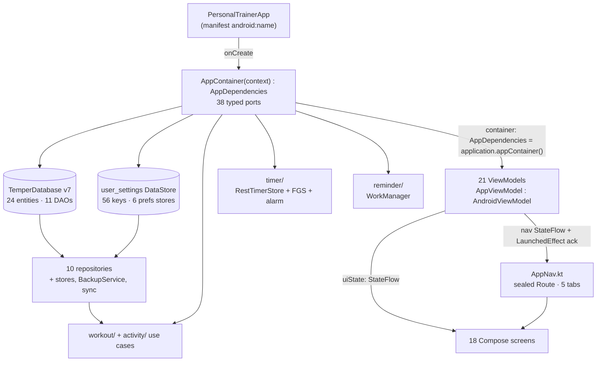

# Current structure

What the code is, as of 24 September 2026 (counts re-measured in whole-app
audit packets X1 and X3, and again in W2a; the prose was first written on 11 September). Read this before
changing anything structural.

This is a description, not a decision. The decisions are the ADRs beside it,
and where this file and an ADR disagree the ADR wins and this file is wrong —
say so. It exists because there was no such description: the closest thing was
[`docs/foundation-audit/architecture.md`](../foundation-audit/architecture.md),
written before the Phase 5 cutover, and it still described Room v2, nine
entities, four tabs and no cardio.

## Shape

One Gradle module, `:app`. No sub-modules — see the note at the end on why not
yet. The Files columns below count Kotlin files.

| Source set | Files | Lines | Tests |
|---|---|---|---|
| `app/src/main` | 564 | 94,074 | — |
| `app/src/test` | 460 | 78,920 | 3,149 |
| `app/src/androidTest` | 33 | 5,914 | 112 `@Test` methods (some parameterised) |
| `app/src/debug` | 12 | 1,618 | Compose previews and the state galleries |
| `app/src/sharedTest` | 5 | 171 | `FakeClock`, `SequentialIds`, `ControllableElapsedRealtime`, `TestWaits`, compiled into both test sets |

## The layers

Everything is under `com.sinura.personaltrainer`.

| Package | Files | Lines | What it is |
|---|---|---|---|
| `ui` | 172 | 46,100 | 18 screens, 21 ViewModels on an abstract `AppViewModel`, `ui/components`, `ui/theme`, `ui/navigation`, `ui/saveposture` |
| `domain` | 206 | 23,281 | Models, rules, calculators, policies, ports, CoachEngine, and 65 `*Copy` text objects (69 app-wide) |
| `data` | 115 | 16,948 | `local/{dao,entity,relation}`, `mapper`, `repository`, `repository/prefs`, `backup`, `sync` (15 files, 2,266 lines), `auth` (4, 224) |
| `timer` | 18 | 2,867 | Rest foreground service, alarm scheduler, notifications, persistence |
| `workout` | 13 | 1,367 | Use cases: start, finish, discard, `CompleteTraining` façade, draft cache and recovery |
| `update` | 9 | 764 | Temper Debug's in-app update check and banner |
| `reminder` | 11 | 681 | WorkManager scheduling, receivers, worker |
| (root) | 6 | 954 | `PersonalTrainerApp`, `MainActivity`, `AppContainer`, `AppDependencies`, `AppViewModel` |
| `diagnostics` | 4 | 332 | Redacted diagnostic bundle, crash store, event ring |
| `util` | 6 | 297 | `JvmTime`, `IdFactory`, quantity formatting, coroutine error helpers |
| `insights` | 2 | 345 | `TrainingInsightsPublisher` and the one source behind it |
| `activity` | 1 | 64 | Activity use cases (confirm, start live, discard, finish) |
| `logging` | 1 | 74 | `AppLog`, the swappable sink |

### `domain` depends on nothing

Six distinct outside imports across 206 files: `kotlin.math.abs`, `max`,
`round`, `floor`, `kotlinx.coroutines.CancellationException` and
`kotlinx.coroutines.flow.Flow` (the ports that stream, such as
`SyncStatusPort`). No app package, no `java.time`, no Android. `tools/check-domain-seams.py` holds that at zero and rejects an import
of any internal package other than `domain` itself.

This is recent. Until 11 September 2026 fifteen domain files carried
`time: TimePort = JvmTime` defaults, and `util/JvmTimePort.kt` calls
`android.os.SystemClock` while `util` imports `TimePort`, `CivilDate` and
`IdPort` straight back — two packages neither of which could compile without
the other, and a ratchet that could not see it because the Android hop was one
import further out than anything it banned.

### The rest of the direction rules, all currently held

- `data` never imports `ui`.
- `ui` never imports a Room `@Entity` or `@Dao`. Every ViewModel goes through
  a repository.
- No package cycles anywhere in `ui`. The three that existed —
  `ui/components`, `ui/history` and `ui/workout` each depending on
  `ui/navigation` which depends on all three back — were all caused by
  `LiveBarCopy` and `LiveBarKind`, which now live in `domain`.

## How it is wired

**Dependency injection is a hand-rolled composition root.** No Hilt, no
Dagger, no Koin. `PersonalTrainerApp.onCreate` builds one `AppContainer`, which
implements `AppDependencies` — an interface of 38 typed ports. Every ViewModel
is `@JvmOverloads constructor(application, container: AppDependencies =
application.appContainer())`, so production gets the real graph through the
default and tests pass `FakeAppDependencies`, which is the same repositories
over an in-memory Room database. There is no mocking library and there should
not be one; `AppViewModelSeamTest` locks the constructor shape.

`timer/`, `reminder/`, `data/sync/SyncWorker`, `MainActivity`,
`ui/update/DebugUpdateBanner` and `AppNav` (which calls
`application.appContainer()` inside a composable) reach the graph by casting
the application to `PersonalTrainerApp` rather than through `AppDependencies`.
Those are the places the seam is bypassed, and they are service-locator shaped
(audit packet S4 moves the worker to a `WorkerFactory`).

**Navigation** is a sealed `Route` hierarchy in
[`ui/navigation/AppNav.kt`](../../app/src/main/java/com/sinura/personaltrainer/ui/navigation/AppNav.kt)
with typed `create()`/`parse()` factories over string paths. ViewModels never
touch `NavController`: they emit a navigation `StateFlow` and the screen
bridges it with a `LaunchedEffect` that acknowledges what it handled.

**Persistence** is `TemperDatabase` version 7 (`temper.db`), 24 entities, 11
DAOs, hand-written migrations 1→…→7, schemas exported to `app/schemas/` and
copied to `app/src/debug/assets/` for the JVM migration tests
([ADR-032](ADR-032-jvm-evidence-lanes.md)). v5 added holds, v6 the three sync
tables (`sync_outbox`, `sync_table_cursors`, `sync_metadata`), v7
`exercises.updatedAtMs`.
`fallbackToDestructiveMigration` appears nowhere and is banned in comments in
both database classes. Legacy `TrainerDatabase` v2 (`personal_trainer.db`)
survives only as migration-test substrate.

**Temper Account sync** lives in `data/sync` and `data/auth`: an outbox written
by `SyncAuthoring` hooks, a `SyncEngine` that pushes then pulls over Supabase
PostgREST, and a WorkManager `SyncWorker`. It is paused
(`domain/AccountSyncGate`, [ADR-031](ADR-031-trusted-server-sync-lane.md)): no
pass runs, and edits made while signed in, with the session loaded, still
queue.

**Preferences** are one DataStore named `user_settings` holding 56 keys
(Temper Debug's update check keeps a separate small `debug_update` store). The
keys are package-level in `data/repository/prefs/`, and six areas —
`DisplayPrefs`, `CoachingPrefs`, `PlanningPrefs`, `RestPrefs`, `ReminderPrefs`,
`BackupPrefs` — sit behind interfaces that `PreferencesRepository` mixes in by
delegation. One store on disk, six in code: the keys share a file, so
splitting them across stores would be a data migration.

**The rest timer** has one source of truth: `RestTimerStore`'s in-memory
`StateFlow`, owned by the container. SharedPreferences holds a row for process
death, the foreground service draws the notification, and AlarmManager wakes
the completion. `RestTimerCompletion.completeOnce` claims by timer id so
rehydration, the alarm and the service cannot each fire the same finish.

## Verification

`./gradlew testDebugUnitTest` runs the unit tests **and** the whole
static gate: every `Test` task depends on `:app:staticChecks`, which runs
`tools/preflight.sh` with `PT_STATIC_ONLY=1`. That is 24 checkers, 8 fixture
proofs and a syntax check — domain seams, design-token ceilings, unbounded waits,
swallowed cancellation, supply-chain ledger, version floor. Until 11 September
2026 none of it was wired into Gradle, so the push gate could go green on a
branch that broke all of it.

The counts the ratchets hold live in `tools/checker-baselines.toml`. Growth
past a number fails closed; a count that comes in under it prints a note asking
you to tighten the file.

Lanes, and which gate each one is, are in
[`docs/DEVELOPMENT.md`](../DEVELOPMENT.md). The short version: JVM is the merge
gate, the emulator and the phone gate the signed release.

## Known debt, named

Not a to-do list — a list of things a reader will notice and should not have to
rediscover.

- **`ActiveWorkoutViewModel` is 2,362 lines** with 31 `MutableStateFlow`
  references, and still holds rule decisions that belong in `domain` — prefill,
  lift selection, the log-set sequence.
- **`RoutineEditorViewModel` is 1,490 lines**, mostly the staged-targets
  commit and refusal logic.
- **`BackupCoordinator` is 985 lines** (audit packet F10c splits it).
- **`WorkoutRepository` is 1,340 lines** and covers two things: the session
  aggregate and the progression / personal-record analytics over it.
- **`PlannerRepository` fuses schedule rules with reminder delivery.** They are
  separate subjects sharing a class.
- **No repository interfaces.** `AppDependencies` is the only abstraction
  between a ViewModel and a concrete repository, and 13 ViewModels import
  repository outcome types (`SaveExerciseResult`, `StartSessionOutcome`,
  `WorkoutRepository.DeletedSet`) directly. `data/repository/prefs` is the
  first place in the data layer with interfaces.
- **Six soft foreign keys.** `schedule_rules.routineId` and `.templateId`,
  `measurable_goals.exerciseId`, `activity_blocks.exerciseId`,
  `activity_sessions.templateId` and `.occurrenceId`,
  `schedule_occurrences.completedActivityId` have no FK constraint, so orphan
  references are possible.
- **`strings.xml` holds two strings and no UI text.** User-facing copy is
  `domain/*Copy.kt` objects and inline literals; `stringResource` is used
  nowhere in `ui`. There is no localisation path today, and that is a decision
  nobody has written down.
- **Emulator goldens are gone** ([ADR-032](ADR-032-jvm-evidence-lanes.md)).
  Packet X3 removed the golden checks, their PNGs and `GoldenPageCatalog`. The
  hosted emulator lane still runs the layout and journey tests, for crashes,
  journeys and reachability, and blocks nothing. Visual evidence is the JVM
  render set; the floor reaches the full matrix in packet W3.
- **`PlanDayViewModel` has no tests**, and `ui/components` sits at roughly
  0.15 test lines per production line against `domain`'s 1.16.
- **Test scaffolding ships in `main`**: `InformationArchitecture`,
  `AccessibilityMatrix`, `CatalogReviewRenderer`, `PlanReviewRenderer`,
  `DiagnosticRedaction.DiagnosticCanaries`. Each has one reference in `main` —
  its own declaration — and the rest in tests.

## Why not multiple modules yet

The obvious split is `:domain` (pure Kotlin), `:data`, `:ui`, `:timer`,
`:reminder`, and it would buy compile-time enforcement of the direction rules
above rather than a Python checker enforcing them.

It was impossible until this week: `domain` and `util` each needed the other to
compile, so neither could be a module. That is fixed, and `domain` is now
genuinely standalone. What remains is cost, not blockage — roughly 400 test
files plus the `sharedTest` wiring would move, `AppContainer` would need
splitting, and `app/schemas/` belongs with `:data`. At 94k lines the
incremental-build win is modest, so the case rests on enforcement. Gradle
modules are out of scope for the whole-app audit program.

If that case gets made, do `:domain` first and alone. It is the only module
with no inbound dependency to unpick.
