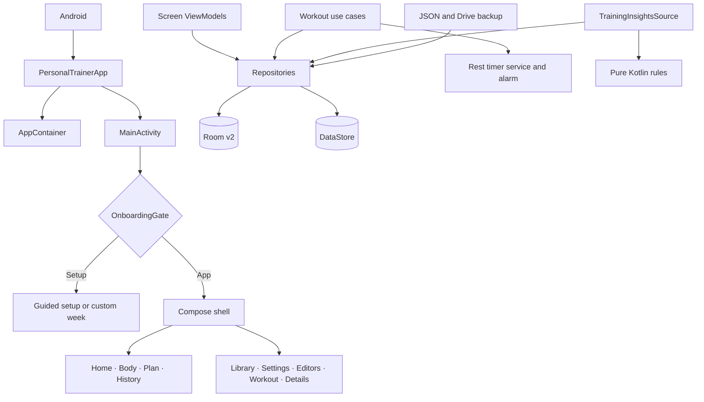

# Temper foundation audit

> **This is a dated audit, not a description of the app today.** It was
> written before the Phase 5 foundation cutover and much of what it calls
> "current" is not: it describes Room v2 on `TrainerDatabase` with nine
> entities, a four-tab bar, and no cardio domain. The app is on
> `TemperDatabase` v4 with 21 entities, five tabs, and a full activity model.
> For what the code is now, read
> [`architecture/CURRENT_STRUCTURE.md`](../architecture/CURRENT_STRUCTURE.md).
> This package keeps its value as the record of what the audit found and why
> the foundation program was scoped the way it was — tier 4 of the authority
> ladder in [ADR-001](../architecture/ADR-001-documentation-authority.md), and
> nothing above it.

**Audit date:** 23 August 2026  
**Audited revision:** `trunk` at `248439680024`  
**Scope:** Current product, every user-facing surface, component system, runtime and data
architecture, quality posture, and fit for the agreed Android-first fitness platform.

It does not replace the historical [19 August audit](../AUDIT.md), and it is not an
implementation roadmap.

## Product direction used as the evaluation bar

- Native Android and Jetpack Compose first; retain and refine the dark Instrument identity.
- Core recording, schedules, reminders, analytics, and deterministic recommendations work
  offline and without an account.
- Local data ownership and export remain available without a subscription.
- Optional account, encrypted sync, advanced analytics, and API-assisted explanations may
  become premium later.
- A later iOS app may share platform-neutral Kotlin domain rules while keeping a native UI.
- The recording foundation must eventually support strength and cardio, live and backdated
  records, multiple timed activities per day, measurable goals, actionable reminders, and
  day/week/month/year/all-time progress.
- Existing development data may be reset when the foundation is redesigned.

## Foundation verdict

Temper is already a coherent, unusually thoughtful **strength logger**. Its pure-Kotlin
rules, repository boundary, Room constraints, backup validation, set-entry loop, custom
design tokens, and four-tab information architecture are worth preserving.

It is not yet the proposed fitness platform. The current domain assumes strength sets, one
derived training slot per day, one live session, no backdated session creation, no workout
reminders, no measurable goal records, no annual rollups, and no account sync. Google Drive
is a manual whole-file backup, not synchronization.

The existing architecture is a strong starting point, but several trust defects must be
closed before feature expansion:

1. **Rest completion is not reliably scheduled on modern Android.** The app neither declares
   eligible exact-alarm access nor checks for a system exemption. `setAlarmClock()` and its
   `setExactAndAllowWhileIdle()` fallback both require access for apps targeting Android 12+,
   yet both failures are swallowed.
2. **Restore guarantees are weaker than the UI promises.** Snapshot failure does not block
   replacement, retained paths have no recovery UI, catalog-only files bypass the nominal
   empty guard, and the overall Room/DataStore/reconciliation operation is not atomic.
3. **The core workout surface has no behavioral ViewModel or Compose UI tests.** The device
   lane also has one stale package-id smoke assertion, although its other 13 tests pass.
4. **Runtime output can contradict itself.** A 100 lb × 5 set displayed as 501 lb on Summary
   and 500 lb on Session Detail because the two screens use different tie-rounding paths.
5. **Small-phone history rows erase session identity.** At 360 dp the title and date collapse
   to `…` while three fixed metric columns and an overflow button remain.
6. **Privacy defaults are unresolved.** The database and DataStore have no app-layer
   encryption and are eligible for Android’s OS-encrypted backup channel by default, while
   user-exported and Drive full-history JSON has no app-layer encryption.

## Verified baseline

| Check | Result |
|---|---|
| `./gradlew testDebugUnitTest assembleDebug lintDebug` | Passed |
| Gradle unit tests | 758 passed, 0 failed, 0 ignored; 16.021 s |
| `tools/preflight.sh` | Passed |
| Plain-JVM preflight tests | 647 passed |
| Static checks | All reported zero findings |
| Lint | 0 errors, 64 warnings |
| Debug APK | Built; approximately 20 MB |
| API 29 instrumented lane | 14 ran; 13 passed, 1 package-id assertion failed |
| API 35 instrumented lane | Environment process crash before tests on a non-KVM emulator |
| Runtime review | API 35 and API 29 emulators; 360 dp portrait, font scale 2.0, and landscape samples |

Runtime screenshots are preserved in [`evidence/`](evidence/). They are observations from a
software-emulated device, not substitutes for the owner’s physical-phone, TalkBack, Doze,
or gym-floor gates.

## Audit map

- [Architecture and data flows](architecture.md)
- [Page, state, modal, and journey atlas](pages-and-journeys.md)
- [Component and design-system atlas](components-and-design.md)
- [Runtime, accessibility, and visual evidence](runtime-evidence.md)
- [Current-versus-target capability and competitor benchmark](capability-benchmark.md)
- [Ranked engineering, product, privacy, and quality findings](risk-register.md)

## Current application in one diagram

## How to read the findings

- **Critical:** breaks a core trust promise, risks data, or blocks the agreed product.
- **High:** materially harms a primary journey, scalability, privacy, or maintainability.
- **Medium:** creates recurring friction, inconsistency, or an avoidable quality gap.
- **Low:** bounded polish or documentation debt.

Every ranked item identifies its type:

- **Defect:** current behavior is wrong or contradictory.
- **Validation gap:** important behavior is plausible but unproven.
- **Architecture debt:** current structure will resist the target.
- **Target gap:** intentionally absent today but required by the agreed product.
- **Opportunity:** useful, non-blocking improvement.

The ordered program that accepts these findings is
[FOUNDATION_PROGRAM.md](../FOUNDATION_PROGRAM.md). Dispositions are
[ADR-013](../architecture/ADR-013-finding-dispositions.md). This package
remains the dated current-state map. It is not an implementation roadmap.
