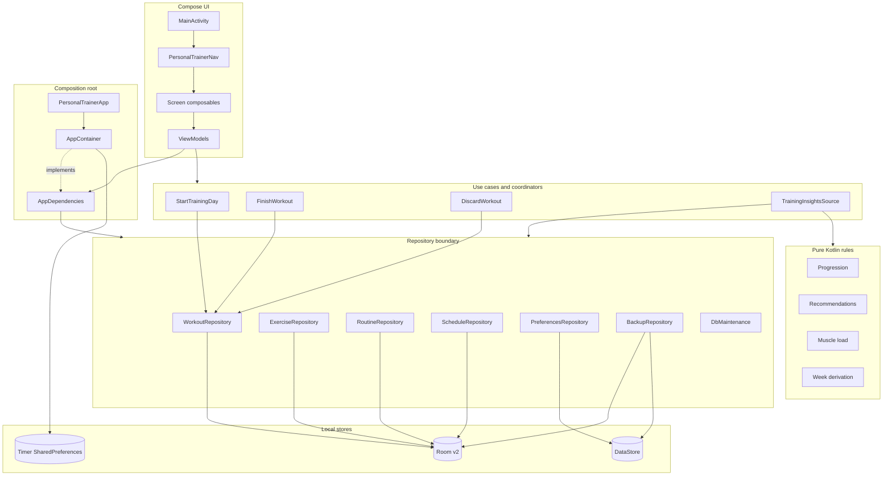
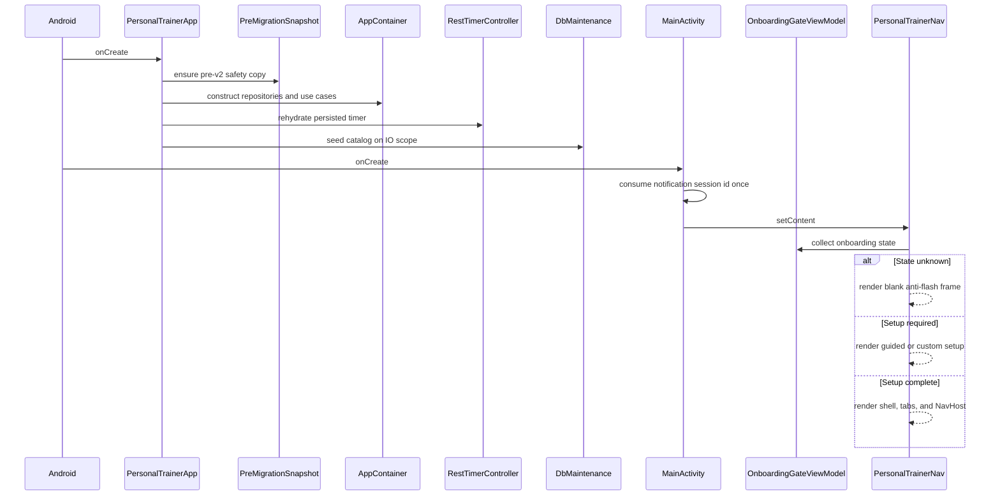
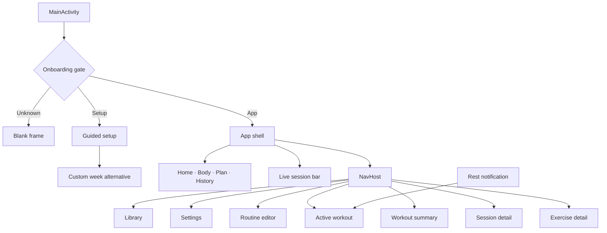
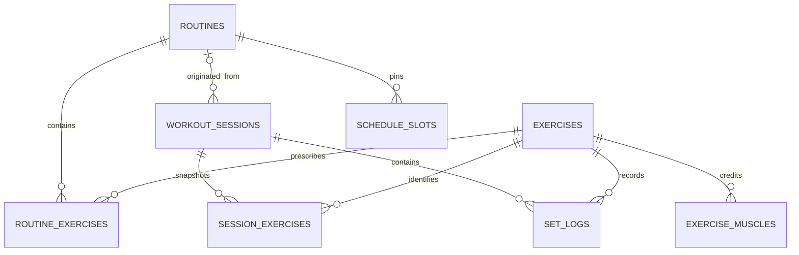
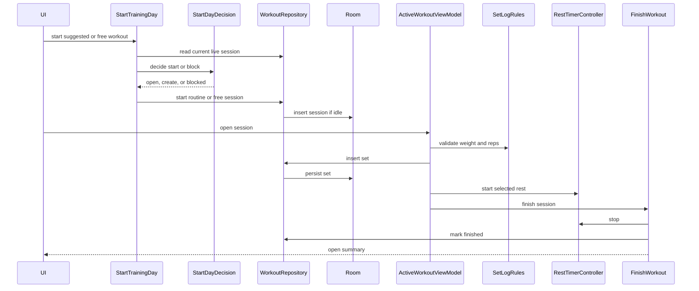
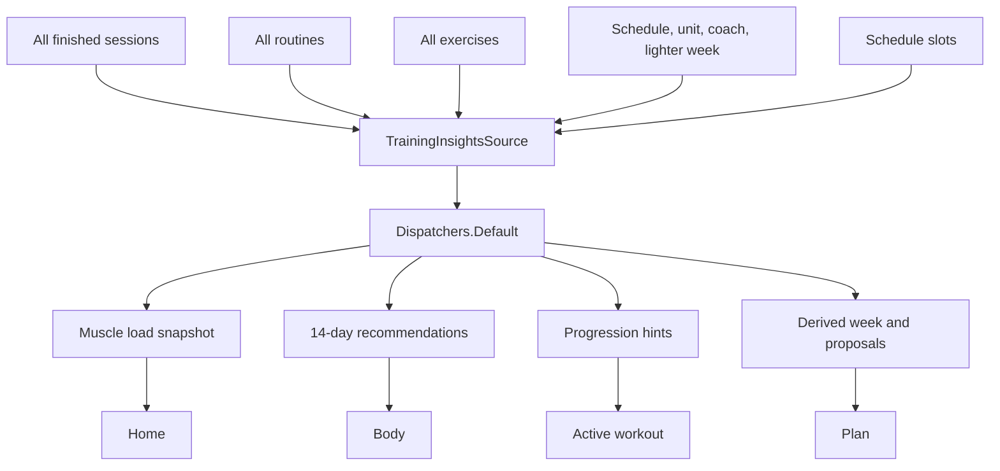
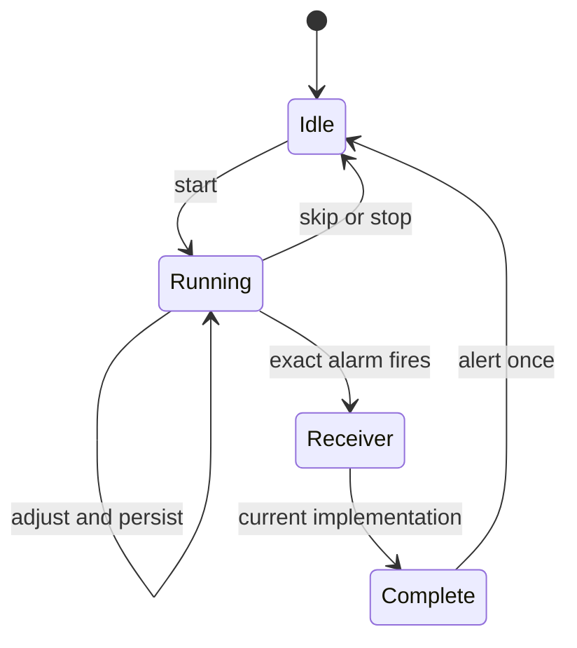
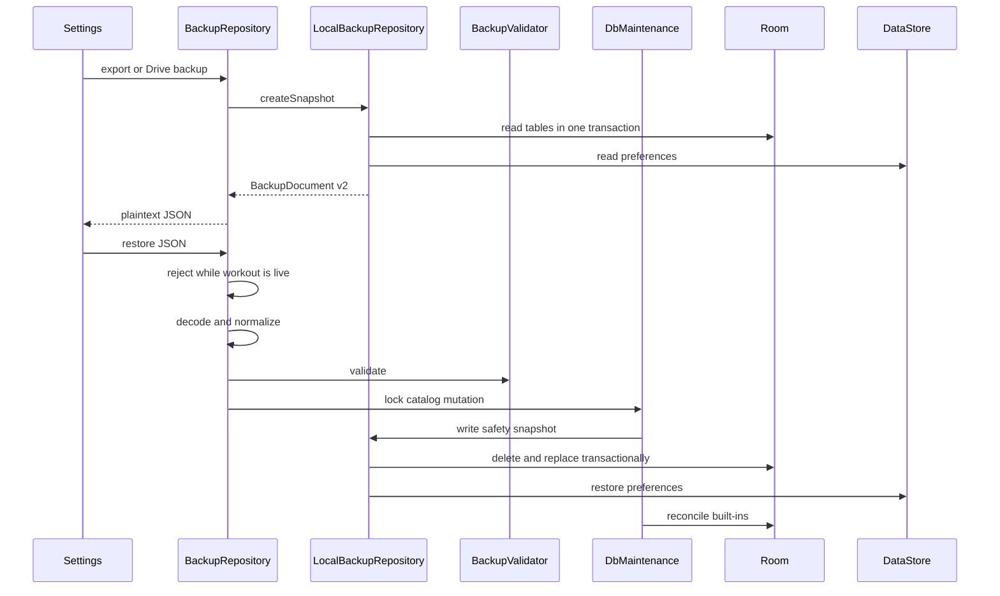
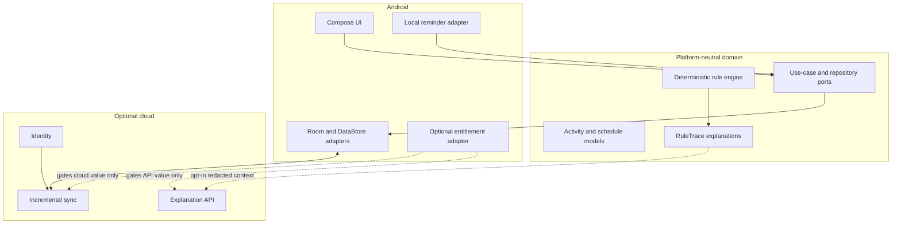

# Architecture and data-flow map

> **Superseded as a description of the app. 23 August 2026.**
>
> Read [`architecture/CURRENT_STRUCTURE.md`](../architecture/CURRENT_STRUCTURE.md)
> instead. Every row of the table below marked "current" was current when this
> was written and several are not now — most importantly the persistence line,
> which names Room v2 on `TrainerDatabase` with nine entities. Phase 5 cut the
> app to `TemperDatabase`, which is at v4 with 21 entities; navigation is five
> tabs, not four; and the "no cardio domain" sentence at the end of §1 was
> undone by ADR-007's activity model.
>
> This file stays because the data-flow diagrams and the layer-ownership
> reasoning are what the foundation program was planned against, and a reader
> tracing why a decision was made needs the state it was made in.

## 1. Current foundation

Temper is a single-module native Android application:

| Concern | Current implementation | Primary evidence |
|---|---|---|
| UI | Jetpack Compose and Material 3 | [`ui/`](../../app/src/main/java/com/sinura/personaltrainer/ui/) |
| Navigation | Compose Navigation; 11 route patterns plus setup gate | [`AppNav.kt`](../../app/src/main/java/com/sinura/personaltrainer/ui/navigation/AppNav.kt) |
| State | ViewModel `StateFlow`, repository `Flow`, saved-state workout draft | [`HomeViewModel.kt`](../../app/src/main/java/com/sinura/personaltrainer/ui/home/HomeViewModel.kt) |
| Dependency graph | Manual `AppContainer` implementing `AppDependencies` | [`AppContainer.kt`](../../app/src/main/java/com/sinura/personaltrainer/AppContainer.kt) |
| Durable records | Room v2, nine entities | [`TrainerDatabase.kt`](../../app/src/main/java/com/sinura/personaltrainer/data/local/TrainerDatabase.kt) |
| Preferences | Preferences DataStore | [`PreferencesRepository.kt`](../../app/src/main/java/com/sinura/personaltrainer/data/repository/PreferencesRepository.kt) |
| Rest state | SharedPreferences, foreground service, receiver | [`timer/`](../../app/src/main/java/com/sinura/personaltrainer/timer/) |
| Domain rules | Pure JVM Kotlin | [`domain/`](../../app/src/main/java/com/sinura/personaltrainer/domain/) |
| Backup | Validated JSON through SAF or optional Google Drive | [`data/backup/`](../../app/src/main/java/com/sinura/personaltrainer/data/backup/) |
| Network | Drive operations only | [`DriveRestClient.kt`](../../app/src/main/java/com/sinura/personaltrainer/data/backup/DriveRestClient.kt) |

There is no backend, app account, continuous sync engine, remote feature flag, telemetry
SDK, or cardio domain.

## 2. Layer ownership



### Boundary assessment

What is strong:

- DAOs are private to repositories.
- The domain has no Android imports.
- Workout finish and discard are centralized, so timer and draft cleanup cannot be forgotten
  by one screen.
- Schedule derivation and coaching are deterministic and heavily unit-tested.
- `AppDependencies` creates a practical ViewModel test seam without adding a DI framework.

What needs qualification:

- “Pure Kotlin” currently means JVM-pure, not Kotlin Multiplatform-ready. Domain files import
  `java.time`, `java.text.NumberFormat`, and `java.util.Locale`; those APIs require isolation
  or replacement before an iOS target can compile.
- `AppContainer` is a reasonable composition root at the current size. It should not be
  replaced solely for fashion, but account, sync, billing, and remote explanation adapters
  will make explicit feature ports more important.

## 3. Boot and render flow



Key evidence:

- [`PersonalTrainerApp.kt`](../../app/src/main/java/com/sinura/personaltrainer/PersonalTrainerApp.kt)
- [`MainActivity.kt`](../../app/src/main/java/com/sinura/personaltrainer/MainActivity.kt)
- [`OnboardingGateViewModel.kt`](../../app/src/main/java/com/sinura/personaltrainer/ui/onboarding/OnboardingGateViewModel.kt)

The `UNKNOWN` gate prevents a setup/app flash, but presents an intentionally blank first
frame while DataStore responds. That is acceptable while the read is fast; startup
instrumentation should guard it if the preference graph grows.

## 4. Navigation model



Route patterns:

- `home`
- `progress`
- `routines`
- `history`
- `library?muscle=...`
- `settings`
- `routine/{routineId}`
- `session/{sessionId}`
- `summary/{sessionId}`
- `history/{sessionId}`
- `exercise/{exerciseId}`

The four-tab information architecture is coherent:

- Home answers “what do I do now?”
- Body answers “what has my training affected?”
- Plan answers “what is scheduled and reusable?”
- History answers “what did I actually record?”

The global live bar is the sole ambient return path to an unfinished workout. Active Workout
and Summary hide it because they already own the session.

Naming is less coherent internally: the visible **Plan** tab is `Route.Routines`, its package
is `ui/plan`, routine editing is `ui/routines`, and persistence/domain terms use `Schedule`.
This does not hurt users, but it raises change cost and documentation drift.

## 5. Current data ownership

| Data | Writer | Store | Notes |
|---|---|---|---|
| Exercise catalog and muscle credit | `ExerciseRepository`, `DbMaintenance` | Room | Built-in plus custom |
| Routines and targets | `RoutineRepository` | Room | Targets copied into sessions |
| Sessions, session exercises, sets | `WorkoutRepository` | Room | Strength-only |
| Pinned schedule slots | `ScheduleRepository` | Room | Ordered cycle, max one rendered slot/day |
| Units and coaching preferences | `PreferencesRepository` | DataStore | Settings, not history |
| Bodyweight history | `PreferencesRepository` | Encoded DataStore string | Historical data in a preference store |
| Training-block archive | `PreferencesRepository` | Encoded DataStore string | Not queryable in SQL |
| Rest timer snapshot | `RestTimerController` | SharedPreferences | Process-death recovery |
| Workout draft | `WorkoutDraftCache`, `SavedStateHandle` | Memory/saved state | Room remains set source of truth |
| Analytics | `TrainingInsightsSource` | Computed | Not persisted |
| Backup document | `LocalBackupRepository` | Plain JSON | Finished sessions only |

### Current Room model



Strengths:

- Session targets are snapshots; editing a routine cannot rewrite history.
- Session deletion cascades to its set graph.
- Exercise deletion is restricted while sets reference it.
- Routine deletion nulls historical session linkage and removes schedule pins.
- No destructive migration fallback exists.

Constraints against the target:

- `WorkoutSession` has no activity type, origin, time zone, sync revision, or tombstone.
- `SetLog` can only express weight, repetitions, RPE, warm-up, and completion time.
- Cardio duration, distance, pace, heart rate, energy, intervals, route, and source cannot be
  represented honestly.
- Historical bodyweight and blocks live as encoded preference strings.
- One unfinished session is enforced globally.
- Schedule derivation emits no more than one training item for a date.

## 6. Workout write path



The loop is real and durable. It is also concentrated in a roughly 1,000-line
`ActiveWorkoutViewModel` and a roughly 1,100-line screen without dedicated behavioral or UI
tests. Domain tests reduce risk but do not prove state orchestration, navigation, or Compose
wiring.

## 7. Insights path and scaling



Good safeguards:

- Computation moved off the main dispatcher.
- Shared flows deduplicate common Home/Plan/Workout collectors.
- Exercise Detail uses a narrow per-exercise query.
- Failure types can degrade independently inside `TrainingInsightsCalculator`.

Scaling debt:

- `WorkoutDao.observeFinishedSessions()` loads the complete session/exercise/set graph.
- Any history emission can recompute insight inputs over all retained history.
- History itself is not paginated.
- Backup export reads all tables and filters finished sessions in memory.
- There are no persisted week/month/year aggregate projections.

This is acceptable for current development data but unproven for the stated multi-year
product. A synthetic baseline such as 500 sessions and 15,000 sets should become a required
performance gate.

## 8. Schedule semantics

The persisted model is an ordered cycle of routine/focus slots. The effective week is a pure
function of slots, completion history, and today:

- missed anchored sessions silently shift to the next open day;
- cycle order wins over weekday anchors;
- unfinished work is reset at the week boundary;
- accepted proposals become pinned slots.

This is well specified in
[`SCHEDULE_SEMANTICS.md`](../SCHEDULE_SEMANTICS.md), but it does not exactly match the new
product direction. The agreed target keeps the recurrence unchanged and asks once whether
to reschedule/push forward or adapt the remaining week. That requires a decision state, not
silent derivation.

The current model also cannot represent morning cardio plus evening lifting. Recurrence,
generated occurrence, and completed activity need to become separate concepts.

## 9. Rest timer and background reliability



The architecture correctly separates timer state, foreground notification, alarm receiver,
and idempotent completion. The implementation has a critical permission flaw:

- [`RestTimerAlarmScheduler.kt`](../../app/src/main/java/com/sinura/personaltrainer/timer/RestTimerAlarmScheduler.kt)
  claims `setAlarmClock()` is exempt from exact-alarm access.
- On Android 12–12L, apps targeting API 31+ require `SCHEDULE_EXACT_ALARM` or a power-save
  exemption. On Android 13+, eligible apps targeting API 33+ may instead use
  `USE_EXACT_ALARM`.
- The fallback `setExactAndAllowWhileIdle()` requires the same access.
- The manifest declares neither exact-alarm permission, and the app does not check for an
  exemption.
- Both exceptions are swallowed, leaving only the foreground service’s screen-on tick as a
  backstop.
- Even when an alarm reaches the receiver, the implementation does not re-check that
  `endsAtElapsedRealtime` is due before completing. That contradicts its scheduler comment
  and allows a stale in-flight or wall-clock-shifted alarm to end an extended or newly
  started rest early.
- Android clears alarms at reboot and the manifest has no boot receiver. Persisted state can
  rehydrate when the app/service next starts, but it cannot actively deliver a rest cue across
  reboot as the persistence comment implies.

Official reference:
[AlarmManager.setAlarmClock](https://developer.android.com/reference/android/app/AlarmManager#setAlarmClock(android.app.AlarmManager.AlarmClockInfo,%20android.app.PendingIntent)).

The fix strategy belongs in the roadmap because it affects Play policy and UX. Acceptance is
not “the method returned”; it is a fresh-install, screen-off, forced-Doze test on API 31+.

## 10. Backup and restore



This is a substantial manual backup design, not sync:

- structurally invalid documents are rejected;
- Room table replacement is transactional;
- a best-effort pre-restore safety-copy attempt exists;
- a point-in-time guard refuses restore when a workout is already live;
- Drive uses minimal `drive.file` scope.

Remaining concerns:

- files are plaintext and contain complete fitness/bodyweight history;
- restore is wholesale replacement;
- the overall restore is not atomic across Room replacement, DataStore preferences, and
  catalog reconciliation; a later failure can be reported after Room replacement committed;
- the live-workout check occurs before the maintenance lock and is not serialized with
  workout start, so a concurrent start can race into the replacement window;
- the empty-destructive guard counts built-in exercises, so a catalog-only file is not
  considered empty and can replace a phone with authored history;
- the safety snapshot can fail without blocking restore, and its private path is never shown
  or consumed by a recovery flow;
- unfinished sessions are deliberately omitted;
- the current all-rows snapshot will slow as history grows;
- file-level Drive backup has no entity conflict semantics and cannot become multi-device
  sync merely by running more frequently.

## 11. Recommended target boundaries

The target should evolve from the current strengths, not start with a server-first rewrite.



### Recommended activity model

Use one session envelope with ordered typed blocks:

```text
ActivitySession
  id, status, source, performedAt, startedAt, endedAt, timeZoneId
  scheduledOccurrenceId?, notes, createdAt, updatedAt, deletedAt?, revision
  blocks[]

StrengthBlock
  ordered exercises[]
    prescribed targets
    logged StrengthSet(weightKg, reps, rpe?, warmup, completedAt)

CardioBlock
  activityType, indoorOutdoor
  duration, distance?, avgPace?, avgHeartRate?, maxHeartRate?
  energy?, rpe?, intervals[], routeRef?
```

This permits:

- a strength-only workout;
- a cardio-only activity;
- a mixed gym session;
- two separate sessions on the same day;
- live, backdated, and imported origins without pretending they are identical.

Do not use a schemaless metric key/value table for primary metrics. Typed columns and
validated value objects preserve units, queryability, and migration safety.

### Recommended schedule model

Separate:

1. `ActivityTemplate` — reusable strength/cardio prescription;
2. `ScheduleRule` — recurring intent and preferred local time;
3. `ScheduleOccurrence` — one generated date/time instance with `planned`, `done`, `skipped`,
   `missed`, or `moved` state;
4. `ReminderPolicy` — offsets, quiet hours, and allowed actions;
5. `ActivitySession` — what actually happened, linked when applicable.

Two occurrences can then exist on one day, and rescheduling one does not mutate the entire
recurrence.

### Recommended sync contract

- Local database remains the source of truth.
- Every syncable entity gets a stable UUID, `createdAt`, `updatedAt`, revision, and tombstone.
- Writes append to a durable outbox in the same local transaction.
- Sync is opt-in and can be disabled without disabling the recorder.
- Conflict policy is defined per entity before release; “last write wins everywhere” is not
  sufficient for set logs and schedule edits.
- Export remains available independently of an account.
- Subscription checks live at cloud/API boundaries, never in core log, history, or export
  use cases.

### Recommended explanation API contract

The local rule engine remains authoritative. It emits a structured trace:

```text
RuleTrace
  ruleId
  action
  reasonCodes[]
  evidenceWindow
  inputsUsed[]
  alternatives[]
  generatedAt
```

A future API may turn that trace into natural language after explicit opt-in. It must not
silently return and apply new weights, schedules, or medical claims.

## 12. Architecture acceptance criteria

- Core recording, schedule viewing, reminders, rules, history, and export work in airplane
  mode without an account.
- Two planned occurrences can coexist on one local date and complete independently.
- A backdated record appears in the intended day/week/month/year using its captured time zone.
- Every recommendation exposes a deterministic trace and can be overridden.
- Multi-year history does not require loading every set for Home or Plan.
- Cloud disconnect for seven days does not block writes; reconnect causes no lost sets.
- A cloud/API entitlement being false never hides or destroys local records.
- A fresh-install modern-Android rest alert fires with the screen off under the chosen,
  policy-compliant background strategy.
