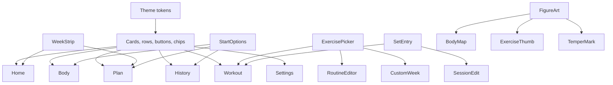

# Component and design-system atlas

## 1. Design-system verdict

Temper’s Instrument direction is a genuine system, not a coat of dark paint:

- semantic color roles;
- two bundled typefaces with tabular figures;
- a 4 dp spacing scale and explicit touch floors;
- centralized shape, motion, and haptic vocabulary;
- custom surfaces, rows, chips, numeric entry, charts, anatomy, and navigation;
- a static token checker that currently reports zero violations.

The direction should be retained. “Premium” work now means making every control, state, and
small-device layout obey the same system, then proving accessibility and gym-floor behavior.
It does not mean adding gradients, glass, extra tabs, or animation for its own sake.

## 2. Layer map

```text
L0  Platform shell       themes.xml, fonts, icons, notification resources
L1  Theme tokens         ui/theme/*
L2  Shared components    ui/components/*
L3  Navigation chrome    ui/navigation/*
L4  Feature components   ui/<feature>/*
L5  Context providers    LocalWeightUnit
```

## 3. Theme tokens

| File | Tokens | Role | Assessment |
|---|---|---|---|
| `Color.kt` | surface ladder, text, Volt, gold/warn/danger/cyan, heat ramp | Color grammar | Strong and semantic |
| `Type.kt` | `InstrumentType`, full Material map, Space Grotesk, Inter | Type hierarchy | Strong; no screen-level visual regression |
| `Metrics.kt` | spacing, gaps, borders, 48/56/72 dp floors | Layout rhythm | Strong; spacing literals are not linted |
| `Shape.kt` | `Radius`, Material shapes | Corner vocabulary | Consistent |
| `Motion.kt` | duration, easing, spring specs | Motion vocabulary | Consistent but no reduced-motion policy |
| `Haptics.kt` | tick, commit, reject, celebrate | Physical feedback | Valuable; device-only verification needed |
| `LogLoopScale.kt` | stack threshold, headline lines | Large-text adaptation | Correct but narrowly applied |
| `Theme.kt` | complete dark Material scheme | Platform component fallback | Strong; dark-only by decision |

### Verified contrast

| Pair | Ratio | Result |
|---|---:|---|
| `TextPrimary` / `Surface2` | 16.16:1 | AAA |
| `TextSecondary` / `Surface2` | 7.19:1 | AAA |
| `TextTertiary` / `Surface2` | 3.23:1 | Fails normal-text AA |
| `Volt` / `Pit` | 16.79:1 | AAA |
| `Danger` / `Surface3` | 5.86:1 | AA |
| `Warn` / `Surface2` | 9.68:1 | AAA |

`TextTertiary` is documented as decorative/disabled only. That rule must be audited at use
sites because 11–12 sp kicker and caption text is not large text. A disabled value is fine;
the only explanation of a state is not.

## 4. Shared component inventory

### 4.1 Surfaces and rows — `GymSurfaces.kt`

| Component | Responsibility | Main consumers | Review |
|---|---|---|---|
| `Kicker` | Uppercase tracked micro-label | Nearly every screen | Consistent; tertiary contrast rule applies |
| `GymSectionHeader` | Section title and optional text action | Home, Body, Plan, History, Settings | Action hierarchy can become text-heavy |
| `GymCard` | Default bordered card | Most features | Clickable/non-clickable branches duplicate implementation |
| `HairlineDivider` | One-pixel grouping rule | Lists and sheets | Consistent |
| `GroupedList` | Inset stacked-row panel | Most features | Settings implements a parallel wrapper |
| `MetricCluster` | Numeral, unit, label | Stats, history, live bar | Strong scan pattern |
| `StatTile` | Promoted metric card | Home, Summary, Exercise Detail | Can crowd at large font |
| `InstrumentRow` | Identity left, optional metrics right | Most list surfaces | Sound base abstraction |
| `SessionLogRow` | Fixed set/volume/duration columns | History | Fails identity at 360 dp with overflow menu |

`SessionLogRow` reserves 48 dp + 88 dp + 48 dp for metrics before inter-item spacing and a
48 dp menu. The resulting title/date column can collapse to `…`; alignment is not worth
erasing identity.

### 4.2 Actions, entry, rest, and dialogs — `Common.kt`

| Component | Responsibility | Main consumers | Review |
|---|---|---|---|
| `EmptyState` | Empty explanation plus optional action | Ten screens and picker | Useful compact/full modes |
| `ScreenLoading` | Delayed loading indicator | Screen gates | No explicit screen-reader announcement |
| `ConfirmActionDialog` | Shared confirm/dismiss pattern | Destructive and permission flows | Good standardization |
| `SetEntryPanel` | Weight/reps logging layout | Active Workout, Set Edit | Stacks at font scale ≥1.6 |
| `WeightStepper` | Weight display, adjust, type | Set entry | Gym-floor appropriate |
| `RepsStepper` | Repetition display, adjust, type | Set entry | Gym-floor appropriate |
| `StepperButton` | Tap/hold repeat | Steppers | Large target and haptic detents |
| `NumberEntryDialog` | Validated typed numeric input | Workout, bodyweight | Strong parse gate |
| `RestDock` | Condensed rest bar / idle line | Active Workout | Tap opens rest floor |
| `RestIdleRow` | Next-rest line and Start | Active Workout log | Chips moved to rest floor |
| `RestPresetChips` | Horizontal duration choices | Workout, Settings | Scrollable at large text |
| `InstrumentChip` | Selectable/filter control | Widespread | Correct selected semantics |
| `CustomRestDialog` | Parse custom mm:ss | Workout, Settings | Good bounded input |
| `PrimaryGymButton` | One dominant commit action | Widespread | Strong Volt grammar |
| `SecondaryGymButton` | Quiet outlined action | Widespread | Consistent |
| `NotesBlock` | Collapsible notes | Workout, Session Detail | Duplicated privately in Routine Editor |

`RestControl` is public so the rest floor page can reuse −15 / Skip / +15.

### 4.3 Feedback — `GymStatus.kt`

| Component | Meaning | Review |
|---|---|---|
| `GymErrorBanner` | Error and optional retry | Clear but generic title can hide domain-specific failure |
| `GymStatusBanner` | Temporary success | Auto-dismiss needs TalkBack timing validation |
| `PersonalRecordBanner` | Gold record event | Haptic contract lives in the host screen |
| `GymNoticeBanner` | Warning/action | Appropriate for backup/notification state |

`PersonalRecordBanner` is reusable visually but not behaviorally: celebration haptics are
triggered by Active Workout. Reusing it elsewhere can silently lose the physical feedback.

### 4.4 Catalog and picking

| File/component | Responsibility | Review |
|---|---|---|
| `ExercisePickerSheet` | Search, suggest, create, multi-select, confirm | More than 11 parameters; too many modes in one API |
| `ExerciseRow` | Thumbnail, name, muscle, equipment | Reused effectively |
| `ExerciseSearchField` | Custom search well | Clear Instrument treatment |
| `ExerciseThumb` | Anatomy/equipment identity | Decorative semantics correctly cleared |
| `EquipmentGlyphIcon` | Compact equipment identity | Useful in workout switcher |
| `EquipmentGlyph` / `glyphFor` | Equipment drawing mapping | Centralized |
| `thumbViewFor` / `thumbMuscles` | Anatomy view and highlights | UI is coupled to domain taxonomy |

No keyed-art loader for the documented `imageKey` hook is implemented. That is not a current
defect because the product deliberately uses generated anatomy, but it should not be
described as an existing asset extension point.

### 4.5 Visualization and brand

| Component | Responsibility | Review |
|---|---|---|
| `TrendBars` | Additive metric bars | Appropriate for volume |
| `LineTrend` | Level metric line | Appropriate for estimated 1RM |
| `LabelledTrend` | Headline, delta, chart | Can expose a synthesized description |
| `WeekStrip` / `WeekCell` | Seven-day shared row | Correctly reused by Home and Plan |
| `BodyView`, `BodyPlate`, `drawTemperFigure` | Shared anatomy | One geometry source |
| `TemperMark` | Brand/empty-state mark | Decorative semantics cleared |
| `TemperIcons` | Four tab icons | Cohesive custom navigation |

Canvas charts and anatomy require explicit semantic summaries; visual coherence alone does
not make them accessible.

### 4.6 Other shared files

| Component | Responsibility |
|---|---|
| `ResumeOrDiscardDialog` | Resolve a blocked start consistently |
| `DangerGymButton` | Private destructive variant inside that dialog |
| `ExerciseThumbGallery` | Development-only thumbnail/glyph previews |
| `ThemeGallery` | Development-only token/type/color previews |

Only seven `@Preview` functions exist, all in the two galleries. There are no page/state
previews.

## 5. Navigation components

| Component | Responsibility | Review |
|---|---|---|
| `PersonalTrainerNav` | Gate, providers, shell, routes | Central file is large but authoritative |
| `InstrumentNavBar` | Four-tab container | Correct role grouping |
| `NavTab` | Icon, label, selected indicator, haptic | `Role.Tab`; selected announcement needs device proof |
| `ScreenEnter` / `ScreenExit` | Shared destination transition | No reduced-motion branch |
| `LiveSessionBar` | Resume/finish/discard global chrome | Strong product concept; untested orchestration |

## 6. Feature component inventory

### Home

- `HomeMasthead` — date, day-state headline, Settings.
- `HomeStatRow` — last-session and days-since tiles.
- `DailyAgendaCard` — today's occurrences; one Volt Start; numbered lift order.
- `ThisWeekCard` — empty-agenda leftover: planned/rest/empty/live hero variants.
- `ReadyToProgressSection` — actionable progression hints.
- `LinkRow` — low-emphasis destinations.

### Body

- `ProgressHeader` — display-window controls.
- `BodyMapCard` — figure and front/back controls.
- `HeatLegend` and `LegendSwatch` — load key.
- `MuscleHeatRow` — reliable muscle target and contribution.
- `MuscleDetailSheet` — focused explanation and navigation.
- `RecommendationCard` — rule output and action.
- `dispatchRecommendation` — UI-layer action routing.

### Plan

- `PlanHeader` / `PlanHeaderActions` — title and command set.
- `BlockLine` — current 12-week state.
- `BlockReviewPanel` — completed-block summary.
- `WeekStrip` — shared calendar row.
- `PlanDaySheet` — one day’s start/edit/swap/unpin actions.
- `RoutineRow` — routine identity and lift count.
- `RoutinePicker` / `FocusPicker` — schedule-slot selection.
- `PreferenceBlock` — days, split, week start, lighter week.

### History

- `TrainingCalendarCard` / `DayCell` — month and intensity.
- `DaySessionsSheet` — same-day disambiguation.
- `SessionLogRow` — shared list readout.
- `FinishedBlockCard` — past training block.
- `RecordRow` — record summary.
- `SessionReceipt` — date, work, count, duration, notes.
- `ExerciseBlock` — exercise section in receipt.
- history `SetRow` — compact completed-set columns.
- `SetEditSheet` — finished-set repair.

### Active Workout

- `WorkoutHeader` — title, elapsed, sets, work, Finish.
- `LiftSwitcher` — horizontal exercise selection.
- `CurrentLiftHeader` — lift identity and target.
- `SetDots` — progress against prescribed sets.
- `LastTimeStrip` — prior-session context.
- `ProgressionStrip` — transparent next-weight action.
- `SetEntryPanel` / `LogBar` — primary input and commit.
- workout `SetRow` — editable/deletable live set.
- `SecondaryLogOptions` — warm-up and RPE.
- `RestDock` — fixed rest state.
- `RestNotificationsDisabledBanner` — recovery path.
- `NotesBlock` — session notes.

### Start options

- `StartOptionsSheet` — today’s plan, routines, free workout, or live return.
- local `RoutineRow` — routine choice with set/time estimate.
- `FreeWorkoutAction` — quiet no-plan start.

### Routine and custom-week editing

- `RoutineEditorHeader` / `RoutineTitleField` — identity.
- `SessionLiftStrip` — numbered horizontal session cards; tap opens targets.
- `CompactLiftRow` — identity-before-metrics instrumented row (not the production editor).
- `CompactTargetFields` — sets, reps, rest, target load.
- `MiniNumberField` — inline numeric input.
- `SwapExerciseSheet` — movement-family alternative.
- private `NotesBlock` — duplicate routine notes.
- `WeekDayStrip` — custom-builder day selection.

### Library

- `FamilyHeader` — movement-family disclosure.
- `LibraryRow` — exercise row wrapper.
- `CollisionRow` — built-in/custom name conflict.
- `LiftOverflowSheet` / `SheetActionRow` — row actions.
- `AddToRoutineSheet` — destination routine.
- `ExerciseEditorSheet` — custom exercise form.
- Material `FloatingActionButton` — create action.

### Exercise Detail

- `ExerciseDetailHeader` — thumbnail and lift name.
- `RecordsCard` / `RecordMetric` / `RecordProvenance` — record values and basis.
- `TrendCard` / `GhostTrend` — unlocked and pending charts.
- `SessionRow` — lift appearance in a session.
- `RoutinePickerSheet` — add current lift to routine.

### Onboarding

- `OnboardingHeader` / `QuestionTitle` / `ChoiceStep` — flow framework.
- `ForkStep` — guided/custom choice.
- `ExperienceStep` — training age.
- `DaysPerWeekStep` — frequency.
- `WhichDaysStep` — preferred days/auto spacing.
- `PlaceStep` — equipment context.
- `GoalStep` — strength/muscle/athletic/general.
- `EmphasisStep` — balanced/upper/lower.
- `BodyweightStep` / `BodyweightWheel` — optional current weight.
- `PreviewStep` / `WeekLine` / `RoutineCard` — generated result.

### Settings

- `SettingsHeader` — Back/title.
- `SettingsGroup` — local parallel to `GroupedList`.
- `WeightUnitsSection`.
- `SchedulePrefsSection`.
- `CoachingSection`.
- `RestTimerPrefsSection`.
- `BackupRestoreSection`.
- `PlanSetupSection`.
- `AboutSection`.
- `DangerAction`.

### Summary

- `SummaryHero` — animated total work.
- `PersonalRecordPanel` / `RecordMark` — record celebration.
- `LiftBreakdown` — per-lift work.
- `SummaryActions` — Done/full receipt.

## 7. Reuse map



The system is more organized than the historical C-grade audit implies. Fragmentation is
concentrated in page-local rows, fields, and Material outliers—not in missing foundations.

## 8. Duplication and coupling register

| Pattern | Locations | Impact | Direction |
|---|---|---|---|
| Notes disclosure | Shared `Common.kt`, private Routine Editor copy | Copy/behavior drift | Parameterize one shared component |
| Set row | Active Workout, Session Detail | Similar data, legitimately different actions | Share metrics/copy, keep layouts |
| Routine row | Plan, Start Options | Repeated identity anatomy | Consider one configurable row |
| Grouped panel | `GroupedList`, `SettingsGroup` | Styling drift | Reuse shared panel |
| Numeric entry | Dialog/steppers/`MiniNumberField` | Three input languages | Define entry rules by context |
| Week row | `WeekStrip`, custom `WeekDayStrip` | Similar but different jobs | Document distinction |
| Recommendation routing | `dispatchRecommendation` in UI | Hard to unit-test | Emit intent or route in ViewModel |
| Exercise picker API | 11+ parameters | Combinatorial state | State/config object and events |
| PR haptics | Host screen rather than banner | Reuse can lose feedback | Document or own in one coordinator |
| Weight unit default | `LocalWeightUnit` defaults pounds | Wrong if composed outside provider | Assert provider at shell boundary |

## 9. Stock Material outliers

- `Switch` in Settings;
- `FloatingActionButton` in Library;
- `OutlinedTextField` in notes, forms, and compact targets;
- `SnackbarHost` in workout/history flows;
- `DropdownMenu` and items in overflow actions;
- standard modal bottom sheets and dialogs.

Using Material primitives is not itself a flaw. The audit question is whether they resolve to
the Instrument scheme and interaction rules. Runtime screenshots showed the switches and FAB
as the most obvious foreign silhouettes.

## 10. Responsive and accessibility audit

### Verified strengths

- touch floors are explicit;
- key chips use `selectable`, exposing selected state;
- tab container uses `selectableGroup` and `Role.Tab`;
- body hotspots expose names and button role;
- charts accept semantic descriptions;
- decorative anatomy clears semantics;
- rest countdown exposes a merged remaining-time description;
- weight/reps wells stack at font scale 1.6+;
- the setup fork and first question remained navigable at font scale 2.0;
- landscape did not crash or clip the first question horizontally.

### Verified or likely gaps

| Area | Finding | Confidence |
|---|---|---|
| Small phone | History identity collapses to `…` | Runtime verified |
| Small phone | Routine names and target labels compress heavily | Runtime verified |
| Body map | Some direct anatomy targets are below 48 dp | Code verified |
| Large text | Adaptation is concentrated in Home and set entry | Code verified |
| TalkBack | No automated traversal/focus tests | Verified absence |
| Screen previews | No page/state previews | Verified absence |
| RTL | Manifest supports RTL; full visual/semantic pass absent | Unverified |
| Reduced motion | No system preference branch | Code verified |
| Contrast | Tertiary text is 3.23:1 | Calculated |
| Keyboard | No automated focus/IME test for sheets/dialogs | Verified absence |
| Rotation | Setup survived sample; active workout matrix unproven | Partial runtime |
| Tablet/foldable | Phone-first single column only | Code verified |

### Required runtime matrix

| Dimension | Required pages | Pass criterion |
|---|---|---|
| Font 1.0/1.6/2.0 | Setup, Home, Plan, Workout, History, Settings | No lost numeral or primary action |
| TalkBack | All 13 screens and all destructive dialogs | Logical order, selected state, focus return |
| 360/412/600 dp | History, routine rows, stats, map, workout | Identity never sacrificed for metrics |
| RTL | Tabs, week strips, fixed metric rows, dialogs | Correct mirroring and stable numeral order |
| Portrait/landscape | Setup and active workout | Usable scroll and no state loss |
| IME | Search, notes, mini fields, number dialog | No covered confirm; valid Done behavior |
| Motion disabled | Navigation, PR, banners, rest | No essential meaning lost |
| Contrast | Every semantic role/state | Normal text ≥4.5:1 or explicitly nonessential |
| Haptics/sound off | Log, rest, PR, destructive action | Visual equivalent remains |

## 11. Premium-experience priorities

1. Correct contradictions before decoration: exact rest completion, summary rounding, history
   identity.
2. Preserve the one-Volt-action rule.
3. Make the active logging viewport usable even when permission guidance is present.
4. Keep identity visible before fixed metrics on small screens.
5. Consolidate notes, rows, grouping, and numeric-entry contracts.
6. Add page/state previews and targeted Compose semantics tests.
7. Define reduced-motion and accessibility gates as part of “premium,” not as cleanup.
8. Retain the restrained dark system; do not add a second visual direction until the first is
   verified across devices.
