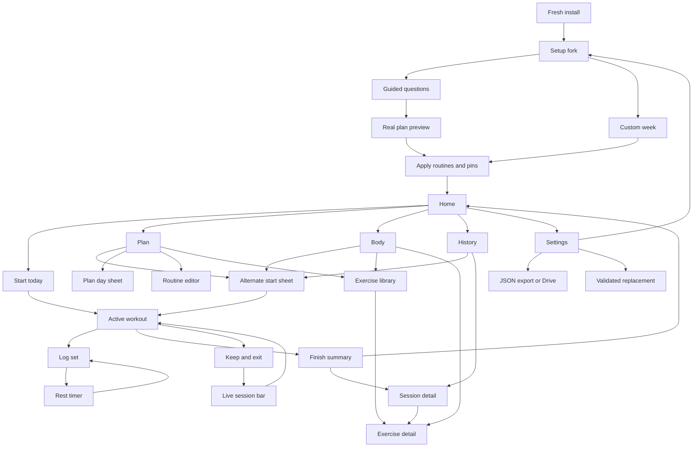

# Page, state, modal, and journey atlas

## 1. Surface count

| Surface class | Count | Implemented | Placeholder | Runtime sampled |
|---|---:|---:|---:|---:|
| Setup screens | 2 | 2 | 0 | 2 |
| Tab destinations | 4 | 4 | 0 | 4 |
| Pushed destinations | 7 | 7 | 0 | 7 |
| Shared bottom sheets | 11 | 11 | 0 | 5 representative |
| Dialog patterns | 10+ | 10+ | 0 | 3 representative |
| Global app chrome | 2 | 2 | 0 | 2 |
| System notification surfaces | 2 | 2 | 0 | In-app state only |

Every primary CTA found in the current product is wired to a ViewModel or navigation action.
The primary application contains no mock screen. `ThemeGallery` and
`ExerciseThumbGallery` are development previews and intentionally have no route.

## 2. Global shell and access rules

### Onboarding gate

| State | Trigger | Rendered result |
|---|---|---|
| `UNKNOWN` | DataStore has not emitted | Blank frame to prevent route flash |
| `UNAVAILABLE` | Settings unreadable | Retry empty state |
| `APP` | Settings readable | Main shell. First visit (`onboardingComplete == false`) shows Home plus a get-started sheet |

The questionnaire is a pushed route from Home or Settings, not a launch replacement. No login exists.

### Bottom navigation

Home, Body, Plan, and History are visible only on tab destinations. Pushed screens hide the
tab bar and expose explicit Back navigation.

### Live session bar

The live bar appears anywhere a workout is unfinished except Active Workout and Workout
Summary. It is the only ambient resume path and offers finish/discard in overflow.

Strengths:

- one clear answer to “where did my workout go?”;
- live state does not compete with another Home resume button;
- session counters are aggregated in SQL.

Risks:

- it has no behavioral ViewModel or UI test;
- discoverability depends on noticing a compact strip after leaving the workout;
- “stale” status still needs physical-phone and TalkBack verification.

Runtime evidence: [live session bar](evidence/12-live-session-bar.png).

## 3. Setup surfaces

### 3.1 Guided setup

**Files:** [`OnboardingScreen.kt`](../../app/src/main/java/com/sinura/personaltrainer/ui/onboarding/OnboardingScreen.kt),
[`OnboardingViewModel.kt`](../../app/src/main/java/com/sinura/personaltrainer/ui/onboarding/OnboardingViewModel.kt)

**Job:** Turn a stranger’s answers into an immediately startable week.

**Steps**

1. Strength, cardio, or both
2. Lifting experience (skipped for cardio-only)
3. Days per week
4. Preferred weekdays or automatic spacing
5. Training place/equipment
6. Goal (skipped for cardio-only)
7. Emphasis (skipped for cardio-only)
8. Optional bodyweight
9. Generated block preview

**Reads:** exercise catalog, week-start preference, current unit, existing routines.

**Writes:** Nothing until “Use this plan.” Apply then writes preferences, routines, schedule
slots, block start, and setup completion.

**States:** catalog loading/error, answer steps, preview, apply in progress, full-seven-day
confirmation, warning when rebuilding around an existing program.

**What works**

- one question per screen;
- the split is derived instead of making beginners understand program jargon;
- the real generated lifts appear before commitment;
- rerunning setup does not delete history;
- bodyweight is optional.

**Friction and gaps**

- experience and goal choices are visually selected but do not expose an obvious explicit
  “selected” semantic in every custom card;
- a first install opens Home with generate / build / workout; the questionnaire is optional;
- bodyweight explains twelve-week use but is not connected to a general measurable-goal
  system;
- the questionnaire cannot ask for multiple daily activity times or cardio intent.

Runtime evidence:
[fork](evidence/01-onboarding-fork.png),
[generated preview](evidence/02-plan-preview.png),
[font scale 2.0](evidence/19-font-scale-2.png).

### 3.2 Custom week

**Files:** [`CustomWeekScreen.kt`](../../app/src/main/java/com/sinura/personaltrainer/ui/routines/CustomWeekScreen.kt),
[`CustomWeekViewModel.kt`](../../app/src/main/java/com/sinura/personaltrainer/ui/routines/CustomWeekViewModel.kt)

**Job:** Let a user construct a Monday–Sunday strength week manually.

**Reads:** exercise catalog, week start, optional answers carried from the guided flow.

**Writes:** routines, routine exercises, schedule pins, preferences, and block only on
confirmation.

**States:** blank day, populated day, picker open, expanded lift targets, applying, full-week
warning.

**What works**

- all seven days fit at the audited 360 dp width;
- empty state has a direct Add lifts action;
- one picker supports multi-add;
- `SessionLiftStrip` lines the custom builder with the routine editor.

**Friction and gaps**

- it builds strength lifts only;
- a day is either one lift collection or rest—there is no morning/evening occurrence model;
- inline target entry inherits the routine editor’s compressed labels;
- the page name “Your week” and the Plan tab’s schedule vocabulary are not unified.

Runtime evidence:
[custom week](evidence/03-custom-week.png),
[exercise picker](evidence/05-exercise-picker.png) and
[Library catalog](evidence/08-library.png) for catalog anatomy.

## 4. Tab destinations

### 4.1 Home

**Files:** [`HomeScreen.kt`](../../app/src/main/java/com/sinura/personaltrainer/ui/home/HomeScreen.kt),
[`DailyAgendaCard.kt`](../../app/src/main/java/com/sinura/personaltrainer/ui/home/DailyAgendaCard.kt),
[`ThisWeekCard.kt`](../../app/src/main/java/com/sinura/personaltrainer/ui/home/ThisWeekCard.kt)

**Job:** State today and provide the shortest valid next action.

**Reads:** shared training insights, derived week, today's occurrences, progression hints, current block, in-progress
session.

**Writes/actions:** start the tagged planned occurrence (or leftover suggested day), start a free workout, request week suggestion
or answer replay, navigate to Settings/Plan/History/Exercise Detail. Alternate starts (log past, live cardio) open `StartOptionsSheet` from Body, History, or Plan — not from Home.

**Hero states**

| State | Primary behavior |
|---|---|
| Empty week, no routines | Suggest a week |
| Empty week, routines exist | Use stored answers again |
| Agenda today | One Volt: Start {title} (strength preferred). Numbered lift order on the strength row. |
| Leftover planned today | Start this session |
| Rest day / already trained leftover | Quiet Start a free workout |
| Workout live | No Start; use live bar |

**What works**

- one dominant action;
- masthead communicates the day’s reality instead of branding;
- planned session starts in one tap;
- live state does not lie;
- progression links lead to the relevant lift;
- agenda and leftover never compete: occurrences own today.

**Friction and gaps**

- reminder/adherence state is a Plan/missed-work prompt, not Home chrome;
- the “Last session” tiles are empty on first use without teaching what will populate them.

Runtime evidence: [Home](evidence/04-home.png).

### 4.2 Body

**Files:** [`ProgressScreen.kt`](../../app/src/main/java/com/sinura/personaltrainer/ui/progress/ProgressScreen.kt),
[`BodyMap.kt`](../../app/src/main/java/com/sinura/personaltrainer/ui/progress/BodyMap.kt),
[`RecommendationCards.kt`](../../app/src/main/java/com/sinura/personaltrainer/ui/progress/RecommendationCards.kt)

**Job:** Show muscle load and the most useful rule-based next actions.

**Reads:** working sets for the selected heat window; fixed trailing-14-day coach basis.

**Writes/actions:** persist heat window, mark lighter week, open muscle/lift/library/plan/start
destinations.

**States:** loading, error/retry, no history, window empty, populated map, partial insight
failure, recommendation cards.

**What works**

- display window does not silently change recommendation evidence;
- map, calendar, and other load surfaces use one intensity ramp;
- every recommendation names a destination;
- contributor rows can open the lift;
- the row list provides a reliable alternative to small anatomy hotspots.

**Friction and gaps**

- the silhouette consumes almost a full first viewport on a 360 dp phone; recommendations
  begin below the fold;
- hotspots are not guaranteed to reach 48 dp;
- “Body” is strength-muscle-centric and has no honest place for running, cycling, or
  cardiovascular progress;
- recommendations route inside a UI helper, reducing testability;
- a single logged set can produce several “no work” cards, which is technically correct but
  may feel scolding to a new user.

Runtime evidence: [recommendations](evidence/16-body-recommendations.png).

### 4.3 Plan

**Files:** [`PlanScreen.kt`](../../app/src/main/java/com/sinura/personaltrainer/ui/plan/PlanScreen.kt),
[`PlanDaySheet.kt`](../../app/src/main/java/com/sinura/personaltrainer/ui/plan/PlanDaySheet.kt),
[`PreferenceBlock.kt`](../../app/src/main/java/com/sinura/personaltrainer/ui/plan/PreferenceBlock.kt)

**Job:** Own the pinned week, reusable routines, and schedule suggestions.

**Reads:** schedule slots, routines, derived week, proposal, block review, preferences.

**Writes/actions:** pin/unpin/swap day, accept/dismiss proposal, tune preferences, mark lighter
week, create/edit/delete routine, begin next block, start a planned day.

**States:** no routines, no pins, replay available, suggestion preview, partial/full pinning,
day sheet, tune section, complete block review, blocked start.

**What works**

- week and routines are co-located;
- fully pinned weeks hide a dead Suggest action;
- “Use this week” is clearer than planner terminology;
- the day sheet offers start, edit, swap, and unpin from one context.

**Friction and gaps**

- Tune, Library, New, Settings, week state, routines, Suggest/Replay, and Lighter Week can
  create a dense command surface;
- visible Plan, route `routines`, package `plan`, and domain `Schedule` create internal drift;
- missed sessions shift automatically under current semantics instead of asking once whether
  to move/adapt;
- one derived item per day cannot model morning cardio plus evening strength;
- no time-of-day, duration, location, or reminder policy exists.

Runtime evidence:
[Plan](evidence/06-plan.png),
[day sheet](evidence/07-plan-day-sheet.png).

### 4.4 History

**Files:** [`HistoryScreen.kt`](../../app/src/main/java/com/sinura/personaltrainer/ui/history/HistoryScreen.kt),
[`TrainingCalendarCard.kt`](../../app/src/main/java/com/sinura/personaltrainer/ui/history/TrainingCalendarCard.kt)

**Job:** Prove what was recorded and provide a route to repair it.

**Reads:** all finished sessions, calendar summaries, records, past blocks.

**Writes/actions:** repeat a session into a new live workout; otherwise navigational.

**States:** loading, empty, populated month, multiple sessions on one day, repeat blocked by a
live workout, snackbar failure.

**What works**

- calendar and chronological list answer different recall questions;
- multiple sessions on one date open a disambiguation sheet;
- repeat creates a new session rather than mutating history;
- records and block summaries live beside the log.

**Critical runtime friction**

At 360 dp, a populated session row rendered the title and date as `…` while keeping fixed
columns for sets, volume, duration, and overflow. The user cannot identify the workout.
`SessionLogRow` reserves 184 dp for metrics before spacing and the menu, leaving effectively
no identity column.

**Target gaps**

- strength-only records;
- no backdated session creation;
- no week-over-week, year, or all-time dashboard;
- full history is loaded rather than paginated.

Runtime evidence: [History](evidence/17-history.png).

## 5. Pushed destinations

### 5.1 Settings

**Files:** [`SettingsScreen.kt`](../../app/src/main/java/com/sinura/personaltrainer/ui/settings/SettingsScreen.kt),
[`SettingsViewModel.kt`](../../app/src/main/java/com/sinura/personaltrainer/ui/settings/SettingsViewModel.kt)

**Job:** Own preferences and data survival.

**Sections:** units, schedule, coaching/equipment, rest timer, backup/import/Drive, setup
rerun, About.

**States:** Drive signed out/in, old/no backup, operation progress, success/error, restore
confirm, restore blocked while live.

**What works**

- units re-render the app while storage stays kilograms;
- local export/import works without Google;
- restore warns and its UI is disabled when a workout is already live;
- stale backup state is visible;
- guided setup rerun preserves history.

**Friction and gaps**

- the backup explanation becomes a dense wall on a small screen;
- restore promises a phone-local safety copy, but snapshot failure does not block replacement
  and no UI exposes retained snapshot paths;
- restore’s live-session precheck is not serialized with workout start;
- two stock Material switches stand out from custom controls;
- schedule preferences describe days/split/week start but not actual times or reminders;
- equipment is stored as coaching preference, not per-location availability;
- no privacy, app lock, cloud-sync, account, entitlement, or consent surfaces exist.

Runtime evidence: [backup section](evidence/18-settings-backup.png).

### 5.2 Exercise Library

**Files:** [`ExerciseLibraryScreen.kt`](../../app/src/main/java/com/sinura/personaltrainer/ui/library/ExerciseLibraryScreen.kt),
[`ExerciseEditorSheet.kt`](../../app/src/main/java/com/sinura/personaltrainer/ui/library/ExerciseEditorSheet.kt)

**Job:** Search/filter the lift catalog and manage custom exercises.

**Reads:** built-in/custom exercises, movement families, collisions, muscle/equipment filters.

**Writes/actions:** create/edit/delete custom lift, add to routine, open detail.

**States:** loading, empty catalog, no filter matches, collapsed/expanded families,
name-collision attention, editor, delete confirm, add-to-routine sheet.

**What works**

- movement families reduce a 100+ item catalog;
- Body muscle filters survive the route;
- thumbnails encode muscle and equipment without assets;
- custom lifts remain first-class;
- add-to-routine is available without entering the editor.

**Friction and gaps**

- off-tab discoverability relies on Plan/Body links;
- only screen using a stock floating action button;
- no cardio activity catalog or metric configuration;
- exercise picker’s large parameter surface makes its many modes difficult to test.

Runtime evidence: [expanded family](evidence/08-library.png).

### 5.3 Routine Editor

**Files:** [`RoutineEditorScreen.kt`](../../app/src/main/java/com/sinura/personaltrainer/ui/routines/RoutineEditorScreen.kt),
[`SessionLiftStrip.kt`](../../app/src/main/java/com/sinura/personaltrainer/ui/routines/SessionLiftStrip.kt)

**Job:** Edit one reusable strength routine.

**Reads:** routine plus catalog.

**Writes/actions:** rename, notes, add/remove/reorder/swap lift, edit sets/reps/rest/weight.

**States:** loading, missing routine, empty lifts, expanded targets, picker, swap sheet,
remove confirmation.

**What works**

- changes persist without a misleading Save button;
- no Start action competes with editing;
- numbered session cards expose targets and movement controls;
- an empty new stub can be cleaned up on exit.

**Runtime friction**

- exercise names truncate aggressively at 360 dp because target text and two 48 dp movement
  buttons dominate the row;
- the expanded target-weight field uses `lbs`/`kg` as its label, so an empty field can look
  like a unit value rather than a weight input;
- this is a third numeric-entry language beside steppers and number dialogs;
- the private routine `NotesBlock` duplicates the shared session component.

Runtime evidence: [expanded editor](evidence/09-routine-editor.png).

### 5.4 Active Workout

**Files:** [`ActiveWorkoutScreen.kt`](../../app/src/main/java/com/sinura/personaltrainer/ui/workout/ActiveWorkoutScreen.kt),
[`ActiveWorkoutViewModel.kt`](../../app/src/main/java/com/sinura/personaltrainer/ui/workout/ActiveWorkoutViewModel.kt)

**Job:** Log a live strength session with minimal gym-floor friction.

**Reads:** current session graph, progression hints, previous values, draft, timer state,
notification capability.

**Writes/actions:** sets, RPE/warm-up, notes, add/swap/remove lift, timer, finish/discard.

**States:** loading, missing session, empty lifts, entry, validation error, PR, rest running,
notification explanation/denial, leave/discard/remove dialogs, delete undo.

**What works**

- weight/reps are large and typeable;
- press-and-hold steppers and haptics suit one-handed use;
- rest stays outside the scroll;
- logging starts the selected next rest;
- previous values, progression, RPE, warm-up, and plates remain contextual;
- a draft survives process death;
- zero weight is rejected for a working set with specific guidance;
- finish becomes available after any logged set.

**Friction and risk**

- first-rest notification guidance can consume most of the logging viewport on a small phone;
- the user must scroll before entry wells become visible in that state;
- the screen and ViewModel are the largest and most important untested UI units;
- exact-alarm access is missing, so pocket completion is not reliable on modern Android;
- one global live-session invariant prevents concurrent morning/evening live activities;
- the visible error from a failed log remains until the next action, even after the weight is
  corrected.

Runtime evidence:
[entry](evidence/10-active-workout.png),
[rest running](evidence/11-rest-running.png).

### 5.5 Workout Summary

**File:** [`WorkoutSummaryScreen.kt`](../../app/src/main/java/com/sinura/personaltrainer/ui/summary/WorkoutSummaryScreen.kt)

**Job:** Confirm save and summarize the completed session once.

**Reads:** derived summary aggregate.

**Writes:** none.

**States:** loading, missing/no-work fallback, standard summary, PR celebration.

**What works**

- volume is the visual lead;
- gold is reserved for records;
- count-up is protected from replay after rotation;
- Done cannot reopen a dead session;
- full receipt remains one tap away.

**Verified defect**

The hero converts total volume and calls `roundToInt`, while Session Detail uses
`WeightConverter.formatGroupedNumber`, which uses ties-to-even `round`. A stored 100 lb × 5
set reached the exact half-pound boundary and displayed as **501 lb** here and **500 lb**
everywhere else.

Runtime evidence: [Summary](evidence/13-workout-summary.png).

### 5.6 Session Detail

**Files:** [`SessionDetailScreen.kt`](../../app/src/main/java/com/sinura/personaltrainer/ui/history/SessionDetailScreen.kt),
[`SetEditSheet.kt`](../../app/src/main/java/com/sinura/personaltrainer/ui/history/SetEditSheet.kt)

**Job:** Provide a durable receipt and repair mistakes.

**Reads:** one complete session.

**Writes/actions:** add/edit/delete set, edit notes, repeat, delete session.

**States:** loading, missing, empty set group, set sheet, delete/undo, repeat blocked.

**What works**

- edits preserve attribution timestamps;
- heat, volume, and records respond to repaired data;
- session deletion is explicit;
- unloaded exercises remain visible as part of the prescription.

**Gaps**

- performed date/time cannot be edited;
- session duration intentionally does not recompute after repair;
- strength-specific sections cannot host cardio metrics yet;
- ViewModel and screen have no dedicated tests.

Runtime evidence: [Session Detail](evidence/14-session-detail.png).

### 5.7 Exercise Detail

**Files:** [`ExerciseDetailScreen.kt`](../../app/src/main/java/com/sinura/personaltrainer/ui/exercise/ExerciseDetailScreen.kt),
[`ExerciseDetailViewModel.kt`](../../app/src/main/java/com/sinura/personaltrainer/ui/exercise/ExerciseDetailViewModel.kt)

**Job:** Show one lift’s lifetime story.

**Reads:** narrow per-exercise set history, records, weekly volume, estimated 1RM, sessions.

**Writes/actions:** add lift to routine; otherwise navigation.

**States:** loading, missing lift, no history, populated records/trends/sessions.

**What works**

- records, totals, trend types, and provenance are clear;
- bar charts and line charts reflect different metric meanings;
- empty history has a useful Add to routine action;
- chart descriptions can be exposed to accessibility services.

**Gaps**

- no equivalent detail surface for running pace, distance, heart rate, or intervals;
- one session is shown as ghost data until a trend unlocks, but the reason is only copy;
- historical query is unbounded;
- ViewModel and screen have no dedicated tests.

Runtime evidence: [populated detail](evidence/15-exercise-detail.png).

## 6. Modal and dialog registry

| Surface | Hosts | Purpose | Writes |
|---|---|---|---|
| `StartOptionsSheet` | Body, History, Plan | Today’s plan, routine/free start, or return to live workout | Starts/discards session |
| `PlanDaySheet` | Plan | Start, edit, swap, or unpin one day | Schedule/session |
| `MuscleDetailSheet` | Body | Contributors and destinations | None |
| `DaySessionsSheet` | History | Choose among same-day sessions | None |
| `SetEditSheet` | Session Detail | Add/edit completed set | Set row |
| `ExercisePickerSheet` | Workout, Routine Editor, Custom Week | Search/create/select lifts | Context-dependent |
| `SwapExerciseSheet` | Routine Editor | Change equipment variant | Routine exercise |
| `ExerciseEditorSheet` | Library | Create/edit custom lift | Exercise |
| `AddToRoutineSheet` | Library | Choose target routine | Routine exercise |
| `LiftOverflowSheet` | Library | Edit/delete actions | Context-dependent |
| `RoutinePickerSheet` | Exercise Detail | Add current lift to a routine | Routine exercise |
| `ResumeOrDiscardDialog` | Home, Plan | Resolve blocked start | May discard/start |
| Leave workout dialog | Active Workout | Keep live, stay, or discard | Session lifecycle |
| Remove-lift dialog | Active Workout | Remove unlogged lift | Session exercise |
| Full-week warning | Setup/Custom Week | Confirm seven training days | Apply |
| Delete routine dialog | Plan | Confirm destructive routine delete | Routine/schedule |
| Restore/import dialog | Settings | Confirm wholesale replacement | Full data |
| Notification why dialog | Active Workout | Explain permission before OS prompt | None |
| `CustomRestDialog` | Workout/Settings | Parse mm:ss rest | Timer preference |
| `NumberEntryDialog` | Workout/Settings | Parse weight/bodyweight | Context-dependent |

Modal architecture is consistent and real. Remaining premium work is visual/behavioral
standardization of headers, action order, dismissal, keyboard focus, and TalkBack focus
return—not creation of more modal types.

## 7. End-to-end journey map

### Journey-level verdicts

| Journey | Current status | Main limitation |
|---|---|---|
| First install to first plan | Complete | Strength-only assumptions |
| Today’s planned workout | Complete | No timed agenda/reminder |
| Live set logging and rest | Complete UI; background trust defect | Exact alarm access |
| Leave and resume | Complete | Live-bar discovery |
| Finish and verify save | Complete; rounding contradiction | Summary formatter |
| Edit completed work | Complete | No backdated session/date edit |
| Build/edit routine | Complete | Compressed target controls |
| Browse/add custom lift | Complete | Library discoverability |
| Muscle progress and advice | Complete | Strength-only; recommendations below fold |
| Historical recall | Complete; small-phone title defect | No year/all-time overview |
| Backup and recovery | Complete manual path | Plaintext, destructive, non-atomic, and safety-copy recovery is not exposed |
| Cardio recording | Absent | No model or UI |
| Multiple activities per day | Absent | Schedule/session assumptions |
| Workout reminders | Absent | Rest notifications only |
| Measurable goals | Absent | Goal enum is a preference, not a target |
| Optional account sync | Absent | Drive backup is not sync |
