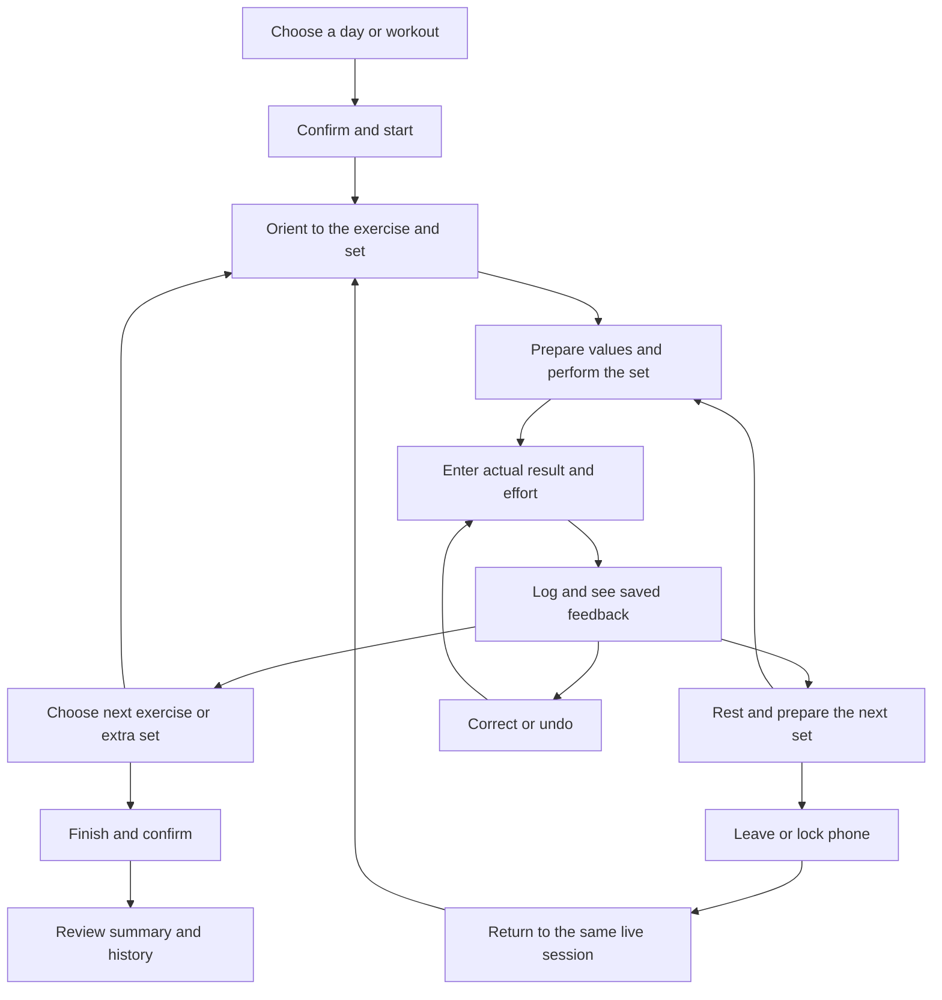

# Temper workflow map

**Research baseline:** 8 October 2026, source commit `eae6517845ee560ceb9695bf2f92788e2b4339cc` (Debug 122).

**Status:** Source-backed desk research plus five owner phone images; fresh runtime acceptance pending.

Read [the brief and boundaries](README.md) before using this map. [S01-S05](EVIDENCE.md#screenshot-register) identify screenshots, not consecutive frames of a single session.

“Prepare,” “record,” and “return” below describe user tasks. They are not proposed new screen names or API states.

## The complete workout journey

The diagram is a research map. Warm-ups, holds, saving failure, and early finish have the specific rules below.

### W01 — Choose today's work or inspect another day

**User's job:** Know what is planned, what is already complete, and whether a workout is live.

**Entry:** Home or return from another tab. **Evidence:** S03.

**Current direction:** Home is the selected day's board with a week picker. Planned session rows confirm before starting. Plan edits the schedule; the Home start sheet offers free workout, routine, cardio, or Extra. The live bar provides return to an existing session.

**Feedback to examine:** Selected date, today, rest/planned/completed states, elapsed session time, saved set count, and remaining rest.

**Exit/recovery:** Choosing a different day must not change the live session. A concurrent start meets the one-live-activity contract; verify the offered route to the existing session rather than inventing a second live workout.

**Source:** [Home decisions](../architecture/ADR-017-home-week-board.md), [start confirmation](../architecture/ADR-018-home-start-confirm.md), [start sheet](../architecture/ADR-021-home-start-and-day-add.md), [HomeScreen](../../app/src/main/java/com/sinura/personaltrainer/ui/home/HomeScreen.kt), [AppNav](../../app/src/main/java/com/sinura/personaltrainer/ui/navigation/AppNav.kt).

**Open research:** Can the owner distinguish today from the selected day and return through the bar without hunting? S03's colored week markers do not establish their meaning.

### W02 — Start and orient to the exercise

**User's job:** Recognize the session, current exercise, set type, position, and next action.

**Entry:** Confirmed planned start or Home start-sheet selection. **Evidence:** Header behind S02; S05 is already scrolled lower.

**Current direction:** Header progress, image/name, Working/Warm-up and a single set-position phrase establish context. Before the first working set the stats show Last. At normal text Best/Volume appear after working work; at font 1.6 and above those move into Details.

**Primary/feedback:** Empty session offers Add exercise. With a repetition lift loaded, entry progresses toward Log set/Log warm-up; an unloaded or missing session cannot commit.

**Exit/recovery:** Back keeps the session live after flushing draft/notes. Missing/loading/retry states require honest feedback.

**Source:** [ADR-027](../architecture/ADR-027-workout-logging-redesign.md), [ADR-030](../architecture/ADR-030-live-workout-set-copy-prepare-stats.md), [primary derivation](../../app/src/main/java/com/sinura/personaltrainer/ui/workout/WorkoutPrimaryAction.kt), [screen](../../app/src/main/java/com/sinura/personaltrainer/ui/workout/ActiveWorkoutScreen.kt).

**Open research:** Does preparation explain the prescription without extra scrolling, and does the owner recognize an extra set versus prescribed work?

### W03 — Prepare values and use coaching

**User's job:** Choose what to attempt while understanding which numbers are editable and which are previous performance or advice.

**Entry:** Loaded lift/prefill, Plan/Last quick fill, or return from rest. **Evidence:** S05; next-set line in S04.

**Code-supported behaviour:** Selecting effort changes effort without replacing weight/reps. Apply copies suggested weight, reps, and effort into the draft, marks it chosen, and persists it; it does not log. Why opens rule/evidence explanation and its use-suggestion action uses the same fill operation. Applied status requires matching values including effort; matching load/reps alone is insufficient.

**Primary/feedback:** Suggestion, selection, current draft, and saved row need distinct meaning. An untouched prefill may follow refreshed advice; user-edited values should retain ownership under the coach contract.

**Exit/recovery:** Ignoring advice leaves the owner free to enter their result. S05's Tempo dismiss affordance is not matched to source; its scope/reset rule remains unknown.

**Source:** [coach contract](../architecture/ADR-029-coach-engine.md), [Apply decision](../architecture/ADR-027-workout-logging-redesign.md), [ViewModel setRpe/applyMicroRec](../../app/src/main/java/com/sinura/personaltrainer/ui/workout/ActiveWorkoutViewModel.kt), [SetMicroRec](../../app/src/main/java/com/sinura/personaltrainer/domain/SetMicroRec.kt), [NextSetRecommendation](../../app/src/main/java/com/sinura/personaltrainer/ui/workout/NextSetRecommendation.kt).

**Open research:** Can the owner state what Apply will change before tapping it? Can the visible recommendation be understood without opening Why?

### W04 — Perform a repetition set, warm-up, or hold

**User's job:** Perform the intended work, with logging and timing appropriate to its type.

**Entry:** Prepared draft.

**Current rules:** A working repetition set needs effort before commit. Warm-ups and holds are exempt. A hold has Start hold, a disabled GET READY lead-in, then Log hold. Holds and the set stopwatch are distinct from the rest timer.

**Feedback/exit:** During GET READY a tap must not accidentally record a one-second hold. A running hold/stopwatch requires stop-and-switch confirmation before changing lift. Cancelling keeps the selection. A running rest alone does not invoke that guard.

**Source:** [effort amendment](../architecture/ADR-026-frontend-redesign.md), [P2b lead-in plan](../owner-eight-plan-2026-09-29.md), [primary actions](../../app/src/main/java/com/sinura/personaltrainer/ui/workout/WorkoutPrimaryAction.kt), [work clocks](../../app/src/main/java/com/sinura/personaltrainer/ui/workout/FloorWorkClocks.kt).

**Open research:** The supplied images do not show warm-up, bodyweight, or hold preparation. Check whether the labels and action changes make sense before adding a different visual treatment.

### W05 — Enter actual result and log

**User's job:** Record what happened, understand why a commit is available, and know when it saved.

**Entry:** After performing the set. **Evidence:** S05.

**Code-supported behaviour:** Log readiness checks the loaded live session, selected exercise, ready or user-edited draft, unlocked entry, and effort when required. Running rest is not a disabling condition. Successful saving clears effort for the next set, exits warm-up/correction/extra-set mode, stops hold/stopwatch, and retains weight/reps.

**Primary/feedback:** The commit names the action and payload. Saving/checking/updating lock the relevant actions. The pressed action identity and frozen set values are checked; rapid duplicate taps cannot silently become Next exercise.

**Exit/recovery:** Failed save retains the frozen command; Retry checks whether that set already persisted before another write. Conflicting state offers Review save and Return to entry. Review save is recovery from a save conflict, distinct from reviewing a finished workout.

If reconciliation finds that the set already saved, the recovered path clears the pending save and resets entry state but does not replay the receipt, success feedback, automatic-rest scheduling, or final-set rest stopping. Do not assume a previously running rest was stopped by that reconciliation. If it proves the set was not saved, Retry can perform the write and use the normal post-save path. Verify those outcomes separately; recovery is not always a replay of a fresh Log tap.

**Source:** [ActiveWorkoutUiState/log handling](../../app/src/main/java/com/sinura/personaltrainer/ui/workout/ActiveWorkoutViewModel.kt), [primary actions](../../app/src/main/java/com/sinura/personaltrainer/ui/workout/WorkoutPrimaryAction.kt), [FloorSetSaves](../../app/src/main/java/com/sinura/personaltrainer/ui/workout/FloorSetSaves.kt), [WorkoutDock](../../app/src/main/java/com/sinura/personaltrainer/ui/workout/WorkoutDock.kt).

**Open research:** S05's subdued Log could reflect missing selected effort or another readiness condition. The green 9 marker cannot establish actual selection. Capture suggested-only versus selected effort and the visible disabled reason.

### W06 — Rest and prepare the next set

**User's job:** See time remaining and enough context to act when ready.

**Entry:** Newly saved working set or manually started rest. **Evidence:** S04, S05; remaining rest in S03.

**Code-supported behaviour:** On the normal post-save path, automatic rest follows a newly saved working set when more prescribed sets remain, after free-lift working sets, and after extra sets. Warm-ups/corrections do not start automatic rest. On that normal path, the last prescribed working set stops existing rest and offers progression. Already-saved recovery does not replay either timer transition (W05). Post-log rest starts after receipt settling; prescribed coach duration precedes routine/default fallback.

**Primary/feedback:** Compact rest card and expanded rest share timer state and command infrastructure. Expanded rest includes exercise, last set, next-set advice where applicable, planned duration, remaining time, and -15/+15/Skip.

**Exit/recovery:** Closing expanded rest pops its route. Hiding a surface is distinct from Skip. Natural completion and Skip have different outcomes. A user may log while rest is running if entry is otherwise ready.

**Source:** [ADR-012](../architecture/ADR-012-rest-and-reminders.md), [post-log handling](../../app/src/main/java/com/sinura/personaltrainer/ui/workout/ActiveWorkoutViewModel.kt), [RestTimer rules](../../app/src/main/java/com/sinura/personaltrainer/domain/RestTimer.kt), [RestCommands](../../app/src/main/java/com/sinura/personaltrainer/ui/workout/RestCommands.kt), [rest screen](../../app/src/main/java/com/sinura/personaltrainer/ui/workout/RestTimerScreen.kt).

**Open research:** What should dominate rest: a quiet countdown, next-set preparation, or advice? Do the planned and actual durations have clear meaning? Extra-set planned-rest alignment and dock Skip scoping need source/decision review before any behaviour change.

### W07 — Leave, lock, and return

**User's job:** Use the phone elsewhere and return without losing the workout or confusing timer controls.

**Entry:** Back, Home/recents/another app, or locking the device. **Evidence:** S01 and S03.

**Code-supported behaviour:** Back flushes draft/notes and leaves the live session. Foreground rest uses a quiet foreground-service notification. Background-unlocked presentation uses shade notification plus draggable overlay when allowed. Locked presentation uses the documented lock-glance path. The exterior timer is an application overlay, not established Picture-in-Picture.

**Feedback/return:** The in-app live bar's main area returns to the session; overflow is independent. The exterior notification and overlay intentionally coexist. The overlay supports drag/resize and a timer-scoped dismiss zone; a one-second difference between screenshots' counters cannot prove a synchronization fault.

**Exit/recovery:** Record the distinction between hiding the overlay, skipping this rest, and ending the workout. Denied overlay/notification/exact-alarm permissions and platform background restrictions need explicit phone checks. Reboot clears short rest under ADR-012; do not promise a live countdown survives reboot.

**Source:** [running presentation](../../app/src/main/java/com/sinura/personaltrainer/timer/RestTimerRunningPresentation.kt), [overlay controller](../../app/src/main/java/com/sinura/personaltrainer/timer/RestTimerOverlayController.kt), [live bar](../../app/src/main/java/com/sinura/personaltrainer/ui/navigation/LiveSessionBarViewModel.kt), [ADR-012](../architecture/ADR-012-rest-and-reminders.md).

**Open research:** Does each dismissal do what the owner expects, and is the return route obvious? Verify lock screen and process-recovery behaviour on the installed build.

### W08 — Switch exercise or do another set

**User's job:** Find current/unfinished work, move intentionally, and retain prepared inputs.

**Entry:** Lift switcher, Skip for now, or primary Next exercise. **Evidence:** S02.

**Code-supported behaviour:** Switcher rows distinguish Current, Complete, and Remaining. Selecting another lift persists the departing draft/stopwatch, clears correction context, and restores the destination's saved draft or loads prefill. Ordinary switch restores a stored stopwatch paused. A correction is not carried across the switch.

**Primary/feedback:** Next exercise chooses the next unfinished lift, wrapping to earlier skipped lifts. Saving does not automatically switch. Add another set explicitly reopens logging after target completion. Free lifts have no prescribed completion target and retain logging.

**Exit/recovery:** Skip for now changes selection without deleting the lift or changing the plan. Remove is separate, with Undo. Add exercise opens the catalogue path. Running hold/stopwatch invokes the guard described in W04.

**Source:** [LiftSwitcherSheet](../../app/src/main/java/com/sinura/personaltrainer/ui/workout/LiftSwitcherSheet.kt), [selection/skip handling](../../app/src/main/java/com/sinura/personaltrainer/ui/workout/ActiveWorkoutViewModel.kt), [WorkoutAdvance](../../app/src/main/java/com/sinura/personaltrainer/domain/WorkoutAdvance.kt).

**Open research:** Is orientation still clear in a long list when the current row is offscreen? Can the owner distinguish Skip for now, Remove, Next exercise, and Add another set?

### W09 — Correct or undo a mistake

**User's job:** Repair a saved result without accidentally creating another set or losing a prepared change.

**Entry:** Saved-set history/chip or an Undo offer. No supplied screenshot shows the full interaction.

**Code-supported behaviour:** Correction changes the primary to Save changes and identifies the editing set. Switching lift clears correction context. Save failure preserves its command for recovery; successful correction does not start a new automatic rest.

**Feedback/exit:** Inspect saved-versus-draft identity, cancel correction, Undo, and any change to counts/history. The end dialog warns when a correction remains unsaved; Save as is retains the previously saved version and offers Back to my change.

**Source:** [WorkoutSavedSets](../../app/src/main/java/com/sinura/personaltrainer/ui/workout/WorkoutSavedSets.kt), [primary actions](../../app/src/main/java/com/sinura/personaltrainer/ui/workout/WorkoutPrimaryAction.kt), [EndWorkoutDialog](../../app/src/main/java/com/sinura/personaltrainer/ui/components/EndWorkoutDialog.kt), [undo offers](../../app/src/main/java/com/sinura/personaltrainer/ui/workout/FloorUndoOffers.kt).

**Open research:** Can the owner identify the set being corrected and predict what navigation will retain? Record actual Undo timing rather than inventing a new dwell budget.

### W10 — Finish early, finish the plan, or discard

**User's job:** End intentionally and understand what will be saved.

**Entry:** Header Finish or dock Finish workout.

**Code-supported behaviour:** Header Finish is available with at least one saved set while entry is unlocked, including warm-up-only work. Dock Finish follows completion of prescribed work with no unfinished lift remaining. Both open End workout? Save as is needs saved work; Leave without saving leads to a separate discard confirmation. Dismissal returns to the workout.

**Feedback/exit:** During correction the dialog offers Back to my change and describes the saved version. Live-bar Finish instead refuses an outstanding correction and directs the owner to the session. Completion stops rest, writes finish, then clears draft. A failed finish must not be documented as preserving a running rest: timer stop precedes completion write.

**Source:** [EndWorkoutDialog](../../app/src/main/java/com/sinura/personaltrainer/ui/components/EndWorkoutDialog.kt), [EndWorkoutCopy](../../app/src/main/java/com/sinura/personaltrainer/domain/EndWorkoutCopy.kt), [FinishWorkout](../../app/src/main/java/com/sinura/personaltrainer/workout/FinishWorkout.kt), [live bar](../../app/src/main/java/com/sinura/personaltrainer/ui/navigation/LiveSessionBarViewModel.kt).

**Open research:** Can the owner distinguish leaving the live screen from finishing and discarding? Check empty session, partial plan, correction, and failed finish separately.

### W11 — Review and trust the result

**User's job:** Confirm recorded work, inspect details, and return to normal app use.

**Entry:** Successful finish.

**Code-supported behaviour:** Navigation opens workout summary and removes the active workout route. Summary Done returns Home; its session action opens Session Detail. Back should not resurrect a completed logger.

**Feedback/recovery:** Review saved sets/counts and units in summary, History, and details. Historical correction is a separate journey to inventory, with effects on summaries/progression checked.

**Source:** [AppNav summary routes](../../app/src/main/java/com/sinura/personaltrainer/ui/navigation/AppNav.kt), [WorkoutSummaryScreen](../../app/src/main/java/com/sinura/personaltrainer/ui/summary/WorkoutSummaryScreen.kt), [SessionDetailScreen](../../app/src/main/java/com/sinura/personaltrainer/ui/history/SessionDetailScreen.kt).

**Open research:** Summary and History are not covered by this screenshot batch. Establish what reassurance and next action the owner needs before redesigning them.

## Validation scenarios

These are agent verification scenarios to execute later, not results or verbatim prompts for an owner study. Their expected outcomes would teach the behaviour being studied. Use the neutral prompts in [the first-study procedure](EVIDENCE.md#how-to-run-the-first-study) for unaided usability observation. Use synthetic records in Temper Debug on a dedicated emulator for mechanical checks; physical interaction and system-surface checks use a suitable dedicated device/fixture without treating the owner's history as disposable.

| ID | Scenario | What to observe |
|---|---|---|
| V01 | Selected historical day while a workout is live | Board date stays truthful; live session is unaffected; bar returns to the same session. |
| V02 | First working set, suggested-only effort, then selected effort | Draft/suggestion distinction and required-effort readiness are visible; touching effort retains entered weight/reps. |
| V03 | Apply and Why → use suggestion | Both fill draft without recording; count does not change until Log. |
| V04 | Log while rest runs; rapid second tap | Ready set saves once; rest is not a readiness gate; second tap cannot silently advance. |
| V05 | Last prescribed set, free lift, extra set, warm-up | Primary action and automatic rest follow each distinct case. |
| V06 | Save failure, retry after an uncertain write, conflict | Frozen values survive; retry reconciles the same set. Already-saved recovery does not replay receipt/success feedback, start automatic rest, or replay the final-set rest stop. Retry of a proven-unsaved set can follow the normal save path. Check a final prescribed set with rest already running; recovery remains understandable without a duplicate row. |
| V07 | Switch away/back with edited input; switch during correction | Per-lift draft restoration matches source; correction does not appear to carry over silently. |
| V08 | Hold lead-in and timed-work switch guard | GET READY cannot log; cancelling switch preserves the selection; stopwatch restoration is clear. |
| V09 | Compact/expanded rest, natural end, Skip, late timer action | All surfaces refer to the intended rest; outcomes are distinct; closing only leaves the surface. |
| V10 | App background, lock, denied permissions, rotation/process restart | Session return, timer truth, and retained input are verified per supported case, not assumed. |
| V11 | Undo, correction, early finish, discard cancellation, failed finish | Counts/draft/save meaning stay clear; end failure is tested including stopped-rest consequences. |
| V12 | Finish → summary → History → detail → return | Saved payload/counts agree; completed logging route does not reopen. |
| V13 | 360×640, 412 dp, landscape; fonts 1.0/1.6/2.0; adaptive 600 dp | Required values/actions remain readable and reachable; include long names, large loads, IME, RTL, TalkBack, reduced motion as relevant. |
| V14 | Enter an actual weight/repetition result different from the suggestion | Exercise both steppers and direct entry, fractional loads in supported units, incomplete/invalid input, correction, keyboard dismissal, and commit reachability. Confirm displayed units and the saved result match the intended actual result; record the interaction cost rather than assuming Apply is the normal path. Check bodyweight/hold field meaning in their relevant variants. |

For each executed task record commit/build, fixture, environment, action sequence, expected and observed result, artifact, limitation, and owner feedback. [ADR-032](../architecture/ADR-032-jvm-evidence-lanes.md) defines native render evidence; [DEVELOPMENT](../DEVELOPMENT.md) defines the gate.

V14 reuses UX06/F10 rather than opening a duplicate input backlog. [WeightRepsEditor](../../app/src/main/java/com/sinura/personaltrainer/ui/workout/WeightRepsEditor.kt) opens [NumberEntryDialog](../../app/src/main/java/com/sinura/personaltrainer/ui/components/NumberEntryDialog.kt); confirming that dialog changes the draft. [NumericEntryTest](../../app/src/test/java/com/sinura/personaltrainer/domain/NumericEntryTest.kt) covers parsing rules, which do not by themselves prove control discoverability or keyboard usability.

## Whole-app inventory and expansion order

The table identifies research coverage, not implementation priority or permission to add features.

| Area | User's job / connection to workout | Research coverage now | Next evidence |
|---|---|---|---|
| Home | Understand selected day, start, return | S03 plus W01 and sources | Planned/rest/empty/completed states and start confirmation |
| Active workout / lift switcher | Prepare, record, recover, progress | S02/S05; W02-W05/W08-W10 | First set, completion, correction, save/retry states |
| Rest / system surfaces | Rest and retain continuity | S01/S04/S05; W06-W07 | Done/idle, denied permissions, locked/background transitions |
| Summary / History / session details | Trust completion and repair records | Source-backed W11 | Complete summary/detail/correction journey |
| Plan / routine editor | Build and maintain useful training | Inventory only; [Plan](../../app/src/main/java/com/sinura/personaltrainer/ui/plan/PlanScreen.kt), [editor](../../app/src/main/java/com/sinura/personaltrainer/ui/routines/RoutineEditorScreen.kt) | Edit/save/failure, ordering, recurrence and start relationship |
| Library / exercise details / pickers | Find or understand a lift | Inventory only; [Library](../../app/src/main/java/com/sinura/personaltrainer/ui/library/ExerciseLibraryScreen.kt), [details](../../app/src/main/java/com/sinura/personaltrainer/ui/exercise/ExerciseDetailScreen.kt) | Search/filter/empty/custom-lift journey and return context |
| Body | Understand training coverage | Inventory only; [ProgressScreen](../../app/src/main/java/com/sinura/personaltrainer/ui/progress/ProgressScreen.kt) | Day/week/month, selection/legend/list, empty state |
| Cardio / backdated activity | Record other training honestly | Inventory only; [live cardio](../../app/src/main/java/com/sinura/personaltrainer/ui/activity/LiveCardioScreen.kt), [composer](../../app/src/main/java/com/sinura/personaltrainer/ui/activity/ActivityComposerScreen.kt) | Start/leave/finish and dated-entry flows |
| Onboarding | Establish a usable plan without confusion | Inventory only; [OnboardingScreen](../../app/src/main/java/com/sinura/personaltrainer/ui/onboarding/OnboardingScreen.kt) | Guided/custom path, interruption, plan acceptance |
| Settings / recovery / account | Understand preferences, permissions, backup and optional account | Inventory only; [Settings](../../app/src/main/java/com/sinura/personaltrainer/ui/settings/SettingsScreen.kt), [privacy](../PRIVACY.md) | Unit/rest preferences, denied permissions, export/restore, honest account status |

Deepen Home/start, completion/review, and exercise discovery first because they surround the core loop. Then extend planning, Body, cardio, setup, and Settings as the owner's tasks warrant. Every inventory-only row requires current evidence before design conclusions.
