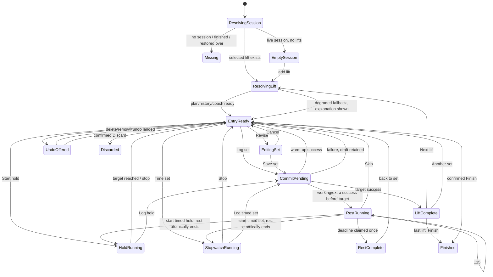

> This is a recommendation, not current law.

# Temper workout-entry experience

**Critical design recommendation — gym-floor strength session**

**Audited revision:** `origin/trunk` at `d077d81949265627aaffb286269078e11a9df9e6`  
**Included:** Live 65, floor redesign Packets 1–5, and progression engine squash `c38a4c19`  
**Scope:** Read-only UX, interaction, accessibility, feedback, and implementation analysis  
**Decision level:** Recommendation. Accepted ADRs and `docs/FOUNDATION_PROGRAM.md` remain law.

## Evidence and confidence

This report is based on the shipping Compose implementation, domain rules, ViewModels,
repositories, timer service, and tests at the audited revision. The primary paths inspected
were:

- `ui/workout/ActiveWorkoutScreen.kt`, `ActiveWorkoutViewModel.kt`,
  `WorkoutLiftCard.kt`, `WorkoutLogBar.kt`, `WorkoutHeader.kt`,
  `RestTimerScreen.kt`, and `RestTimerViewModel.kt`
- `ui/components/SetEntryPanel.kt`, `SnapWheel.kt`, `RestTimerUi.kt`,
  `InstrumentChip.kt`, `SetTable.kt`, `GymStatus.kt`, and `PinnedDock.kt`
- `domain/FloorEntryWheels.kt`, `FloorTimerSurface.kt`, `WorkoutAdvance.kt`,
  `SetMicroRec.kt`, `Coach.kt`, `RuleTrace.kt`, `RestTimer.kt`,
  `RestPrescription.kt`, `WarmupRamp.kt`, and `SetLogRules.kt`
- `data/repository/WorkoutRepository.kt` and the rest timer service, notification,
  persistence, and alarm paths
- `docs/FOUNDATION_PROGRAM.md`, accepted records in `docs/architecture/`,
  `docs/DESIGN_AUDIT.md`, current evidence documents, recent packet commits, and
  workout UI/domain/device tests

No emulator was connected on this worker. That did not block the audit: the severe findings
below are explicit state and event behavior in current code. Visual judgments are based on
the actual Compose hierarchy, token use, dimensions, and copy. Confidence is **high** on the
interaction findings and **medium-high** on the final visual density until the first phone
prototype is seen. The missing `active-strength-populated-api29` page golden is itself an
evidence gap: `GoldenPageCatalog` names it, but only the substrate gallery is committed.

---

## 1. Executive verdict

Temper has a trustworthy underlying workout record and a serious timer foundation. It does
not yet have a professional gym-floor entry interaction.

The current screen is a collection of individually thoughtful parts that do not form one
coherent instrument. It still behaves like a vertically scrolling form with a permanent
control dock attached. Recent packets fixed important details—large Log, standing advance,
one timer gateway, optional stopwatch, deterministic advice, and undo—but they also exposed
or introduced contradictions:

1. **RPE is available only while rest is running.** It disappears before the first set,
   after rest completes, after warm-ups, and on a final set—the moments when the lifter
   actually needs to rate the set before logging it.
2. **Tapping the already-selected lift re-runs prefill and can overwrite a hand-entered
   draft.** A stray tap on the largest identity target can replace the weight and reps with
   the coach or plan values without a warning.
3. **The wheel can show one value while the draft retains another.** `SnapValueWheel`
   permanently exempts the page on which it first opened. After moving away and scrolling
   back to that original page, the wheel can display the original numeral but suppress the
   write, leaving Log set pointed at the previously committed value.
4. **The “one clock” design is not one visible clock.** A running rest/set value appears in
   the header instrument strip and again in the bottom dock, beside a second-by-second
   session elapsed clock. The same active timer is duplicated.
5. **`Start next` is always rendered in idle rest, even when there is no valid next action.**
   It is a live-looking button that often does nothing. When advance is valid, it duplicates
   the Volt `Next lift` action directly below it.
6. **An empty free workout still gets rest controls.** A person can start a rest before a lift
   exists, while the actual task—Add a lift—is in the scrolling body.
7. **A success haptic fires before validation and before the database write.** Invalid or
   failed logs can feel successful. A rapid second tap can also feel committed even though
   the double-write guard correctly rejects it.
8. **Per-lift prefill has no visible loading/ready state and no dirty guard.** Log can become
   available while history/progression prefill is still resolving; a late result can replace
   a user edit.
9. **Hold and set stopwatch time is ViewModel tick state, not derived from a monotonic
   timestamp.** Scheduler stalls or process death can undercount or lose an in-progress timed
   set. Rest itself is much stronger and uses elapsed realtime, persistence, timer identity,
   and an alarm.
10. **Undo is a single volatile slot.** A second delete/remove replaces the first offer, and
    process death loses the promise. The repository reversal is sound; the host model is not.
11. **The progression presentation is ahead of its evidence.** Production still calls
    `SetMicroRecCalculator.suggest` rather than `Coach.decide`; the façade is exercised only
    by equivalence tests. Micro-rec traces omit the thresholds and alternatives that would
    make Why genuinely explanatory.

### Professional-quality score

| Area | Verdict | Why |
|---|---|---|
| Durable set record | Strong | Transactional numbering, validation, process draft recovery, duplicate-log guard |
| Rest alarm | Strong | Unique generation, elapsed realtime, exact/best-effort result, non-negative shade, completion claim |
| Entry interaction | **Not acceptable yet** | Wheels are slow, vertically gesture-conflicted, non-direct, and can diverge from the logged draft |
| Focus and hierarchy | Needs redesign | Every lift remains a card in one long list; selected card, entry, sets, notes, timer, and dock compete |
| Post-log clarity | Needs redesign | New row can remain below the fold; haptic precedes success; timer change carries too much of the confirmation |
| Progression UX | Promising, incomplete | Local, deterministic, Why and Use exist; trace and override presentation are too cryptic |
| Accessibility | Partial | Good semantics in several controls; no physical TalkBack closure, glyph-only fields, fixed wheel heights, hard dwell |
| Visual finish | Coherent palette, unprofessional composition | Instrument tokens are good; glyph-only labels, repeated Volt frames, and stacked chrome read as a prototype |

### Visual-design problems versus interaction-model problems

**Visual design**

- Two 120 dp wheel windows dominate the current lift card before RPE, history, or context.
- Four custom glyphs replace ordinary field labels. They save little space and require the
  user to learn private iconography under glare.
- Volt appears as selected-card border/fill, wheel selection frames, selected chips,
  recommended chips, `Use`, and the 72 dp Log button. The action color no longer belongs
  clearly to the action.
- The card header tries to carry picture, lift ordinal, name, muscle, equipment, set count,
  rest time, and overflow at once.
- The recommendation and warm-up ramp use caption/tertiary treatment despite affecting the
  next set.
- The live screen has no committed page golden, so visual regressions are protected mainly by
  source-string tests and intent flags rather than an actual rendered baseline.

**Interaction model**

- RPE visibility is coupled to rest state rather than set-entry state.
- Selecting the selected lift changes data.
- Wheel gesture and page state can disagree.
- Vertical wheels sit inside a vertical session list, so the same one-handed gesture means
  “change my weight” or “move the page” depending on where the thumb lands.
- `Start next` can be a no-op and can duplicate Next lift.
- Rest, session elapsed, hold, and stopwatch do not yet obey one visible-clock rule in the UI.
- Log feedback acknowledges intent, not durable success.
- Async prefill can race user input.
- Set timing and undo do not fully survive interruptions.

**Verdict:** do not add more polish around the current wheels. Preserve the data model,
timer engine, deterministic coach, large dock, and undoable operations; replace the entry
and state-transition layer.

---

## 2. Current-state walkthrough and failure points

### 2.1 Starting a session

**What works**

- A planned Home row confirms before starting. Home’s start sheet offers free, routine,
  cardio, and Extra without adding a tab.
- A second live activity is blocked by the one-live-session invariant.
- Start errors are caught and surfaced.
- A routine starts with its copied exercise targets; a free workout opens an honest Add a
  lift empty state.
- A stale or missing session becomes a terminal “Workout missing” state instead of an
  infinite spinner.
- Close and system back leave the session live; Finish owns save/discard.

**Where it fails**

- Session readiness and selected-lift readiness are treated as the same thing. Once the Room
  session row arrives, the screen can draw `0 × 5` and enable Log while progression,
  last-time evidence, and rest prefill are still loading.
- A fast tap can receive a heavy commit haptic, then a zero-weight validation error.
- Free-workout empty state puts Add a lift in content but mounts an unrelated rest dock.
- The current session title and four metric cells consume substantial top height before the
  current lift.
- There is no explicit “Lift 1 of 6” focus model. The whole routine is still a vertical stack
  of cards, one expanded in place.

### 2.2 Lift focus and interruption

The ViewModel correctly repairs an invalid selected exercise ID to a real session lift and
restores the selected ID/draft through cache and `SavedStateHandle`.

The interaction remains unsafe:

- Tapping another lift abandons the one per-session draft; returning can prefill again rather
  than restore what was being prepared for that lift.
- Tapping the current lift deliberately triggers reselection prefill. This is not an
  affordance a user can predict.
- There is no automatic visual focus to the selected card after a resume or external
  navigation.
- Swap/remove disappears entirely once a lift has any set, so the menu cannot explain why an
  action is unavailable and offers no “Skip for now.”

In a gym, interruption is normal: equipment is occupied, someone asks a question, the phone
locks, or the next machine becomes free. A professional entry surface must preserve an
unfinished draft per lift and make switching explicit, not destructive.

### 2.3 Weight

The current floor weight is a three-row `VerticalPager`, 120 dp high, stepping 2.5 kg or
5 lb through as many as 161 kg pages or 201 lb pages. It has a centered Volt frame and a
24 dp glyph; there is no direct typing path on the live floor.

Strengths:

- The settled value is discrete.
- The Log payload names the unit and value.
- Bodyweight lifts correctly omit meaningless weight.
- Barbell rows can show plate math.
- Haptics mark a settled detent.

Failures:

- Large corrections require repeated flings with no deterministic landing.
- A vertical fling can be stolen by or mistaken for page scrolling.
- A phone lying on a bench invites accidental wheel movement while the user tries to scroll.
- Gloved or wet fingers are poor at controlled short flings.
- The field’s meaning—lifted, added, or assistance—is hidden behind a custom glyph for
  sighted users.
- Machine-stack and dumbbell jumps are not the floor wheel’s step even though the progression
  engine now knows equipment-specific increments.
- Returning to the wheel’s original parked page can leave displayed and stored values out of
  sync.

This is the most serious control failure because the number can look right and still log
wrong.

### 2.4 Reps and hold time

Reps use the same wheel, 1–100 by one. Holds use 5-second pages. Holds are correctly stored as
duration with reps `0`, not as a fake one-rep set.

Failures:

- Reps rarely need a high-velocity browse control. They usually change by one or are typed
  directly.
- A three-row 120 dp control is excessive for a one-digit count.
- Hold time disappears when running, then the dock changes to an elapsed display; this is
  conceptually sound but not introduced clearly.
- The first press of the dominant button on a hold starts timing rather than logging. Copy
  changes to `Start hold`, but there is no timed-set cue at completion and no durable
  monotonic deadline.
- Manual stopwatch timing is similarly ephemeral and can undercount after scheduling stalls.

### 2.5 Warm-up

Warm-up is a 48 dp selectable chip and changes the primary copy to `Log warm-up`. Warm-up
sets do not count toward working-set progress and do not auto-start rest. Those are correct.

The new progression engine computes a 40/60/80 percent ramp, but the floor renders it only
as a quiet line such as `Warm up 40 · 60 · 80 kg`. None of those values is directly usable.
The user must perform the longest possible wheel changes precisely in the phase where
several weights are intentionally far apart.

Persisted `setNumber` includes warm-ups and working sets in one sequence, while progress
counts working sets only. The table can therefore show warm-up Set 1 and first working
Set 2 while the lift progress says 1/3. The database order is sound; the visible ordinal is
not.

### 2.6 RPE

The five equal chips, 6–10, are the right basic control. They are selectable, can be cleared,
fit at 360 dp/font 2.0, and can show a recommendation without selecting it.

The visibility rule makes them unusable as a consistent record:

- first set: hidden;
- ordinary set while previous rest is running: visible;
- rest reaches zero before the set: hidden;
- after warm-up: hidden because no rest starts;
- final prescribed set: likely hidden because the previous rest may have completed and no
  new rest starts.

RPE belongs to the set being committed. Timer state must not decide whether the typed set
field exists.

### 2.7 Log set

Current strengths:

- 72 dp, full-width, bottom-pinned Volt action;
- copy includes the full payload;
- changes to `Log warm-up`, `Save set`, `Start hold`, `Log hold`, or `Next lift`;
- disabled while the write coroutine is in flight;
- ViewModel guard rejects a second Log call;
- repository transaction assigns a unique contiguous set number;
- the draft snapshot being logged is isolated from edits made for the next set during the
  write.

Current failures:

- Heavy haptic occurs before validation and persistence.
- Disabled state has no `Logging…` or progress state.
- The row added by the write is below the entry surface; bring-into-view targets the entry,
  not the receipt. The strongest success evidence can remain off-screen.
- A database failure leaves the numbers, which is correct, but the error is generic dock text
  and follows a false success haptic.
- Finish is enabled when the session has zero sets, although the domain then refuses Finish.
  The UI knowingly offers a path whose only result is an error.

### 2.8 Post-log, rest, and timing

After a successful ordinary working set:

- the set row is inserted;
- warm-up and RPE clear;
- weight and reps remain for fast repeat sets;
- a personal record may show;
- rest starts unless it was a warm-up or the final prescribed set;
- a micro-recommendation appears with Why and optionally Use.

That data behavior is mostly right. Presentation is not:

- Rest in the bottom dock and the same rest state in the header duplicate the active clock.
- Session elapsed also updates every second beside them.
- Compose runs final-ten-second haptics while the timer service can also vibrate for the
  final-five ticks, risking doubled pulses when the app is visible.
- Running rest has only Skip in the compact dock; duration correction lives on the full rest
  page.
- Idle rest expands a 144 dp wheel inside the dock, making the permanent lower chrome much
  taller.
- The first-rest battery warning can add another row to the dock.
- The full rest page is much clearer: a single ring, last set, next line, presets/custom,
  ±15/Skip, and Back to the bar. It should remain a detail surface, not be copied onto the log.

The rest engine itself is professional: elapsed-realtime deadline, unique timer ID, stale
alarm rejection, exact/best-effort result, persisted row, frozen 0:00, screen-off
notification, completion cue, and reboot clearing.

### 2.9 Stopwatch and hold transitions

Packet 3 correctly made set duration optional and avoided writing a duration if the stopwatch
was never used. However, the interaction contract says starting the stopwatch does not cancel
a pending rest alarm. Even though the current UI normally makes the user Skip rest before
`Time set` appears, the state model permits a hidden rest to remain armed while the visible
clock changes to SET. That can produce a rest alarm during a set and means “one visible clock”
is not “one active clock.”

The recommended state machine below makes the transition atomic: starting a timed set ends
the rest generation, then starts the set clock.

### 2.10 Next lift and Another set

The standing choice is a major improvement over timed auto-advance. The session stays on the
finished lift until the user acts.

Current problems:

- `Start next` in the idle rest row duplicates `Next lift` when advance is valid.
- `Start next` remains enabled-looking when advance is invalid.
- The primary action says only `Next lift`; `PendingAdvance` already holds the next lift’s
  name, but the UI does not show it.
- An `Add set` action also appears under the set table, creating a second Another-set route.
- On the last lift, there is no next ID, so the ordinary Log action can remain active past the
  prescription without first asking for Another set.
- Derived resume state and immediate post-log state use different next-lift selection logic;
  one uses the immediate next item and one can choose the next unfinished item.

### 2.11 Progression and Why

What must remain:

- all recommendations are local and deterministic;
- the recommendation never logs or silently rewrites the plan;
- Use fills the draft only;
- the user can keep or enter different values;
- Why renders offline from `RuleTrace`.

What is unprofessional today:

- `HOLD`, `+2.5`, and `BACK OFF` are meaningful only after the private icon/copy language is
  learned.
- The main line, caption, warm-up line, Why, and Use can stack above the dock’s dominant
  action.
- Micro-rec Why mostly repeats output facts. `RuleTrace.forMicroRec` records next weight,
  reps, and RPE but not the evidence, increment, target, RPE thresholds, rest threshold, or
  alternatives that produced them.
- `RuleTraceCopy` does not render alternatives.
- “Override” is technically possible by ignoring Use, but it is not named in Why.
- `Coach.decide` is not yet the production call site, so the architecture claim and actual
  floor authority are not aligned.

### 2.12 Revise, delete, remove, skip, and undo

Strengths:

- Any set row can be selected and revised.
- Editing preserves set identity, time, and ordinal.
- Delete and renumber are one transaction.
- Delete latest stops the associated rest.
- Undo restores the exact ID and completion time and deliberately does not invent a new rest.
- Removing an unlogged lift is transactional and restores the same position.
- A lift with logged work cannot be removed or swapped into a different identity.

Failures:

- A set row does not visibly advertise that it opens actions.
- Revise/Delete appear as icon-only trailing actions after row selection.
- Only one delete/remove undo can exist; the next action silently expires the previous
  reversal.
- The 6-second dwell is not extended with Android’s recommended accessibility timeout.
- Undo state survives recomposition/rotation through the ViewModel but not process death.
- There is no “Skip this lift for now” action. Remove is data destruction; selecting another
  card is an indirect skip.

---

## 3. Design principles and non-negotiables

### Binding law

The redesign must preserve:

1. **Instrument only:** dark-only, semantic tokens, tabular numerals, no raw colors, no
   second visual language.
2. **One filled Volt act per state:** on the entry surface that is Log set. A contextual
   completion state may replace it with Next lift, but never add a second filled action.
3. **Five-tab IA:** Active Workout and Rest remain pushed routes. No sixth tab. Library and
   Goals do not move onto the bar.
4. **Offline deterministic authority:** recommendation, progression, Why, and override work
   locally. No LLM authors a load, set, routine, plan, or record.
5. **One live activity:** no second live workout or independent foreground clock.
6. **Typed strength record:** weight, reps or duration, RPE, warm-up, and completion identity
   stay honest.
7. **One timer source of truth:** rest keeps the unique ID, elapsed realtime, persistence,
   exact/best-effort result, notification, and completion claim.
8. **No overlay rest clock:** notification and the pushed Rest page remain the off-screen and
   detailed surfaces.
9. **Recommendations explain and never seize control:** Why plus explicit Use; manual input
   always wins.
10. **No schema reset or destructive fallback:** this redesign needs no schema change.
11. **Targets:** 48 dp absolute minimum, 56 dp gym control, 72 dp commit; 360/412/600 dp,
    font 1.0/1.6/2.0, TalkBack, reduced motion, RTL where relevant.
12. **Cheap destructive operations use Undo; irreversible session end remains confirmed.**

### Product principles

1. **The next physical act is always obvious.** The screen answers only: what lift, what set,
   what numbers, and what to tap now.
2. **The displayed payload is the committed payload.** No animation, prefill, or wheel state
   may show a number different from the draft snapshot.
3. **No live-looking dead controls.** A control is hidden, disabled with a reason, or acts.
4. **Defaults remove work; they never remove agency.** Repeat sets should require only Log.
   Large or unusual changes must still be direct.
5. **One visible ticking clock.** Session elapsed is rounded to minutes; rest/hold/stopwatch
   owns the sole seconds-changing numeral.
6. **State change follows cause.** A set receipt appears before rest motion. A durable success
   haptic follows the write, never precedes it.
7. **Every important state has two channels.** Text or icon plus color; motion or haptic never
   carries meaning alone.
8. **Interruption is normal.** Draft per lift, timer deadline, pending undo, and current focus
   must recover calmly.
9. **The lower third is the action zone.** Commit, timer correction, advance, and Undo stay
   reachable with one hand.
10. **Progression advises in the entry surface, not in the permanent dock.** The dock is for
    time and commitment.

---

## 4. Recommended screen anatomy

Dimensions below are content dimensions in dp, plus normal status/navigation insets. They are
floors; text may add height at font 2.0 instead of clipping.

### 4.1 Baseline portrait: 360 × 800 dp

```
┌──────────────────────────────────────┐
│  TOP STRIP · 56 + 40 dp              │
│  ×  Lower A                Finish    │
│     18 min · 7 sets · 2,340 kg       │
├──────────────────────────────────────┤
│  CURRENT LIFT · 88 dp                │
│  [still] Back Squat       Lift 1/6   │
│          Barbell            2 / 4 ▾  │
├──────────────────────────────────────┤
│  ENTRY SURFACE · scrolls              │
│  SET 3 OF 4                          │
│  HOLD · 100 kg × 6      Why · Use    │
│  [ −2.5 ][  100 kg  ][ +2.5 ]        │
│  [  −1  ][   5 reps ][  +1  ]        │
│  RPE (optional) [6][7][8][9][10]     │
│  Recent sets / warm-up ramp           │
├──────────────────────────────────────┤
│  ONE CLOCK ROW · 56 dp               │
│  REST 1:24       −15   +15   Skip    │
│  LOG SET · 72 dp                      │
│  Log set · 100 kg × 5                │
└──────────────────────────────────────┘
```

### 4.2 Top strip

**Row A — session chrome**

- Height: **56 dp**
- Horizontal gutter: **8 dp outer / 8 dp internal**
- Close: **48 × 48 dp**, left
- Session title: flexible, one line at font ≤1.6; two lines allowed at 2.0
- Finish: at least **64 × 48 dp**, right
- Finish is disabled with accessible reason until one set exists. In an empty free workout,
  the quiet alternative is Discard, not a failing Finish.

**Row B — session telemetry**

- Height: **40 dp** at font ≤1.6; **48–56 dp** at font 2.0
- Order: rounded elapsed minutes · working set count · work/volume
- Elapsed updates once per minute and says `18 min`, not `18:04`
- No rest, hold, or stopwatch numeral here
- Tapping opens session details/timer page only if it has a clear label; it does not duplicate
  timer controls
- At 360/font 2.0, retain elapsed and sets; move volume into the details sheet rather than
  ellipsizing identity

This keeps useful session context without creating a second ticking clock.

### 4.3 Current-lift card

- Show **one current lift**, not every routine lift as cards in the entry list.
- Height: **88 dp** at font ≤1.6; **104 dp maximum** at font 2.0
- Gutter: 16 dp; inner padding: 12 dp
- Picture: **56 × 56 dp**
- Primary line: lift name, two lines maximum
- Secondary line: equipment/load meaning
- Right column: `Lift 1/6`, then working progress `2/4`
- Whole card target: at least **72 dp** high
- Tap opens a bottom sheet listing all lifts and progress. It never resets the draft.
- Overflow remains **48 × 48 dp** and offers: Change equipment/lift when legal, Skip for now,
  Remove when legal, and an explanation when logged sets prevent identity changes.

The lift-switcher sheet uses existing pictures, names, progress, and rest state. Selecting a
lift restores that lift’s draft and scrolls the entry surface to its top.

### 4.4 Entry surface

The center is the only scrolling region.

Order:

1. **Set context:** 32–40 dp, `SET 3 OF 4`; `WU 2` or `EXTRA 1` when relevant.
2. **Recommendation strip:** 52 dp collapsed, content-driven at font 2.0. Plain call + payload,
   then Why and Use. Hidden only when no recommendation exists, never because the clock
   changed.
3. **Warm-up controls:** conditional 48–104 dp; ramp chips before the first working set.
4. **Weight field:** 88 dp baseline; 96 dp at font 2.0.
5. **Reps or target-time field:** 80–88 dp.
6. **RPE:** label plus five 48 dp chips, always present for a working-set draft.
7. **Recent sets:** latest two rows by default; `All sets` expands. Each row is at least 56 dp.
8. **Notes:** remove from the normal log loop. Put in overflow or Finish.

At 360/font 2.0, the surface scrolls; the field controls do not shrink and the dock never
moves. At 412 dp, use 20 dp side gutters but keep one column. Do not put weight and reps side
by side: the saved height is not worth halving the targets.

### 4.5 Bottom dock

The stable dock has two layers:

1. **Clock/action row:** **56 dp**, Surface1, hairline above
2. **Commit:** **72 dp**, full-width Volt, 16 dp side gutter

Total stable content height is approximately **152–160 dp plus navigation inset**.

Rules:

- Only the dock displays a ticking rest/hold/set value.
- Idle rest shows `Rest 1:30` with quiet −15/+15 and Start only when manual start is useful.
- Running rest shows `REST 1:24 · −15 · +15 · Skip`.
- Hold shows `HOLD 0:18` and no rest controls.
- Stopwatch shows `SET 0:18 · Stop`.
- No `Start next` in the generic timer row.
- Notification/battery/persistence warnings appear as one compact row immediately above the
  clock and never cover Log.
- Error, success receipt, or Undo is one anchored host above the dock. It must not push the
  commit below the navigation bar.

**Lift-complete variant**

- Replace the clock row with a **72 dp next-lift preview**: 40 dp still, next name, planned
  work, and a 48 dp `Another set` secondary action.
- The same Volt slot becomes `Next lift · Seated row`.
- On the last lift, the slot becomes `Finish workout`; `Another set` remains secondary.
- Choosing Another set restores the entry state and the Volt returns to `Log set`.
- There is still exactly one filled action.

---

## 5. Exact interaction specifications

### 5.1 Weight — pick: stepper plates + direct keypad

**Default**

- Prefill from, in order: preserved dirty draft; explicit user-applied recommendation; planned
  target; last completed working set; zero only when the load type permits it.
- Show a small source label: `Plan`, `Last time`, or `Suggested`. It is information, not a
  chip selection.
- Once the user touches weight/reps/RPE/warm-up, mark that lift draft dirty. Async prefill may
  no longer replace it.

**Control**

- Left `−step`: **64 × 72 dp**
- Center numeral: flexible, at least **152 × 72 dp**, clear `WEIGHT` text label and unit
- Right `+step`: **64 × 72 dp**
- A tap changes one discrete step and gives one light detent.
- Hold repeats after **450 ms**, maximum **5 changes/second**; release or pointer exit stops
  immediately. Do not use the current 60 ms fast repeat.
- Step comes from the same equipment-aware increment table as progression. If equipment
  cannot express the real stack, the user’s direct value remains legal.

**Direct entry**

- Tapping the center opens the existing strict numeric parser in a bottom sheet/dialog with
  the system decimal keypad.
- Existing value is selected.
- Show unit and an example.
- Invalid input never mutates the draft; the error states the rule.
- Confirm closes and focuses the weight field. Cancel changes nothing.
- Decimal comma remains accepted.

**Presets**

- Do not show a row of arbitrary weight chips.
- Show only context-bearing actions when available: `Plan 100`, `Last 97.5`, `Suggested 102.5`.
- Tapping one changes the draft and is explicitly reversible by the normal controls.

### 5.2 Reps — pick: stepper + direct keypad

- Same three-part control, step one.
- Left/right targets at least **64 × 64 dp**.
- Center says `5 reps`; tap opens whole-number keypad, 1–100.
- Hold repeat starts after 450 ms at no more than 5/second.
- Preserve the rep value after Log for fast repeated sets.
- For bodyweight lifts, this becomes the first and visually largest field.

### 5.3 Hold duration — pick: stepper + direct keypad, then the one clock

- Draft control uses −5/+5 seconds and direct seconds/mm:ss entry.
- Primary copy before timing: `Start hold · 0:30`.
- Start:
  1. atomically ends any running rest generation;
  2. stores monotonic start/deadline state;
  3. switches the sole dock clock to HOLD;
  4. changes the Volt copy to `Log hold · elapsed`.
- At target, give the restrained timed-set cue and leave `Log hold · 0:30` ready. Do not
  auto-log.
- Early Log stores honest elapsed seconds, minimum one.
- Rotation/recreation derives remaining/elapsed from the timestamp. Process recovery restores
  a running hold or an honest stopped elapsed value.
- Holds remain typed duration with reps `0`.

### 5.4 Optional set stopwatch — pick: explicit count-up in the clock row

- Quiet action `Time set` appears only when rest is idle/complete and the lift is not a hold.
- Starting it atomically closes a live rest if a race left one active; a hidden rest alarm may
  never ring during the set.
- Clock counts from monotonic start time rather than incrementing a mutable integer once per
  coroutine wake-up.
- `Stop` freezes elapsed but keeps `used=true`.
- Logging stores duration only when used.
- Lift switch asks `Stop timing and switch?` only while actively running; a stopped stopwatch
  follows its current lift draft.

### 5.5 RPE — pick: five always-visible chips

- Label: `RPE · OPTIONAL`
- Values: 6, 7, 8, 9, 10; equal width; each at least **48 × 48 dp**
- One tap selects; tapping selected clears it.
- Visible for every working-set draft, independent of rest.
- Warm-up mode hides/disables RPE with the visible reason `Warm-up`.
- Sighted first-use helper can say `6 = four reps left · 10 = max`; dismiss permanently.
- TalkBack names each value and meaning: `RPE 8, about two reps left, not selected`.
- Recommendation may outline a chip but never select it.
- Selecting RPE never changes weight or reps. Use on the recommendation is the only action
  that applies those values.

### 5.6 Warm-up — pick: explicit mode plus generated ramp chips

- Warm-up is a 48 dp chip above weight, separate from RPE.
- When a ramp exists and no working set has been logged, show up to three equal actions:
  `40% · 40 kg`, `60% · 60 kg`, `80% · 80 kg`.
- Tap sets weight and Warm-up, but does not log.
- After Log, advance visual emphasis to the next unused ramp value; do not auto-apply.
- Warm-up Log never starts rest, never increments working progress, and clears Warm-up after
  durable success.
- Display warm-up rows as `WU1`, `WU2`, not working Set 1/2. Persisted order can remain
  unchanged.
- Bodyweight/assisted lifts omit a percentage ramp when `WarmupRamp` returns empty.

### 5.7 Set number and repeated sets — pick: automatic ordinal

- No set-number input.
- Working draft says `Set N of target`.
- Warm-ups say `WU N`.
- Past target says `Extra N`, never `Set 6 of 5`.
- Delete/reorder derives visible ordinals again; repository keeps contiguous storage numbers.
- After a normal Log, retain weight and reps. Clear only per-set Warm-up and RPE, matching
  current fast-repeat behavior.
- “Repeat set” does not need a button when the draft already retains the numbers.

### 5.8 Log set

**Enabled only when**

- session and selected lift are resolved;
- per-lift prefill is ready or has degraded to planned/manual values;
- the displayed draft is valid;
- no commit is already in flight;
- hold timing requirements are satisfied.

**Tap contract**

1. Capture an immutable visible payload.
2. Lock the commit action immediately.
3. Give only a subtle press response—not a success haptic.
4. Validate the same payload shown on the button.
5. Write transactionally.

**Success**

1. Insert/update receipt appears: `Set 2 logged · 100 kg × 5 · RPE 8`.
2. One commit haptic fires.
3. New row settles over 150–180 ms; reduced motion shows it immediately.
4. Timer state changes after the receipt.
5. Button unlocks with the next draft.

**Failure**

- No success haptic, no rest start, no draft clearing.
- Reject double-pulse once.
- Error anchors to the field or commit: `Could not save. Your set is still here. Try again.`
- Retry uses the same visible payload unless the user edits it.

**Rapid taps**

- A second tap during commit is absorbed silently; do not haptic it.
- A weight/reps change during the write belongs to the next draft, as current tests require.
- The success receipt states the captured payload so there is no ambiguity.

### 5.9 Rest

**Auto-start**

- Working set before target: start prescribed rest.
- Warm-up: no auto-start.
- Final prescribed set: show the advance state; manual Rest remains available in the timer
  detail if wanted.
- Extra set: start rest.
- Edit/undo: never invent rest.

**Idle**

- Show `Rest 1:30`, not a countdown.
- −15/+15 edit directly within 15 seconds–30 minutes.
- Tap value opens presets: **0:30, 1:00, 1:30, 2:00, 3:00, Custom**.
- Custom accepts seconds or mm:ss.
- Start is shown only when manually starting rest is meaningful.

**Running**

- Sole ticking clock in dock.
- −15, +15, Skip are 48–56 dp.
- Tap clock opens the existing full Rest page.
- Adjustment mints/updates through the same timer gateway; stale alarms remain unable to end
  the replacement generation.
- At zero: freeze 0:00, one completion claim, completion cue, then `Back to the bar`.

**Capability honesty**

- Notification denied: retain compact recovery row.
- Alarm best effort: Rest page states `May be late when the phone sleeps`; never “precise.”
- Persistence failure: dock states `Rest may not survive leaving the app`.
- First rest plainly discloses that the cue uses Alarm volume and can sound in silent mode;
  Settings remains the off switch.

### 5.10 Advance, skip, and finish

- On target completion, show next lift picture, name, planned work, and equipment.
- Primary: `Next lift · {name}`.
- Secondary: `Another set`.
- No timer auto-advance and no dwell auto-choice.
- Next always chooses the next unfinished lift in session order, including after resume.
- Another set explicitly arms one extra draft; after logging it, ask again rather than
  silently making the prescription open-ended.
- `Skip for now` moves to the next unfinished lift without deleting or changing the plan.
  The skipped lift remains available in the switcher.
- Last lift: primary becomes `Finish workout`; secondary Another set.
- Finish with zero sets is unavailable; empty session offers confirmed Discard.

### 5.11 Revise, delete, remove, and undo

- Each set row has a visible 48 dp overflow, not a hidden row-selection gesture.
- Menu: `Revise set N`, `Delete set N`.
- Delete acts immediately and shows named Undo. It never starts/restarts rest.
- Remove acts immediately only for a lift with no logged sets and shows named Undo.
- Logged lift menu keeps Remove visible but disabled/explained: `Delete its sets first`.
- Cheap mutation operations are serialized.
- Undo tokens form a short LIFO queue. A second delete does not erase the first promise;
  Undo latest reveals the next live offer.
- Base dwell remains 6 seconds, extended via Android’s recommended accessibility timeout.
- Pending operation snapshots survive Activity recreation and process recreation through
  `SavedStateHandle`; no database schema is required.
- Expired Undo disappears without a false “saved” cue.

### 5.12 Progression kicker, Why, and override

**Collapsed recommendation**

`HOLD · 100 kg × 6`  
`Why` · `Use`

- Keep it in the entry surface above the field it can change, not above the permanent Log
  button.
- Kicker always travels with a readable payload; never show `+2.5` alone.
- Use applies to the draft only and marks it dirty.
- Editing any value after Use is the override.

**Why sheet**

Order:

1. Call: `Hold 100 kg for 6`
2. Evidence: `Last set: 100 kg × 5 at RPE 9`
3. Rule: `High effort holds the load`
4. Threshold: `Hold at average RPE 9+`
5. Rest: `Start at 2:30`
6. Alternatives considered: `Add a rep`, `Add weight`, `Back off`
7. Actions: `Use suggestion` and `Keep my numbers`

Use the existing `RuleTrace` structure, but populate and render its thresholds and
alternatives. Wire the production floor through `Coach.decide` once equivalence is retained;
do not change the locked rule rows in the same packet as the UI.

---

## 6. Haptic, motion, and audio feedback matrix

Feedback must be restrained. Ordinary data entry has haptics, not sounds. Audio is reserved
for timed events when the user may not be looking.

| Event | Haptic | Motion/visual | Audio | Rationale |
|---|---|---|---|---|
| Weight/reps/time single step | One light detent | Numeral changes/crossfades in 90 ms | None | Feels discrete without becoming noisy |
| Stepper hold repeat | Softer detent per step, max 5/s | Continuous numeral updates | None | Prevent overshoot and buzzing |
| Direct value confirmed | One light click | Sheet closes; field hairline settles | None | Confirms local draft, not durable work |
| Warm-up toggled | One light click | Chip check/fill 90 ms | None | Mode change |
| RPE selected/cleared | One light detent | Selected check/border 90 ms | None | Discrete optional state |
| Recommendation Use | One light confirm | Suggested source label appears; values settle 150 ms | None | Applies draft only |
| Log pressed | Press response only | Button depresses 0.98, locks | None | Intent is not yet success |
| Log durable success | One medium/heavy confirm | Receipt + row settle 150–180 ms | None | Acknowledges the record actually landed |
| Validation/write failure | Two short reject beats | Field/error appears immediately | None | Distinct from success and detent |
| Duplicate Log while busy | None | Existing busy state remains | None | Do not falsely acknowledge rejected input |
| Rest starts | One light confirm, folded into Log success when automatic | Clock row changes after receipt, 180 ms | None | Clear cause → effect without two buzzes |
| Rest −15/+15 | One light detent | Clock updates immediately | None | Direct correction |
| Rest Skip | One medium click | Track collapses 150 ms | None | Deliberate state end |
| Rest 5–4 seconds | One light pulse if enabled | Warn label + restrained pulse | Dry tick if enabled | Prepare without alarm fatigue |
| Rest 3–1 seconds | One medium pulse if enabled | Same pulse; no extra animation | Slightly stronger tick if enabled | Stand-up countdown |
| Rest complete | Strong two-beat waveform | 0:00 → Back to the bar, 240 ms | Existing two-note stand-up cue | User may be looking away |
| Hold starts | One medium click | Sole clock changes to HOLD | None | Physical timed effort begins |
| Hold target reached | One medium double pulse | HOLD DONE label, no bounce | One short neutral tone if timer sound enabled | Phone may be on bench; distinct from rest done |
| Stopwatch Start/Stop | One light/medium click | SET clock begins/freezes | None | Manual control |
| Next lift | One medium confirm | Current card swaps 180–240 ms | None | Major context change |
| Another set | One light confirm | Extra draft appears, `EXTRA 1` | None | Secondary branch |
| Delete/remove | One light warning click after write | Undo host enters 150 ms | None | Reversible; avoid theatrical danger |
| Undo success | One medium confirm | Restored row/lift settles 180 ms | None | Reversal landed |
| Personal record | Log success beat plus one short gold accent beat 120 ms later | Gold rail/flash, no repeated bounce | None | Current triple-heavy celebration is excessive mid-session |

### Single-source rule

The timer service owns final-five haptic/audio delivery. Compose mirrors only the visual
countdown. This removes the current risk of service vibration plus foreground UI haptic on
the same second.

### Reduced motion

- All 90/150/180/240 ms transitions collapse to zero through `LocalReducedMotion`.
- Rest pulse, row movement, card swap, and PR scale/flash stop.
- Dwell, timer passage, haptics, and optional audio remain; reduced motion is not mute mode.
- Focus and state must land in their final position immediately, not disappear.

### Sound/alarm policy

- No sound for taps, Log, progression, Next, delete, undo, or PR.
- Rest ticks and completion remain independently controlled by the existing Sound,
  Last five seconds, and Vibration settings.
- Keep the alarm stream and exact-alarm architecture. Clearly disclose that silent ringer
  does not mute an enabled rest cue.
- Notification denial removes the shade/lock clock but must not pretend the local timer
  failed; the compact recovery row stays.
- Best-effort alarm and failed persistence are different states and use different copy.

---

## 7. State machine, edge cases, and accessibility

### 7.1 Recommended state machine



### 7.2 Invariants

- There is at most one commit pending.
- There is at most one active timed mode: REST, HOLD, or STOPWATCH.
- One active timer has one visible seconds-changing numeral.
- Every timer transition invalidates/cancels the prior generation before the next begins.
- The button payload, captured payload, success receipt, and persisted row are equal.
- Async prefill can update only an untouched draft for the still-selected lift.
- Every lift has its own recoverable draft.
- Progression can populate only through initial untouched prefill or explicit Use.
- No advance action is rendered unless it can act.
- No destructive action loses an unexpired Undo merely because another action occurred.

### 7.3 Edge-case matrix

| Edge case | Required behavior |
|---|---|
| Session load slow | Skeleton matching top/lift/fields; dock commit absent, not disabled-looking |
| Session missing | Existing terminal missing state + Back home |
| Free session empty | Add a lift is the one Volt action; no rest/stopwatch controls |
| Selected-lift prefill slow | Lift identity visible; field skeleton; Log unavailable |
| Progression/history load fails | Planned/manual fields become ready; one quiet “Suggestion unavailable”; logging works offline |
| User edits before prefill returns | User edit wins; stale async result discarded |
| User taps selected lift | Open switcher or no-op; never refill numbers |
| User switches lifts mid-draft | Preserve both drafts; restore on return |
| Loaded working set at 0 | Inline weight refusal; no haptic success or rest |
| Bodyweight/assisted at 0 | Legal; no empty weight well for pure bodyweight |
| Hold at 0 seconds | Refuse before write |
| Wheel at original page | Removed from floor; until replacement, returning page must commit the shown value |
| Rapid Log taps | One row, one success haptic, one rest generation |
| Input changes during write | Logged receipt uses captured values; edits remain next draft |
| Write failure | Draft retained; retry; no rest, PR, advance, or success haptic |
| Same-millisecond sets | Repository total order/set number remains deterministic |
| Delete + Log race | Serialize mutation; contiguous numbers; clear named outcome |
| Delete + delete | Both undo tokens remain available in LIFO order |
| Remove while set logs | Repository guard wins; lift remains; plain reason shown |
| Rest persistence fails | Countdown may run, but copy says it will not survive leaving; no alarm claim |
| Notification denied | Compact Turn on row; in-app clock and enabled direct cue continue honestly |
| Exact access denied | Best-effort schedule; Rest page says may be late |
| Clock/zone change | Rest remains elapsed-realtime based; session elapsed display does not jump seconds on screen |
| Reboot during short rest | Clear rest per ADR-012; no late next-day cue |
| App background during hold | Monotonic deadline recovers; timed-set cue remains honest |
| Start set while rest active | End/cancel rest generation first; no hidden later alarm |
| Finish while write pending | Finish disabled until the write resolves |
| Process death with draft | Per-lift visible draft returns |
| Process death with Undo | Reversal offer returns for remaining recommended timeout |
| Reduced motion | Final states appear immediately; no pulse/slide/scale |

### 7.4 360 dp and font scale 2.0

- No horizontal field pair.
- Top telemetry drops volume before it truncates the session title.
- Current-lift card grows to two title lines.
- Field center allows two lines (`100` / `kg`) if needed; minus/plus remain 64 dp.
- RPE stays one row because only numerals occupy the five 48 dp cells; label is above.
- Timer controls may use `−15`, `+15`, and icon+TalkBack label; Skip remains a word.
- Log allows two lines and remains 72 dp minimum; if payload needs three lines, put payload
  in the receipt line immediately above rather than clipping the action.
- All center content scrolls behind a stable dock with enough bottom padding.
- No fixed 40 dp wheel row containing 48 sp effective numerals.

### 7.5 TalkBack

- Weight field: `Weight, 100 kilograms, adjustable. Swipe up or down by 2.5. Double tap to
  type.` Expose custom increase/decrease/set actions in addition to visible buttons.
- Assistance field says `Assistance`, not Weight.
- Reps: `Reps, 5, adjustable`.
- Hold: `Target hold, 30 seconds`; running clock is read on focus but not announced every
  second.
- RPE chips expose radio/selectable state and effort meaning.
- Warm-up exposes selected state; warm-up rows announce `Warm-up 1`.
- Log announces its exact payload and disabled reason.
- Success receipt is a polite live region once. Rest is not.
- Rest announces at completion, not every second. Optional announcements at 10 and 5 seconds
  should be a phone-test decision, off by default.
- Set row overflow says `Actions for set 2`; menu actions name the set.
- Undo host is a polite live region and uses the system-recommended timeout.
- The lift switcher announces progress and current selection.
- Pictures remain decorative because adjacent text supplies identity.

### 7.6 Color-independent states

- Selected lift: border plus `Current`/progress semantics.
- Warm-up: cyan plus `WU`.
- Latest set: Volt rail plus `Latest` in semantics.
- RPE recommendation: outline plus `Recommended` semantics.
- Rest warning: amber plus `10 seconds` and REST label.
- Rest done: gold plus `Back to the bar`.
- PR: trophy plus `Personal record`.
- Error: error icon plus fix copy.
- Destructive action: Delete/Remove words plus Danger; never red alone.

---

## 8. Alternatives considered and rejected

### 8.1 Weight

| Alternative | Strength | Failure on the floor | Decision |
|---|---|---|---|
| Vertical wheel | Glanceable surrounding values; playful detents | Nested vertical gesture, slow large jumps, accidental motion, weak direct precision, current state divergence | **Reject for live weight** |
| Stepper only | Exact and glove-friendly | Too many taps for large changes | Reject alone |
| Keypad only | Fast arbitrary value | Opens IME for every small plate change; less one-handed | Reject alone |
| Preset chips | One tap for known values | Cannot represent arbitrary machines/plates; chip clutter | Use only for Plan/Last/Suggested |
| Free text always visible | Direct | Keyboard and validation dominate the floor | Reject |
| Stepper + tap-to-type | Exact small changes, direct large changes, large targets | Two interaction paths to learn | **Pick**; both paths are conventional and already exist in the codebase |

### 8.2 Reps

| Alternative | Decision |
|---|---|
| Wheel | Reject: excessive space and gesture ambiguity for a usually one-step change |
| Chips 1–20 | Reject: clutter and arbitrary ceiling |
| Keypad only | Reject: too much ceremony for 5→6 |
| Stepper + tap-to-type | **Pick** |

### 8.3 Hold time

| Alternative | Decision |
|---|---|
| Wheel | Reject on live floor; same gesture conflict |
| Preset chips only | Reject; holds vary too widely |
| Direct typing only | Reject for ±5-second adjustments |
| Stepper + keypad, then single dock clock | **Pick** |

### 8.4 RPE

| Alternative | Strength | Decision |
|---|---|---|
| Slider/wheel | Continuous feel | Reject: RPE is five discrete values and accidental drags are costly |
| Stepper | Compact | Reject: hides the whole scale and costs taps |
| Keypad | Direct | Reject: absurd for five choices |
| Chips 6–10 | Visible scale, one tap, selectable semantics | **Pick** |

### 8.5 Rest length

| Alternative | Decision |
|---|---|
| 15-second wheel to 30 minutes | Reject: up to 120 pages in a permanent dock |
| ±15 only | Keep for correction, not initial selection |
| Presets only | Keep common values but add Custom |
| Presets + ±15 + direct custom | **Pick** |

### 8.6 Set handling

| Alternative | Decision |
|---|---|
| Editable set-count field | Reject: confuses plan target with completed record |
| One Log button that remains open-ended past target | Reject: extra sets become accidental |
| Auto-advance after target | Reject: unsafe around equipment and interruptions |
| Derived ordinal + standing Next/Another choice | **Pick** |
| Swipe-to-delete | Reject: sweaty horizontal gesture and hidden destructive affordance |
| Visible overflow → immediate delete + Undo | **Pick** |

### 8.7 Screen structure

| Alternative | Decision |
|---|---|
| All lift cards in one scroll | Reject for floor focus; useful in plan/history, not during a set |
| Horizontal named chip rail always visible | Better, but names truncate and compete with entry |
| One current card + lift switcher sheet + named next preview | **Pick** |
| Full-screen rest automatically after every log | Reject: steals context and blocks fast corrections |
| Condensed dock + optional pushed Rest page | **Retain** |

---

## 9. Sequenced implementation packets

Every packet is independently phone-testable, needs the JVM gate, and requires no schema
reset. Do not combine these into one visual rewrite.

### Packet A — State correctness before appearance

**Change**

- Fix `SnapValueWheel` parked-page divergence while wheels still ship.
- Add selected-lift readiness and dirty generation guards.
- Make current-lift re-tap non-mutating.
- Hide rest/stopwatch dock in an empty session.
- Hide/disable no-op `Start next`.
- Move Log success haptic after durable success; add busy/failure feedback.
- Disable Finish with zero sets and while Log is pending.

**Retains:** current card/list and wheel visuals so correctness can be judged alone.  
**Phone proof:** fast launch/tap, edit before prefill, wheel away-and-back, double Log, failed
zero-weight Log, empty free workout.

### Packet B — Direct weight/reps/time entry

**Change**

- Replace live-floor weight, reps, and hold wheels with the hybrid stepper/keypad controls.
- Restore visible text labels; keep field glyphs as supporting marks.
- Use equipment-aware increments.
- Cap hold-repeat acceleration.

**Retains:** draft validation, load-type behavior, plate math, Log payload, current timer and
card placement.  
**Phone proof:** barbell, dumbbell, machine stack, bodyweight, assisted, 87.5 kg direct entry,
glove/damp-finger one-handed pass.

### Packet C — One-lift focus and top-strip cleanup

**Change**

- Render one current-lift card.
- Add lift switcher sheet and per-lift draft map.
- Make telemetry minute-grain and remove timer numeral from the header.
- Keep the sole active clock in the dock.
- Move Notes to overflow/Finish.

**Retains:** session ordering, pictures, equipment badges, selection recovery, close/finish
semantics.  
**Phone proof:** six-lift routine, switch with unfinished drafts, leave/resume, process
recreate, 360/font 2.0.

### Packet D — Warm-up, RPE, and visible set identity

**Change**

- RPE always visible for working sets.
- Warm-up ramp becomes explicit preset actions.
- Display WU/working/extra ordinals separately.
- Add RPE meanings and TalkBack descriptions.

**Retains:** Packet 1 equal 6–10 track, Warm-up outside RPE, typed domain fields, no rest after
warm-up.  
**Phone proof:** two warm-ups then three working sets; RPE first/intermediate/final set;
bodyweight and hold lift.

### Packet E — One active clock and rest editing

**Change**

- Consolidate REST/HOLD/SET into one active state machine and one visible clock.
- Derive hold/stopwatch from monotonic timestamps and recover them.
- Starting timed work atomically ends rest.
- Replace inline rest wheel with presets, ±15, and Custom.
- Make timer service the single source for final-five haptic/audio.
- Surface exact/best-effort/persistence honesty on the Rest page/compact warning.

**Retains:** Packet 2 timer gateway and dock ownership; Packet 3 optional duration; ADR-012
rest identity, notification, alarm, and reboot policy.  
**Replaces:** Packet 3’s hidden concurrently armed rest behavior.  
**Phone proof:** screen on/off, lock shade, ±15, denied notification, denied exact access,
hold completion, stopwatch, early set start, no doubled final-five pulse.

### Packet F — Post-log, advance, and progression

**Change**

- Add durable-success receipt and row settle.
- Next-lift preview with named Next/Another branch.
- Correct last-lift completion and next-unfinished derivation.
- Remove duplicate Add set/Start next routes.
- Move recommendation into entry; wire production through `Coach.decide`.
- Enrich/render micro-rec evidence, thresholds, alternatives, and explicit Keep my numbers.

**Retains:** standing advance from Packet 1; no auto-advance; Packet 4 kicker/Why/Use;
deterministic local rules; current locked progression behavior.  
**Phone proof:** target completion, extra set, last lift, resume after target, HOLD/+N/BACK OFF,
Why, Use, manual override.

### Packet G — Recovery and destructive actions

**Change**

- Visible set-row overflow.
- Skip for now.
- Serialized mutations and LIFO undo tokens.
- Recommended accessibility timeout and process-restored undo.
- Clear disabled reasons for logged-lift swap/remove.

**Retains:** Packet 5 immediate cheap destructive writes, named undo, exact row/lift restore,
and confirmation for Finish/Discard.  
**Phone proof:** delete two sets rapidly and undo both; remove/undo; process recreate during
undo; blocked logged-lift remove; skip and return.

### Packet H — Accessibility and visual acceptance gate

**Change/evidence**

- Commit populated active-strength goldens at 360 × 800 for entry, rest, hold, completion,
  error, and font 2.0.
- Run TalkBack task pass, reduced motion, RTL semantics, 360/412/600 widths.
- Tune spacing/color use only from rendered evidence.
- Validate alarm sound/haptics on Temper Debug physical phone.

**Retains:** Instrument tokens and all established domain behavior.  
**Phone proof:** the checklist below. This packet closes evidence; it is not a place to
quietly redesign controls again.

### What to retain versus replace from current Packets 1–5

| Current packet | Retain | Replace/refine |
|---|---|---|
| Packet 1 | Warm-up separate from RPE; five equal RPE values; standing Next/Another; no auto-advance; readable dwell | RPE timer-gating; duplicate Another/Add set routes; unnamed next target |
| Packet 2 | Read-only session telemetry; timer in lower dock; one timer gateway; pushed Rest page | Header’s duplicate timer numeral; inline rest wheel; always-present Start next; excess dock stacking |
| Packet 3 | Optional stopwatch; duration written only if used; holds remain duration | Mutable tick counters; hidden concurrent rest alarm; unclear Start/Stop transition |
| Packet 4 | Deterministic kicker, Why, Use; field glyphs as non-color support | Glyph-only labels; cryptic bare `+N`; incomplete trace; recommendation in permanent dock |
| Packet 5 | Immediate reversible delete/remove/skip; named Undo; irreversible finish/discard confirmation | One volatile undo slot; fixed timeout; invisible set action affordance |
| Pre-packet live 60 wheels | Discrete increments and haptic detent as concepts | Live-floor wheel control itself |

---

## 10. Phone validation checklist and success metrics

### 10.1 Phone checklist

**Start and focus**

- [ ] Planned row → confirm → correct first lift, correct target, no transient 0 kg
- [ ] Free workout → only Add a lift is dominant; no timer controls
- [ ] Six-lift routine → switch to any lift and back; each draft survives
- [ ] Tap current lift repeatedly; values never reset
- [ ] Leave, resume, rotate, background, and force-stop/recreate; correct lift/draft returns

**Entry**

- [ ] Change weight one step with thumb; hold repeat does not overshoot
- [ ] Enter 87.5 directly; decimal comma works
- [ ] Barbell/dumbbell/stack increments match equipment
- [ ] Bodyweight has no false weight field; assisted says Assistance
- [ ] Reps 5→6 in one tap; direct 20 works
- [ ] 30-second hold starts, cues, and logs honest elapsed seconds
- [ ] Stopwatch unused leaves duration blank; used writes seconds
- [ ] Warm-up ramp values apply in one tap and never start rest
- [ ] RPE can be recorded on first, middle, final, warm-up-adjacent, and no-rest sets

**Log and races**

- [ ] Log button always names the visible payload
- [ ] Zero-weight loaded set rejects without success haptic
- [ ] Ten rapid double taps create ten sets, never eleven
- [ ] Change next-set weight during a delayed write; receipt and next draft both remain clear
- [ ] Simulated write failure keeps the draft and starts no timer/PR/advance
- [ ] Same-millisecond and delete/log race tests remain contiguous

**Rest and clocks**

- [ ] Exactly one seconds-changing clock is visible
- [ ] Auto rest starts after working set before target, not warm-up/final target
- [ ] −15/+15/Skip work one-handed in the dock
- [ ] Presets 0:30/1:00/1:30/2:00/3:00 and custom work
- [ ] Lock-screen/shade never goes negative
- [ ] Notification denied shows compact recovery and Log remains visible
- [ ] Exact alarm denied says best effort
- [ ] Screen off and Doze completion cue fires once
- [ ] Final-five produces one tick/pulse per second, not two
- [ ] Start hold/set clock while rest is active; rest alarm cannot fire during the set
- [ ] Reboot clears short rest per law

**Advance and recovery**

- [ ] Final target set shows correct next picture/name
- [ ] Next does not happen until tapped
- [ ] Another set requires explicit tap and remains Log set
- [ ] Resume after target derives the same next unfinished lift
- [ ] Last lift offers Finish and Another set, not an accidental open-ended Log
- [ ] Skip for now preserves the lift
- [ ] Delete/undo set restores ID/time/order and does not restart rest
- [ ] Remove/undo lift restores position
- [ ] Two rapid deletes can both be undone
- [ ] Undo timeout extends under TalkBack

**Accessibility and physical conditions**

- [ ] 360 dp at font 1.0, 1.6, and 2.0; 412 and 600 dp
- [ ] TalkBack: choose lift, set weight, reps, RPE, Log, adjust rest, Next, revise, delete/undo,
  Finish
- [ ] Reduced motion: no pulse/slide/scale; state remains obvious
- [ ] Color-blind check: every selected/warn/error/PR/warm-up state has text/icon
- [ ] One hand, left and right
- [ ] Phone flat on bench, upright on rack, and held
- [ ] Dry finger, lightly damp finger, and thin gym glove
- [ ] Bright overhead glare and dim corner
- [ ] Interruption: incoming notification, lock/unlock, app switch, equipment swap
- [ ] Sound/vibration off independently; silent ringer disclosure is accurate

### 10.2 Success metrics

| Metric | Target |
|---|---|
| Unassisted first-set entry completion | ≥95% in representative beginner/intermediate tests |
| Correct first action on active workout | ≥90% choose field or Log; 0% choose a dead control |
| Prefilled repeat-set time | Median ≤3 seconds from screen-ready to Log |
| Corrected set time | Median ≤8 seconds for one weight + one rep change |
| Direct arbitrary weight | ≤3 deliberate taps before numeric typing begins |
| Accidental field changes | <1 per 100 logged sets; **0** display/persist mismatches |
| Rapid duplicate logs | 0 duplicate rows in 1,000 automated double-tap trials |
| Payload integrity | 100% equality: button = captured payload = receipt = database |
| Dead controls | 0 visible enabled controls that no-op in any modeled state |
| Visible clocks | Exactly 1 seconds-changing workout clock in every state |
| Rest completion | Exactly 1 cue per timer ID; 0 negative displays |
| Foreground final-five | Exactly 5 audio/haptic events when enabled, never doubled |
| 360/font 2.0 | Log, active clock, current lift, and active field reachable; 0 clipped critical copy |
| Touch targets | 100% interactive targets ≥48 dp; Log ≥72 dp |
| TalkBack critical flow | 100% completion without sighted assistance; 0 per-second announcement spam |
| Reversible operations | 100% successful Undo inside live timeout, including two rapid operations |
| Recommendation trust | 100% advice has Why + Use + named override; 0 silent field/plan writes |
| Perceived response | Press response <100 ms; local durable receipt normally <500 ms |

Do not add remote analytics to obtain these metrics. Use deterministic tests, moderated phone
tasks, and owner floor sessions; the offline core remains complete.

---

## 11. Final recommendation in plain language

Keep Temper’s engine, records, pictures, timer service, one large Log button, standing
Next/Another choice, and undo. Those are the right bones.

Replace the live wheels with large minus/number/plus controls where the number can also be
typed. Show one lift at a time. Keep RPE visible whenever a working set is being prepared.
Turn the generated warm-up weights into one-tap choices. Put only one ticking clock in the
lower dock. Confirm a set only after it is really saved. Show the next lift by name and
picture. Make every recommendation say Why and let Allen plainly keep his own numbers.

In gym terms: the screen should feel like a plate-loaded control panel—one lift, two numbers,
one optional effort rating, one clock, one big Log—rather than a form that happens to use
gym colors.

That is the recommended direction. It stays inside every current ADR, adds no tab, adds no
LLM author, requires no schema reset, and does not weaken the rest alarm or progression
rules.
