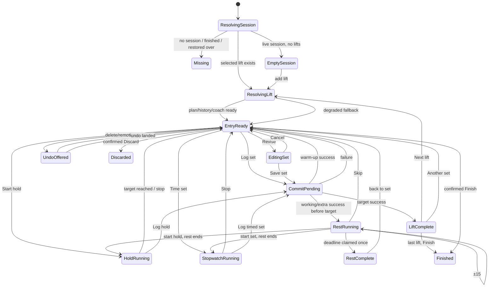

> **Status:** Implementation action plan. Not current law.  
> **Law remains:** [FOUNDATION_PROGRAM.md](FOUNDATION_PROGRAM.md) and accepted records in [docs/architecture/](architecture/README.md).  
> **Source of truth for *what* to build:** [workout-entry-experience-report.md](workout-entry-experience-report.md) (do not edit that report body).  
> **This document** says *how* to build every point in that report: one phone-testable packet at a time, Packet A first, no Kotlin in this packet.

# Temper workout-entry implementation plan

**Owner:** Allen Hormoz  
**Sitting line:** `trunk`  
**Plan revision:** docs-only packet on `trunk` after Live 65 and the experience report  
**Audited code this plan names:** `origin/trunk` at `d077d81949265627aaffb286269078e11a9df9e6` (report) plus the report itself at `6742bdff`  
**Decision level:** How to implement the accepted recommendation. This plan does not reopen ADRs.

This is the gym-floor entry rebuild: one lift, two numbers, optional RPE, one clock, one Log. Packets A–H below are the only implementation sequence. Do not start Packet A until this file is on `trunk`. Do not batch A with B. Do not cut a drop for this docs packet.

---

## 0. How to use this document

1. Open the [experience report](workout-entry-experience-report.md) beside this plan. The report is the *what*; this file is the *how*.
2. Before cutting any Kotlin branch, re-list **open PR paths** against `trunk`. If any path in that packet’s file list is already owned, **stack**. `docs/ROADMAP.md` is the only last-merge exception.
3. Implement **one packet**. Gate: `./gradlew testDebugUnitTest` (runs `:app:staticChecks` / `tools/preflight.sh`) then `./gradlew assembleDebug` whenever Kotlin or resources change. This docs packet skipped assemble.
4. After a packet that changes the gym floor, cut a Temper Debug Obtainium drop from `python3 tools/debug-drop-plan.py`. Never batch A+B into one drop.
5. Phone checks are Allen’s on **Temper Debug** (`com.sinura.personaltrainer.debug`). Gym-floor Temper stays on the signed APK.
6. Branch names for later code: `cursor/<short-slug>-b87f`. Delete the vehicle after squash-merge.

### Reading order for a builder

1. §1 Goal and non-negotiables  
2. §2 Sequence and path ownership  
3. The packet you are cutting (A–H)  
4. That packet’s rows in the [traceability table](#12-traceability-table-every-report-point)  
5. Haptic tickets owned by that packet  
6. Phone checklist rows tagged to that packet  

If a later packet would be easier by rewriting an earlier packet’s UI, **do not**. Appearance waits. State first.

---

## 1. Goal (owner terms)

Temper already records sets honestly and the rest alarm is professional. The live workout screen still behaves like a scrolling form with wheels, duplicate clocks, and a Log button that can buzz before the set is saved.

The work is to make the gym-floor screen feel like a plate-loaded panel:

- one current lift  
- weight and reps (or hold time) that cannot lie  
- RPE whenever a working set is being prepared  
- one ticking clock in the lower dock  
- one filled Volt act  
- Why plus an explicit keep-my-numbers override  
- interruption-safe drafts, timers, and undo  

No sixth tab. No LLM author. No Room v3 / schema reset. One Volt Log set. One visible clock. 48 / 56 / 72 dp. 360 dp / font 2.0. TalkBack.

---

## 2. Binding law, standing non-goals, and retained bones

### 2.1 Law that every packet must keep

| Decision | Where | Packet implication |
|---|---|---|
| One implementation packet open at a time | ADR-002 | Do not open B while A’s PR exists. Merge A, delete the branch, then cut B. |
| Android + Compose shipping client | ADR-003 | No KMP, no second client. |
| Offline core complete without account | ADR-004 | No remote analytics for §10.2 metrics. |
| Instrument only; one filled Volt | ADR-005 | Dark, semantic tokens, tabular numerals. Packet F still has exactly one filled act. |
| Five tabs; Active Workout is a pushed route | ADR-006, ADR-014, ADR-016 | No sixth tab. Library and Goals stay off the bar. |
| One live activity | ADR-007 | No second live workout or independent foreground clock. |
| Local deterministic recommendations; Why from `RuleTrace`; override is first-class | ADR-008 | Packet F wires `Coach.decide`. No LLM authors a load, set, routine, plan, or record. |
| No opportunistic schema reset; `fallbackToDestructiveMigration` banned | ADR-010 | No `TrainerDatabase` v3 in this program. Undo and drafts use `SavedStateHandle`, not new tables. |
| Rest: unique generation, elapsed realtime, exact/best-effort, reboot-clears-short-rest, no overlay clock | ADR-012 | Packet E changes *when* rest ends, not the alarm architecture. |
| Captured time on durable rows | ADR-011 | Session elapsed display may round; rest stays elapsed-realtime. |
| Palette collisions stay; reduced motion collapses durations to zero | ADR-023 | Packet H does not retune Warn/Volt/PrGold. Every state has a non-colour channel. |
| Warm-up *packs* are extra sessions, not in-lift ramps | ADR-020 | Packet D’s ramp chips are in-set warm-up sets, not golf/lower/upper packs. |
| Hosted runners are not the test lane | ADR-002, ADR-024 | Cursor JVM + Obtainium. Ignore Actions red X except as noise. |

### 2.2 Standing product non-goals (report §8 + owner-loop)

These are **explicit rejects**. If a PR implements one, it is out of scope even if it looks polished.

| Rejected alternative | Why it stays rejected | Enforced in |
|---|---|---|
| Live-floor vertical weight/reps/hold/rest wheels | Nested vertical gesture, slow jumps, accidental motion, display/persist divergence | A (stop the lie), B and E (remove from floor) |
| Stepper only, or keypad only, for weight/reps/hold | Too many taps *or* too much IME | B |
| Arbitrary weight chip rows | Cannot represent machines/plates; clutter | B (Plan/Last/Suggested only) |
| Always-visible free text fields | Keyboard dominates the floor | B |
| RPE slider/wheel/stepper/keypad | Five discrete values; accidental drags are costly | D |
| 15-second rest wheel to 30 minutes | Up to 120 pages in the dock | E |
| Editable set-count field | Confuses plan target with completed record | D, F |
| Open-ended Log past target | Extra sets become accidental | F |
| Auto-advance after target | Unsafe around equipment | F (Packet 1 standing choice stays) |
| Swipe-to-delete | Sweaty hidden destructive | G |
| All lift cards in one floor scroll | Plan/history pattern, not in-set focus | C |
| Always-visible horizontal named chip rail | Truncates; competes with entry | C |
| Full-screen rest after every log | Steals context; blocks fast corrections | E |
| Overlay rest clock | ADR-012 | E |
| Second filled Volt (`Start next` as Volt, Time set as Volt, Use as Volt) | ADR-005 | A, E, F |
| Sixth tab; Library/Goals as tabs | ADR-006 | all |
| LLM-as-author | ADR-008 | F |
| Room v3 / schema reset / destructive fallback | ADR-010 | G, all |
| Remote analytics for success metrics | Offline core | H |
| GitHub-hosted runners as a test lane | ADR-002 | all |
| `connectedDebugAndroidTest` on release `applicationId` | owner-loop | H |
| Telling Allen to open Android Studio | ADR-002 | drop cutter, not these packets |
| Quietly redesigning controls inside Packet H | H is evidence, not a rewrite | H |
| Combining Packets A and B | Report §9; owner instruction | process |
| Changing locked progression rule rows in the same packet as the Why UI | Report §5.12 | F (UI + `Coach.decide` wiring only; rule numbers stay) |

### 2.3 Bones to retain (do not “fix” these)

From report §11 and §9 “What to retain”:

- Transactional set numbering, validation, process draft recovery, duplicate-log guard (`WorkoutRepository`, `SetLogRules`)
- Rest unique ID, elapsed realtime, exact/best-effort, notification, completion claim, reboot policy (`timer/*`, ADR-012)
- Five equal RPE values 6–10; Warm-up outside the track (Packet 1)
- Standing Next / Another; no dwell auto-advance
- Optional stopwatch; duration written only if used; holds remain duration with reps `0`
- Deterministic kicker, Why, Use; recommendation never logs or silently rewrites the plan
- Immediate cheap destructive writes; named Undo; Finish/Discard still confirmed
- Large 72 dp dock Log; `Metrics.commit` / `control` / `touchMin`
- Pictures, equipment badges, session order
- `NumberEntryDialog` + `NumericEntry` (already the strict parser)
- `StepperButton` (already the plate control — retune, do not invent a second stepper)
- `IncrementTable` (already equipment-aware — wire the floor to it in B)
- `Coach` / `SetMicroRecCalculator` locked rows (F only changes the *call site*)
- Instrument tokens (`ui/theme/*`)

---

## 3. Trunk facts this plan is written against

**Open PRs against `trunk` at plan time:** none. Kotlin path ownership is clear. This docs packet may cut from `trunk`. Packet A later also cuts from `trunk` unless a later PR has landed overlapping files.

**Report SHA:** `docs/workout-entry-experience-report.md` on `trunk` (`6742bdff`). Audited Kotlin: `d077d819` + progression squash `c38a4c19`.

**Current defects the report names, with the shipping call sites:**

| Defect | Shipping site |
|---|---|
| RPE hidden unless rest is running | `FloorCompactChrome.showOptionalLogOptions(restRunning)` → `WorkoutLiftCard` `showRpe` |
| Re-tap selected lift re-prefills | `ActiveWorkoutViewModel.selectExercise` emits `reselections` when IDs match |
| Wheel parked-page skip | `SnapValueWheel` + `FloorEntryWheels.shouldCommitSettledPage` (permanent original-page exemption) |
| Duplicate clocks | `WorkoutHeader.instrumentState` *and* dock `FloorTimerSlot`; header also ticks `elapsedSeconds` every second via `System.currentTimeMillis()` |
| `Start next` always in idle rest | `RestIdleCopy.START_NEXT` in `RestTimerUi.RestIdleRow`; tests require it |
| Empty free workout still mounts rest | `ActiveWorkoutScreen` `else if (showRest)` when no selected lift |
| `Haptics.commit` before `logSet()` | `ActiveWorkoutScreen` `onLog` |
| No lift-ready / dirty generation | `prefill()` can overwrite; Log enabled when session row exists |
| Hold/stopwatch increment once per `delay(1_000)` | `startHoldSet` / `startSetStopwatch` in the ViewModel |
| `startHoldSet` already `restTimer.stop()`; `startSetStopwatch` must **not** (Packet 3 test) | `FloorPacket3StopwatchTest` encodes the defect E must invert |
| One undo slot, 6 s fixed | `GymUndoHost` / `Motion.STATUS_DWELL_MS`; no `AccessibilityManager` timeout |
| Production still calls `SetMicroRecCalculator.suggest` | `SetMicroRecUi.workoutMicroRec` |
| `RuleTrace.forMicroRec` facts only | empty `thresholds` / `alternatives` |
| Finish enabled when session exists, including zero sets | `ActiveWorkoutScreen` `canFinish = session != null` |
| Stepper fast repeat 60 ms | `StepperButton.FAST_REPEAT_MS` |
| Floor wheels, glyph-only labels | `FloorCompactChrome.weightAndRepsAreWheels()` / `floorFieldGlyphsReplaceLabels()` |
| Missing populated golden | `GoldenPageCatalog.committed` is only `foundation-state-gallery-api29` |

**Existing components to reuse, not rewrite:**

- `ui/components/StepperButton.kt` — hold-repeat plates  
- `ui/components/NumberEntryDialog.kt` + `domain/NumericEntry.kt` — tap-to-type  
- `domain/IncrementTable.kt` — barbell / stack / dumbbell-kettlebell steps  
- `domain/WarmupRamp.kt` — 40 / 60 / 80  
- `domain/LoadClass` / `WeightMeaning` — Weight vs Added vs Assistance vs none  
- `domain/RpeCopy.kt` — extend; do not replace the 6–10 scale  
- `timer/RestTimerGateway.kt` and friends — one timer gateway  
- `workout/SavedStateWorkoutDraft.kt` + `WorkoutDraftCache.kt` — extend to a per-lift map in C  
- `ui/components/GymUndoHost.kt` — extend to LIFO in G  
- `ui/theme/Haptics.kt` / `Motion.kt` / `LocalReducedMotion` — extend the palette; do not add a second one  

---

## 4. Sequence, stacking, drops, and process

### 4.1 Packet order (hard)

```
WE-0  this document (docs only, no drop)
  → Packet A  state correctness (wheels still ship)
  → Packet B  stepper + keypad (appearance of fields)
  → Packet C  one-lift focus + top strip
  → Packet D  RPE, warm-up ramp, visible ordinals
  → Packet E  one active clock + rest editing
  → Packet F  receipt, advance, Coach.decide, Why
  → Packet G  skip, overflow, LIFO undo
  → Packet H  goldens, TalkBack, reduced motion, physical cues
```

**Do not batch A and B.** A must be phone-testable with the current card list and wheels so Allen can judge *correctness* without a visual rewrite. B is the first appearance change of the fields.

Packets C–H each depend on the previous packet being on `trunk` (same files: `ActiveWorkoutScreen.kt`, `ActiveWorkoutViewModel.kt`, `WorkoutLogBar.kt`). They are **not** independent enough to cut in parallel. ADR-002: one Kotlin packet at a time.

### 4.2 What *is* independent

Only **WE-0** (this plan) is independent of Kotlin. After A–H start, `docs/ROADMAP.md` may receive a one-line last-merge pointer from any packet. That exception is not a license to restack Kotlin.

### 4.3 Open-PR path ownership (mandatory before every later cut)

Before `git checkout -b cursor/<slug>-b87f`:

```bash
gh pr list --base trunk --state open
# for each open PR: list changed files
```

Rules:

- **None of the packet’s paths are on an open PR** → cut from current `origin/trunk`.
- **A Kotlin/resource path is owned** → stack on that PR’s branch. Do not start a second edit of the same file from `trunk`.
- `docs/ROADMAP.md` may still be touched in a few lines (last merge wins).
- A stacked PR includes the packets under it. Merge the **tip** only.

**At WE-0 merge time there were zero open PRs.** Packet A should re-check; do not trust this sentence weeks later.

### 4.4 Shared-file ownership map

These files are the collision set. Only the active packet may edit them:

| File | A | B | C | D | E | F | G | H |
|---|---|---|---|---|---|---|---|---|
| `ActiveWorkoutViewModel.kt` | yes | yes | yes | yes | yes | yes | yes | maybe tests only |
| `ActiveWorkoutScreen.kt` | yes | yes | yes | yes | yes | yes | yes | goldens/a11y |
| `WorkoutLogBar.kt` | yes | maybe | yes | yes | yes | yes | | |
| `WorkoutLiftCard.kt` | yes | yes | yes | yes | | yes | yes | |
| `WorkoutHeader.kt` | | | yes | | yes | | | |
| `SetEntryPanel.kt` | | yes | | | | | | |
| `SnapWheel.kt` | yes | floor stop | | | rest stop | | | |
| `StepperButton.kt` | | yes | | | | | | |
| `RestTimerUi.kt` | yes | | | | yes | | | |
| `RestTimerViewModel.kt` / `RestTimerScreen.kt` | | | | | yes | | | |
| `timer/RestTimerService.kt` and gateway | | | | | yes | | | |
| `FloorTimerSurface.kt` | | | yes | | yes | | | |
| `FloorCompactChrome.kt` | yes | yes | yes | yes | yes | yes | yes | |
| `FloorEntryWheels.kt` | yes | keep for Extra until unused | | | rest pages unused on floor | | | |
| `SetMicroRecUi.kt` / `SetMicroRec.kt` / `RuleTrace.kt` | | | | | | yes | | |
| `Coach.kt` | | | | | | call site only | | |
| `LoggedSetsPanel.kt` / `SetTable.kt` | | | | yes | | yes | yes | |
| `GymStatus.kt` / undo host | A haptic/error host | | | | | F receipt | G | |
| `GoldenPageCatalog.kt` | | | | | | | | yes |
| `Haptics.kt` / `Motion.kt` | A | B | | D | E | F | G | H |
| `docs/ROADMAP.md` | pointer | pointer | pointer | pointer | pointer | pointer | pointer | pointer |
| `docs/workout-entry-experience-report.md` | **never** | **never** | **never** | **never** | **never** | **never** | **never** | **never** |

Home, Plan, History, Settings, Library, cardio, backup, catalog seed: **out of scope** except where a floor packet must call an existing API (`IncrementTable`, `Coach.decide`, rest gateway).

### 4.5 Branch, gate, drop

| Packet | Suggested branch | JVM gate | Obtainium drop |
|---|---|---|---|
| WE-0 (this plan) | `cursor/workout-entry-plan-b87f` | docs-only; skip assemble | **No** |
| A | `cursor/floor-entry-state-b87f` | `testDebugUnitTest` + `assembleDebug` | **Yes** — first floor-behavior drop |
| B | `cursor/floor-stepper-keypad-b87f` | same | **Yes** — separate drop, not A+B |
| C | `cursor/floor-one-lift-b87f` | same | **Yes** |
| D | `cursor/floor-rpe-warmup-b87f` | same | **Yes** |
| E | `cursor/floor-one-clock-b87f` | same | **Yes** — physical rest/hold proof |
| F | `cursor/floor-advance-coach-b87f` | same | **Yes** |
| G | `cursor/floor-undo-skip-b87f` | same | **Yes** |
| H | `cursor/floor-entry-goldens-b87f` | unit + golden assets; assemble | **Yes** if any runtime a11y copy/spacing landed; otherwise evidence-only still drops if APK strings/goldens change the debug build |

Drop cutter (not this worker): `python3 tools/debug-drop-plan.py` → tag `debug-live-YYYY-MM-DD` or `-2` → attach `PersonalTrainer-*-debug.apk` → Obtainium **Temper Debug**. Gym-floor `applicationId` stays off debug.

### 4.6 Review and audit

Foundation protocol still applies: independent review maps every exit criterion; adversarial audit tries to falsify. Critical/high block merge. Phone evidence may remain a milestone after the branch is gone; do not leave “code complete, branch pending phone” work open.

---

## 5. Cross-cutting implementation contracts

These are not packets. Every packet that touches the named surface must obey them.

### 5.1 Targets (report §3.11, §7.4)

- Absolute minimum **48 dp**; gym control **56 dp**; Log **72 dp** (`Metrics.touchMin` / `control` / `commit`).
- Widths **360 / 412 / 600 dp**; font **1.0 / 1.6 / 2.0**.
- No horizontal weight+reps pair on the floor.
- At 360 / font 2.0 the **surface** scrolls; field controls do not shrink; the dock does not move.
- TalkBack, reduced motion (`LocalReducedMotion`), RTL where relevant.

### 5.2 One Volt, one clock, one log set

- Exactly one filled Volt act on the entry surface. Contextual completion may *replace* Log with Next lift / Finish workout, never add a second fill.
- Only the dock displays a seconds-changing rest/hold/set numeral. Session elapsed in the top strip is **minutes**, e.g. `18 min`.
- At most one active timed mode: REST, HOLD, or STOPWATCH.
- Button payload = captured payload = success receipt = persisted row.

### 5.3 Feedback (report §6)

- Ordinary data entry: haptics, no sound.
- Audio: timed events when the user may not be looking, gated by existing Sound / Last five seconds / Vibration settings.
- Timer **service** owns final-five haptic/audio. Compose is visual only (Packet E).
- Reduced motion: 90 / 150 / 180 / 240 ms → 0. Dwell, timer passage, haptics, optional audio remain.
- No sound for taps, Log, progression, Next, delete, undo, or PR.

### 5.4 Copy and Why

- Why renders offline from `RuleTrace`. No LLM prose.
- Override is named (`Keep my numbers`). Use fills the draft only and marks it dirty.

### 5.5 Tests style in this repo

Floor packets have used a mix of:

- **Behavioral ViewModel tests** (`ActiveWorkoutViewModelTest`, `RestTimerViewModelTest`) with `runBlocking` / test dispatchers  
- **Source-string presentation tests** (`FloorPacket3StopwatchTest`, `FloorPacket4KickerGlyphsTest`, `FloorCompactPresentationTest`) that `readOwned` Kotlin and assert strings/flags  
- **Domain tests** (`FloorEntryWheelsTest`, `CoachTest`, `SetMicroRecCalculatorTest`)  
- **Copy tests** (`RestIdleCopyTest`, `UndoHostCopyTest`, `LogBarCopyTest`)

New packets should prefer **behavioral tests** for state (A, E, F, G) and keep presentation ratchets only where they already exist, updating them when the old string is deliberately retired (`START_NEXT`, glyph-only labels, “must not cancel rest”).

Do not add remote analytics. Success metrics (§11) are proven by tests, moderated phone tasks, and owner floor sessions.

---

## 6. Packets A–H

Each subsection is a complete work order: owner, files, tests, acceptance, non-goals, law, risk, rollback, phone proof, drop.

---

### Packet A — State correctness before appearance

**ID:** WE-A  
**Branch:** `cursor/floor-entry-state-b87f`  
**Depends on:** WE-0 on `trunk`  
**Must not include:** stepper/keypad visuals, one-lift layout, RPE-always, rest presets, Coach.decide, LIFO undo, goldens  
**Phone-testable without B:** yes. Wheels and the card list remain.

#### Why this packet exists

The screen can *look* right and still log the wrong number, buzz for a failed set, or refill a draft from a stray tap. Appearance work on top of that would hide the bugs.

#### Tickets (all in this one packet; do not split across PRs)

##### A1 — Wheel displayed value is the committed value

**Report:** §1.3, §2.3 last failure, §7.3 “Wheel at original page”.

**Change:** While `SnapValueWheel` still ships on the floor, returning to the original parked page **must write** the shown numeral into the draft. The first synthetic settle on open may still be ignored; after the user has left that page, a later settle on it is a choice.

Likely implementation: replace the permanent `rememberParkedPage` exemption with a one-shot “ignore first settle” flag, or commit whenever `settledPage` is user-driven. Domain helper belongs in `FloorEntryWheels` so tests do not need Compose.

**Do not change** reminder time wheels or onboarding bodyweight wheels unless a shared helper would break them; those copies (`ReminderCopy.shouldCommitSettledPage`, `BodyweightSteps.shouldCommitSettledPage`) stay as they are.

**Files:**  
`app/src/main/java/com/sinura/personaltrainer/ui/components/SnapWheel.kt`  
`app/src/main/java/com/sinura/personaltrainer/domain/FloorEntryWheels.kt`  
`app/src/test/java/com/sinura/personaltrainer/domain/FloorEntryWheelsTest.kt`  
New: `app/src/test/java/com/sinura/personaltrainer/ui/components/SnapWheelCommitTest.kt` (logic extracted) or extend `FloorEntryWheelsTest`

**Acceptance:**  
- Open a lift, wheel away, scroll back to the original page → draft equals the displayed page.  
- First open does not rewrite the draft to a neighbor page.  
- `logSetWritesTheNumbersTheWheelsDisplay` still passes, now including the return-to-start case.

##### A2 — Selected-lift readiness and dirty generation

**Report:** §1.8, §2.1 session vs lift readiness, §5.1 dirty, §5.8 enabled-when, §7.2 prefill invariant, §7.3 slow prefill / failed prefill / user edits first.

**Change:**

1. Distinguish **session resolved** from **lift entry ready**.  
2. Lift ready when plan/history/coach prefill has completed **or** degraded to planned/manual with a quiet “Suggestion unavailable”.  
3. Log is unavailable until ready (or degraded). Do not enable Log on a transient `0 × 5` if that is not the planned target.  
4. The first user edit of weight/reps/RPE/warm-up on this lift increments a **dirty generation**. In-flight prefill may apply only if `generation` still matches and the draft is not dirty. Stale results for a previous lift ID are discarded.

**Files:**  
`ActiveWorkoutViewModel.kt` (`prefill`, `uiState`, new `LiftEntryReadiness` on `ActiveWorkoutUiState`)  
`ActiveWorkoutScreen.kt` (skeleton fields; Log disabled with reason)  
`domain/` small pure type if useful, e.g. `LiftEntryReadiness.kt`  
`ScreenSkeleton.kt` only if the existing skeleton cannot express field-level wait  

**Tests:** extend `ActiveWorkoutViewModelTest`:

- `prefillDoesNotOverwriteDirtyDraft`  
- `stalePrefillForPreviousLiftIsIgnored`  
- `logDisabledUntilLiftReady`  
- `prefillFailureDegradesAndLogStillWorks`  
- `sessionReadyDoesNotImplyLiftReady`

**Acceptance:** Fast launch never logs coach zeros. Edit-before-prefill wins. Failed history still logs.

##### A3 — Current-lift re-tap is non-mutating

**Report:** §1.2, §2.2, §5.10 tap current, §7.3 “User taps selected lift”.

**Change:** `selectExercise` when `exerciseId == selectedExerciseId` is a **no-op** (Packet A) or opens the switcher (Packet C). It must **not** emit `reselections` / re-run prefill. Packet A: no-op is enough so correctness can be judged on the current card list. Packet C will attach the sheet to the same non-mutating tap.

**Files:** `ActiveWorkoutViewModel.kt`, `ActiveWorkoutScreen.kt` / `WorkoutLiftCard.kt` click handlers  
**Tests:** `selectingSelectedLiftDoesNotPrefillOrClearDraft`

**Acceptance:** Tap the current card repeatedly; weight/reps/RPE/warm-up unchanged.

##### A4 — Empty free workout: no rest/stopwatch dock

**Report:** §1.6, §2.1 empty rest dock, §4.5 / §7.3 empty session.

**Change:** If the live session has **no lifts**, the dock Volt is **Add a lift**. Rest, Start next, Time set, and rest wheels are not composed. Finish is not the dead control (see A7).

**Files:** `ActiveWorkoutScreen.kt`, `WorkoutLogBar.kt`, `FloorCompactChrome.kt` (new flag `emptySessionHidesTimerDock(): Boolean = true`)  
**Tests:** presentation ratchet + ViewModel: empty session `showRest == false`, `offerSetClock == false`

##### A5 — No live-looking dead `Start next`

**Report:** §1.5, §2.10, §5.10, §7.2 “No advance action is rendered unless it can act”.

**Change:** Hide `Start next` unless `WorkoutAdvance` says advance is valid. When valid, Packet A may still show it as a quiet control **or** hide it because it duplicates Next lift — prefer **hide** when `showNext` is already the Volt (duplicate), and hide when invalid (no-op). Packet F removes the remaining idle-row route entirely.

Update copy so TalkBack does not say “Start next to keep going” when the control is gone (`RestIdleCopy`).

**Files:** `RestTimerUi.kt`, `RestIdleCopy.kt`, `WorkoutLogBar.kt`, `FloorCompactChrome.kt`  
**Tests that will fail on purpose and must be rewritten:**  
`FloorCompactPresentationTest`, `FloorPhoneCheckPresentationTest`, `RestIdlePresentationTest`, `RestIdleCopyTest`

**Acceptance:** No enabled-looking control whose tap is a no-op. When Next lift is the Volt, Start next is absent.

##### A6 — Log haptic, busy, failure

**Report:** §1.7, §2.7, §5.8 tap contract, §6 Log pressed / success / failure / duplicate, §7.3 rapid taps / write failure / 0 kg.

**Change:**

1. `onLog` does **not** call `Haptics.commit` before `logSet()`. Press response is `Haptics.tickLight` / existing `PrimaryGymButton` press (already optional via `hapticFeedback`).  
2. Capture immutable payload; set `logging=true` immediately; skip a second tap **silently** (no haptic).  
3. Validate the **captured** payload.  
4. On durable success: one `Haptics.commit` (medium/heavy confirm). PR celebration is **not** retuned until F (A may leave `Haptics.celebrate` as-is so A’s phone proof is about Log, not PR).  
5. On validation or write failure: `Haptics.reject` (two short beats), no rest, no draft clear, error copy: `Could not save. Your set is still here. Try again.` (or keep `SetLogRules` messages for field errors such as zero weight).  
6. Disabled Log exposes `Logging…` (or equivalent) and an accessible disabled reason.

**Files:** `ActiveWorkoutScreen.kt` (`onLog`, PR `LaunchedEffect` untouched except do not fire commit twice), `ActiveWorkoutViewModel.kt` (`logSet` already has `logging` guard — keep; add success event for haptic/receipt), `GymButtons.kt` if the Log button still auto-ticks, `Haptics.kt` only if a “press” vs `commit` split is missing, `HapticsPaletteTest.kt` (today asserts `Haptics.commit` in the screen — retarget to the success path)

**Tests:**

- `logSetRejectsZeroWeightWorkingSetBeforeWriting` — add: no success event  
- `rapidLogTapsEmitOneSuccessHapticEvent`  
- `writeFailureRetainsDraftAndEmitsReject`  
- `loggingFlagDisablesButtonAndAbsorbsSecondTap`  
- Presentation: Log button copy includes payload; busy label present

**Acceptance:** Invalid 0 kg loaded set: reject haptic, no commit haptic, no rest. Ten rapid taps → ten rows, ten success events, never eleven. Fake write failure: draft stays, no rest/PR/advance.

##### A7 — Finish disabled with zero sets and while Log pending

**Report:** §2.7 last failure, §5.10, §7.3 Finish while write pending.

**Change:** `canFinish` is true only when `session.sets` is non-empty **and** `!logging`. Empty free workout offers confirmed **Discard**, not a failing Finish. Finish remains confirmed (`EndWorkoutDialog`).

**Files:** `ActiveWorkoutScreen.kt`, `WorkoutHeader.kt`, `EndWorkoutCopy.kt` / `EndWorkoutDialog.kt` as needed  
**Tests:** ViewModel/screen: empty session Finish disabled; logging disables Finish; one-set session enables Finish

#### Packet A — summary table

| | |
|---|---|
| **Likely files** | `SnapWheel.kt`, `FloorEntryWheels.kt`, `ActiveWorkoutViewModel.kt`, `ActiveWorkoutScreen.kt`, `WorkoutLogBar.kt`, `WorkoutLiftCard.kt`, `RestTimerUi.kt`, `RestIdleCopy.kt`, `FloorCompactChrome.kt`, `GymButtons.kt`, `Haptics.kt` (only if required), copy objects |
| **Tests add/change** | `FloorEntryWheelsTest`, `ActiveWorkoutViewModelTest` (majority), `HapticsPaletteTest`, `FloorCompactPresentationTest`, `FloorPhoneCheckPresentationTest`, `RestIdlePresentationTest`, `RestIdleCopyTest`, `WorkoutLogBarTest` |
| **Non-goals** | Replacing wheels; one-lift layout; RPE always; rest presets; Coach.decide; LIFO undo; goldens; changing reminder/onboarding wheels |
| **ADR/law** | ADR-005 (one Volt — do not make Start next a second fill); ADR-012 (do not touch alarm path); ADR-010 (no schema) |
| **Risk** | Presentation tests that currently *require* `START_NEXT` will fail; rewrite them, do not keep the dead control to please the ratchet. Parked-page fix must not make the first compose settle overwrite a recovered draft. |
| **Rollback** | Revert the A commit. Wheels remain; no schema. |
| **Phone proof** | Fast launch/tap; edit before prefill; wheel away-and-back; double Log; failed zero-weight Log; empty free workout; re-tap current lift; Finish greyed until a set exists |
| **Drop** | Yes, Temper Debug, after JVM green. Do **not** wait to combine with B. |

**Done when:** every A-row in the traceability table is green; JVM gate green; Obtainium drop published; Allen can complete the A phone list without any B visuals.

---

### Packet B — Direct weight / reps / time entry

**ID:** WE-B  
**Branch:** `cursor/floor-stepper-keypad-b87f`  
**Depends on:** A on `trunk`  
**Must not include:** Packet C layout, RPE-always (chips may stay rest-gated until D), rest wheel removal (E), Coach.decide  

#### Why this packet exists

The live wheels are the most serious control failure: the number can look right and still log wrong, and they fight the vertical session list. A already stopped the parked-page lie; B removes the control.

#### Tickets

##### B1 — Weight: stepper plates + tap-to-type

**Report:** §2.3, §4.4–4.5, §5.1, §8.1 pick.

**Control:**

- Left `−step` **64 × 72 dp**  
- Center numeral ≥ **152 × 72 dp**, visible `WEIGHT` (or `ADDED` / `ASSISTANCE` from `WeightMeaning`) plus unit  
- Right `+step` **64 × 72 dp**  
- Tap: one `IncrementTable` step + `Haptics.tick`  
- Hold: after **450 ms**, ≤ **5 changes/s**; pointer exit/release stops immediately. Do not keep `FAST_REPEAT_MS = 60`.  
- Center tap opens existing `NumberEntryDialog` + `NumericEntry`; value selected; unit + example; invalid input does not mutate; decimal comma accepted; Confirm / Cancel  

**Prefill source label (information, not a chip):** `Plan`, `Last time`, or `Suggested` on the field. Dirty after user touch (A2 already marks dirty).

**Context actions only when they exist:** `Plan 100`, `Last 97.5`, `Suggested 102.5` — not an arbitrary chip row. Tapping one writes the draft (reversible by steppers). **Use** on the recommendation strip remains Packet F; if a Suggested chip and Use would duplicate, show the source label in B and leave Use to F.

**Bodyweight:** omit the weight well (`WeightMeaning.NONE`). Assisted: label **Assistance**, not Weight.

**Plate math:** keep for barbell (`PlateMath`) under the field.

**Files:**  
`SetEntryPanel.kt` (floor `compact` branch), `StepperButton.kt` (delay/cap; consider parameters so Extra/paste share the cap), `FloorCompactChrome.weightAndRepsAreWheels()` → `false`, `FloorFieldGlyph.kt` (glyphs become supporting marks, not the only label), `IncrementTable.kt` (call site only), `WorkoutLiftCard.kt`, `LogLoopScale.kt` if wheel heights are assumed  

**Tests:**

- New `FloorStepperEntryTest` / `SetEntryPanelFloorTest`  
- `IncrementTable` already covered — add floor wiring tests: barbell 2.5 kg / 5 lb, stack 5 kg / 10 lb, dumbbell 2.0 kg / 5 lb  
- `NumericEntry` comma/reject tests already exist — assert floor uses them  
- Update `FloorPacket4KickerGlyphsTest` / compact chrome: glyphs may remain but **text labels required**  
- Change `logSetWritesTheNumbersTheWheelsDisplay` name/body to steppers  

**Acceptance:** 87.5 typed; comma; one-step thumb; hold does not overshoot; glove/damp one-handed; bodyweight has no false weight well; assisted says Assistance; displayed = logged.

##### B2 — Reps: stepper + tap-to-type

**Report:** §2.4, §5.2, §8.2.

Same three-part control, step 1, targets ≥ **64 × 64 dp**, center `5 reps`, keypad 1–100. Preserve reps after Log (already). Bodyweight: this field is visually largest.

##### B3 — Hold draft duration: stepper + tap-to-type

**Report:** §2.4, §5.3 (draft half only), §8.3.

Draft uses −5 / +5 (`HoldWork.STEP_SECONDS`) and seconds or `mm:ss` via `NumericEntry`. **Running hold clock and monotonic recovery are Packet E.** Packet B only replaces the *draft wheel*. Primary copy `Start hold · 0:30` may already exist — keep. Do not auto-log.

##### B4 — Repeat acceleration cap

**Report:** §5.1 hold repeat, §6 stepper hold.

`StepperButton`: `HOLD_BEFORE_REPEAT_MS = 450`, max 5/s (`REPEAT_MS >= 200`), remove or raise `FAST_REPEAT_MS`. Soft `tickLight` per repeat. Tests: source ratchet on the constants; optional fake-clock repeat test.

#### Packet B — summary

| | |
|---|---|
| **Likely files** | `SetEntryPanel.kt`, `StepperButton.kt`, `NumberEntryDialog.kt` (reuse), `FloorCompactChrome.kt`, `FloorFieldGlyph.kt`, `WorkoutLiftCard.kt`, `WorkoutLogBar.kt` (payload copy), `FloorEntryWheels.kt` (floor callers stop; Extra/Home may still wheel until separately changed — **out of scope** unless the compact flag is shared) |
| **Tests** | `FloorEntryWheelsTest` remains for any leftover Extra wheels; new floor stepper tests; `HapticsPaletteTest` tick on step; `LogLoopScaleTest` if it assumed 120 dp wheels |
| **Non-goals** | Removing reminder/onboarding wheels; rest-length wheel (E); one-lift card (C); changing `SetLogRules` |
| **ADR/law** | ADR-005 labels + glyphs as non-colour support; ADR-008 no silent suggested write (chips write draft only) |
| **Risk** | Extra/paste/Home share `SetEntryPanel` — compact vs tall well. Only the gym-floor compact path must leave wheels. Do not regress Extra typing wells. |
| **Rollback** | Revert B; A’s parked-page fix remains. |
| **Phone proof** | Barbell, dumbbell, stack, bodyweight, assisted, 87.5, comma, glove/damp, one-handed, 360/font 2.0 |
| **Drop** | **Separate** Temper Debug drop after A’s drop. Never “A+B live N”. |

**Done when:** live-floor wheels are gone; labels are words; increment table matches equipment; hold-repeat capped; Extra/paste typing still works.

---

### Packet C — One-lift focus and top-strip cleanup

**ID:** WE-C  
**Branch:** `cursor/floor-one-lift-b87f`  
**Depends on:** B on `trunk`

#### Why this packet exists

Every lift is still a card in one list. The header burns height and duplicates the clock. Drafts are one-per-session, so switching lifts is destructive.

#### Tickets

##### C1 — One current-lift card

**Report:** §2.1 last failure, §4.3, §8.7 pick.

Render **one** current lift (picture 56×56, name ≤2 lines, equipment/load meaning, `Lift 1/6`, working `2/4`). Height 88 dp (≤ font 1.6), max 104 dp at font 2.0. Whole card ≥ 72 dp. Overflow 48×48.

**Files:** `ActiveWorkoutScreen.kt` (stop mapping every exercise to `WorkoutLiftCard` in the log loop), `WorkoutLiftCard.kt` or a new `CurrentLiftCard.kt`, `SelectedLiftDock.kt` (already unused via chrome flag — confirm)

##### C2 — Lift switcher sheet

**Report:** §4.3, §5.10 skip (sheet lists skipped lifts), §7.5 TalkBack switcher.

Tap on the current card opens a bottom sheet: all lifts, pictures, progress, rest state. Selecting a lift **restores that lift’s draft** and scrolls the entry surface to top. **Never resets** the draft. Re-tap current lift opens this sheet (A3 made it non-mutating).

Reuse `ExercisePickerSheet` patterns only if they already list *session* lifts; do not open Library as a tab. New `LiftSwitcherSheet.kt` is expected.

##### C3 — Per-lift recoverable draft map

**Report:** §2.2, §3.8 interruption, §7.2 every lift has a draft, §7.3 switch mid-draft / process death.

Replace single `WorkoutDraft` / `WorkoutDraftCache` slot with `Map<exerciseId, Draft>` (plus selected id). Persist through `SavedStateHandle` (`SavedStateWorkoutDraft`) **without** a Room table. Process death restores visible numbers per lift.

Switching lifts preserves both drafts. Prefill (A2) applies only to an untouched draft for the still-selected lift.

**Files:** `WorkoutDraft.kt` / cache, `SavedStateWorkoutDraft.kt`, `WorkoutDraftRecovery.kt`, `ActiveWorkoutViewModel.kt`, `WorkoutDraftCacheTest.kt`

##### C4 — Top strip: session chrome + minute telemetry, no timer numeral

**Report:** §1.4, §2.1 metric cells, §2.8 duplicate clocks, §4.2, §5.9 sole ticking clock in dock (header half).

**Row A (56 dp):** Close 48×48, title, Finish ≥ 64×48. Finish rules from A7.  
**Row B (40 dp, 48–56 at font 2.0):** `18 min · 7 sets · 2,340 kg`. Elapsed **once per minute**, not `18:04`. No rest/hold/stopwatch numeral. At 360/font 2.0 drop volume before truncating the title.

Tapping telemetry may open session/timer **details** only with a clear label; it must not duplicate ±15/Skip.

**Files:** `WorkoutHeader.kt` (remove per-second `elapsedSeconds` loop; round minutes), `FloorTimerSurface.instrumentState` (stop feeding header a live rest clock), `ActiveWorkoutScreen.kt`

**Tests:** header presentation: no `RestTimer.formatClock` for session elapsed; minute grain; instrument strip has no REST/HOLD/SET seconds. ViewModel not required to tick the header.

##### C5 — Notes leave the log loop

**Report:** §4.4 item 8.

Notes move to overflow or Finish. Do not show a notes block in the normal set loop.

**Files:** `NotesBlock.kt` call sites in `ActiveWorkoutScreen` / `WorkoutLiftCard`, Finish dialog if notes belong there.

##### C6 — Visual focus after resume

**Report:** §2.2 no automatic visual focus.

After resume / process restore, the current card and entry surface are already the only lift (C1). Ensure bring-into-view still targets the **entry**, not a vanished list offset. `LogLoopBringIntoView.kt` may simplify.

#### Packet C — summary

| | |
|---|---|
| **Likely files** | `ActiveWorkoutScreen.kt`, `WorkoutLiftCard.kt`, `WorkoutHeader.kt`, `ActiveWorkoutViewModel.kt`, `workout/SavedStateWorkoutDraft.kt`, `WorkoutDraftCache.kt`, new switcher composable, `FloorTimerSurface.kt`, `LogLoopBringIntoView.kt`, `NotesBlock` call sites |
| **Tests** | `ActiveWorkoutViewModelTest` per-lift draft restore; new `LiftSwitcherPresentationTest`; `FloorPacket2ToolbarTest` (header no longer a timer); `WorkoutDraftCacheTest`; `LogLoopBringIntoViewTest` |
| **Non-goals** | Horizontal chip rail; putting every card back; overlay clock; schema for drafts |
| **ADR/law** | ADR-005 one Volt; ADR-006 no sixth tab (sheet is not a tab); ADR-007 one live activity; ADR-012 no overlay clock |
| **Risk** | Large screen rewrite on the same files as A/B. Keep B’s stepper. Keep A’s readiness/dirty/haptic. |
| **Rollback** | Revert C; drafts become single-slot again (warn Allen: in-flight multi-lift drafts in the debug DB are still the set rows; only unsaved wheel/stepper numbers per other lifts would drop). |
| **Phone proof** | Six-lift routine; switch with unfinished drafts; leave/resume; force-stop; 360/font 2.0; telemetry does not tick seconds |
| **Drop** | Yes |

---

### Packet D — Warm-up, RPE, and visible set identity

**ID:** WE-D  
**Branch:** `cursor/floor-rpe-warmup-b87f`  
**Depends on:** C on `trunk`

#### Tickets

##### D1 — RPE always visible for working-set drafts

**Report:** §1.1, §2.6, §5.5, §8.4 pick.

- Label `RPE · OPTIONAL`  
- Chips 6–10, equal width, each ≥ 48×48  
- Tap selects; tap selected clears  
- Independent of rest  
- Warm-up mode: hide/disable with visible reason `Warm-up`  
- Recommendation may outline a chip, never auto-select  
- Selecting RPE never changes weight/reps  

**Files:** `FloorCompactChrome.showOptionalLogOptions` (stop taking `restRunning`; working-set drafts always true), `WorkoutLiftCard.kt`, `WorkoutLogBar.kt` `showRpe`, `InstrumentChip.kt`, `RpeCopy.kt`

**Tests:** `rpeVisibleOnFirstSet`, `rpeVisibleAfterRestCompletes`, `rpeVisibleOnFinalSet`, `rpeHiddenInWarmupWithReason`, `rpeDoesNotMutateWeightReps`

##### D2 — First-use helper + TalkBack meanings

**Report:** §5.5, §7.5.

Sighted helper: `6 = four reps left · 10 = max`; dismiss permanently (`SharedPreferences` / existing prefs store — **no schema**). TalkBack: `RPE 8, about two reps left, not selected`. Radio/selectable semantics.

**Files:** `RpeCopy.kt` (meanings), prefs repository, `AccessibilityMatrix` notes for active-strength

##### D3 — Warm-up ramp chips

**Report:** §2.5, §5.6.

48 dp Warm-up chip above weight, still outside RPE. When `WarmupRamp.sets` is non-empty and no working set logged, up to three actions: `40% · 40 kg` etc. Tap sets weight + Warm-up, does **not** log. After Log, emphasise next unused ramp; do not auto-apply. Warm-up Log: no rest, no working-progress increment, clear Warm-up after durable success (already). Bodyweight/assisted: empty ramp omitted.

**Files:** `WarmupRamp.kt` (already), new UI in entry surface, `SetMicroRecCopy.warmupLine` may retire as the only ramp UI

**Tests:** `WarmupRampTest` already; add ViewModel: tap applies weight+warmup; log does not start rest; next chip emphasized; empty for BODYWEIGHT/ASSISTED

##### D4 — Visible ordinals WU / working / extra

**Report:** §2.5 ordinal confusion, §5.7.

No set-number input. Working draft: `Set N of target`. Warm-ups: `WU N` (not working Set 1). Past target: `Extra N`, never `Set 6 of 5`. Table rows match. Repository contiguous `setNumber` **unchanged**.

**Files:** `SetCopy.kt`, `LoggedSetsPanel.kt`, `SetTable.kt`, domain helper `SetOrdinalCopy` (new) so tests are pure

**Tests:** mixed WU + working + extra labelling; delete/renumber still contiguous in DB while labels re-derive

##### D5 — Set context line in entry

**Report:** §4.4 item 1.

`SET 3 OF 4` / `WU 2` / `EXTRA 1` above recommendation (recommendation strip itself is F). Packet D can ship the context line even if the kicker still sits in the dock until F.

#### Packet D — summary

| | |
|---|---|
| **Likely files** | `FloorCompactChrome.kt`, `WorkoutLiftCard.kt`, `RpeCopy.kt`, `WarmupRamp` UI, `SetCopy.kt`, `LoggedSetsPanel.kt`, prefs for helper dismiss, `AccessibilityMatrix.kt` |
| **Tests** | `ActiveWorkoutViewModelTest`, `WarmupRampTest`, new `SetOrdinalCopyTest`, RPE presentation tests, `FloorPacket1` leftover ratchets |
| **Non-goals** | Changing rest-after-warmup domain (already correct); auto-logging ramp; RPE 1–10; schema for helper flag if DataStore already holds booleans |
| **ADR/law** | ADR-020 distinction: in-set warmup ≠ aux packs; ADR-005 chips not a second Volt; ADR-023 RPE selected state has check/border plus semantics |
| **Risk** | Helper prefs must not require Room. Do not show RPE on warm-up as selected from last working set. |
| **Rollback** | Revert D; RPE becomes rest-gated again (bad). Prefer forward-fix. |
| **Phone proof** | Two WU then three working; RPE on first/middle/final/no-rest; bodyweight; hold lift; 360/font 2.0 RPE one row |
| **Drop** | Yes |

---

### Packet E — One active clock and rest editing

**ID:** WE-E  
**Branch:** `cursor/floor-one-clock-b87f`  
**Depends on:** D on `trunk`

#### Why this packet exists

“One clock” is not one visible clock, hold/stopwatch can undercount, a hidden rest can still alarm during a set, and Compose plus the service both vibrate the final five.

#### Tickets

##### E1 — Single timed-mode state machine

**Report:** §2.8–2.9, §5.3–5.4, §5.9, §7.1–7.2.

Introduce an explicit mode enum used by UI and ViewModel: `NONE | REST_IDLE | REST_RUNNING | REST_COMPLETE | HOLD_RUNNING | STOPWATCH_RUNNING` (align names with §7.1). Invariants:

- At most one active timed mode  
- One seconds-changing numeral, in the **dock only** (C already removed header seconds)  
- Every transition cancels the prior **generation** before the next begins  

Empty session: still no timer (A4).

**Files:** `FloorTimerSurface.kt` (replace “one clock two modes” comment that says stopwatch does **not** cancel rest), `ActiveWorkoutViewModel.kt`, `WorkoutLogBar.kt`, `RestTimerUi.kt`

##### E2 — Monotonic hold and stopwatch

**Report:** §1.9, §2.4, §5.3–5.4, §7.3 clock/zone, background hold.

Store `startElapsedRealtime` (and deadline for holds) via `SystemClock.elapsedRealtime()` (or existing `ControllableElapsedRealtime` seam). UI derives remaining/elapsed. Rotation/process recovery restores a running hold or honest stopped elapsed. Tests use `sharedTest/.../ControllableElapsedRealtime.kt`.

**Files:** `ActiveWorkoutViewModel.kt` hold/stopwatch jobs, `HoldWork.kt` (derive helpers), SavedState for timestamps (no Room)

##### E3 — Starting timed work atomically ends rest

**Report:** §2.9, §5.3 start, §5.4, §7.3 “Start set while rest active”.

`startSetStopwatch` **must** `restTimer.stop()` / mint-cancel the generation (same as `startHoldSet` already does). Invert `FloorPacket3StopwatchTest`. Hidden rest alarm may never ring during the set. `Time set` appears only when rest is idle/complete and the lift is not a hold. Lift switch while stopwatch **running** asks `Stop timing and switch?`; stopped stopwatch follows the lift draft.

**Files:** ViewModel, `RestTimerGateway`, confirmation dialog reuse `ConfirmActionDialog.kt`

##### E4 — Rest idle/running UI: presets, ±15, Custom; remove floor rest wheel

**Report:** §2.8 idle 144 dp wheel, §5.9, §8.5 pick.

Idle: `Rest 1:30` (not a countdown). −15/+15 in 15 s–30 min. Tap value → presets **0:30, 1:00, 1:30, 2:00, 3:00, Custom** (seconds or mm:ss). Start only when manual start is meaningful. No `Start next` in this row (A/F).

Running: sole ticking clock; −15, +15, Skip 48–56 dp; tap clock opens existing **RestTimerScreen**. Adjustments go through the same gateway; stale alarms cannot end the new generation.

At zero: freeze 0:00, one completion claim, completion cue, `Back to the bar`.

`FloorCompactChrome.restLengthIsInlineWheel()` → false.

**Files:** `RestTimerUi.kt`, `FloorEntryWheels.rest*` unused on floor, `RestTimerViewModel.kt`, `RestTimerScreen.kt` (presets already partly there — keep as detail surface)

##### E5 — Timer service owns final-five haptic/audio; Compose visual only

**Report:** §2.8 doubled pulses, §6 single-source, Rest 5–1 / complete rows.

Remove `Haptics.warn` / `Haptics.tick` from `RestTimerUi.kt` countdown (around the `RestTick.isWarn` call). Service + `RestTickPlayer` remain the only pulse/tick. Compose may show warn label + restrained visual pulse. Tests: source ratchet “RestTimerUi does not call Haptics for RestTick”; service tests already cover ticks.

##### E6 — Capability honesty

**Report:** §5.9 capability, §7.3 notification/exact/persistence/reboot.

- Notification denied: compact recovery row; in-app clock continues; do not claim the timer failed  
- Exact denied: Rest page `May be late when the phone sleeps`; never “precise”  
- Persistence failure: dock `Rest may not survive leaving the app`  
- First rest: Alarm volume / silent-mode disclosure; Settings is the off switch  
- Reboot: keep ADR-012 clear-short-rest  

**Files:** `RestTimerScreen.kt`, `RestNotificationGate.kt`, `ActiveWorkoutNotificationDenialInstrumentedTest.kt` (do not run as merge gate; keep compiling), copy objects `RestBatteryCopy`, `RestNotificationCopy`

##### E7 — Hold target cue; no auto-log

**Report:** §5.3, §6 Hold target reached.

At target: restrained timed-set cue (haptic double pulse + optional short tone if timer sound enabled), `HOLD DONE`, `Log hold · elapsed` ready. Do not auto-log. Early Log stores honest elapsed ≥ 1 s.

##### E8 — Dock clock copy by mode

**Report:** §4.5.

- Idle rest: `Rest 1:30` quiet −15/+15 and Start when useful  
- Running: `REST 1:24 · −15 · +15 · Skip`  
- Hold: `HOLD 0:18` no rest controls  
- Stopwatch: `SET 0:18 · Stop`  
- Warnings (notification/battery/persistence): **one** compact row above the clock, never covering Log  

Warnings/Undo/receipt must not push Log below the nav bar (anchor host). Full lift-complete dock variant is **Packet F**.

#### Packet E — summary

| | |
|---|---|
| **Likely files** | `FloorTimerSurface.kt`, `ActiveWorkoutViewModel.kt`, `WorkoutLogBar.kt`, `RestTimerUi.kt`, `RestTimerViewModel.kt`, `RestTimerScreen.kt`, `timer/RestTimerService.kt`, `RestTickPlayer.kt`, `RestTimerAlerts.kt`, `Haptics.kt` if a hold-done pulse is new, SavedState timestamps |
| **Tests** | Invert `FloorPacket3StopwatchTest`; `RestTimerViewModelTest`; `RestTimerControllerTest` / `RestTimerServiceTest`; new monotonic hold tests with `ControllableElapsedRealtime`; `RestTimerRehydratorTest`; presentation: no Compose RestTick haptics |
| **Non-goals** | Overlay clock; `USE_EXACT_ALARM`; changing reboot policy; auto-log hold; schema |
| **ADR/law** | ADR-012 entire; ADR-011 rest stays elapsed-realtime; ADR-023 reduced motion no rest pulse |
| **Risk** | Highest packet. Alarm + UI races. Test with controllable elapsed realtime; do not sleep. |
| **Rollback** | Revert E; Packet 3 “do not cancel rest” behavior would return — worse. Prefer forward-fix. |
| **Phone proof** | Screen on/off, shade never negative, ±15, denied notification, denied exact, hold completion, stopwatch, early set start, **one** final-five pulse, reboot clears short rest |
| **Drop** | Yes; physical phone is part of proof but merge does not wait on it |

**Done when:** one visible seconds clock; one active mode; stopwatch/hold recover; rest cannot alarm during a set; Compose does not double the final five.

---

### Packet F — Post-log, advance, and progression

**ID:** WE-F  
**Branch:** `cursor/floor-advance-coach-b87f`  
**Depends on:** E on `trunk`

#### Tickets

##### F1 — Durable success receipt and row settle

**Report:** §2.7 row below fold, §5.8 success, §6 Log success / rest starts / PR, §3.6 cause→effect.

1. Receipt: `Set 2 logged · 100 kg × 5 · RPE 8` (captured payload). Polite live region once. Rest is not a live region.  
2. One commit haptic (already after write from A).  
3. New row settles 150–180 ms; reduced motion: immediate.  
4. **Then** timer state changes (rest start).  
5. Bring-into-view the **receipt/row**, not only the entry.  
6. Button unlocks with the next draft (weight/reps retained; WU/RPE cleared).

**Files:** `ActiveWorkoutScreen.kt`, `GymStatus.kt` or a dedicated receipt host above the dock, `LogLoopBringIntoView.kt`, `Motion.kt` durations

##### F2 — Lift-complete dock: named Next / Another

**Report:** §2.10, §4.5 lift-complete variant, §5.10.

Replace clock row with **72 dp next-lift preview**: 40 dp still, next name, planned work, 48 dp **Another set** secondary. Volt becomes `Next lift · Seated row`. No `Start next`. No `Add set` under the table (`LoggedSetsPanel.showAddSet` false on the floor). No auto-advance, no dwell auto-choice.

Next always chooses the **next unfinished** lift in session order, including after resume. Unify `WorkoutAdvance.nextExerciseId` vs “next unfinished” (report: derived resume vs post-log disagree). **Change `WorkoutAdvance` with tests** so both paths share one function, e.g. `nextUnfinishedExerciseId`.

Another set arms **one** extra draft (`EXTRA 1`); after logging, ask again (do not silently open-end the prescription).

**Files:** `WorkoutAdvance.kt`, `WorkoutLogBar.kt`, `LoggedSetsPanel.kt`, `ActiveWorkoutViewModel.kt` (`PendingAdvance`, `wantAnotherSet`, resume selection), `SetMicroRecUi` kicker **moves out of dock** (F5)

##### F3 — Last lift: Finish workout + Another set

**Report:** §2.10 last lift, §5.10 last lift.

Volt: `Finish workout` (confirmed). Secondary: Another set. Not an accidental open-ended Log. Finish still requires ≥1 set (A7).

##### F4 — Recommendation in the entry surface; production `Coach.decide`

**Report:** §1.11, §2.11, §4.4 item 2, §5.12.

Collapsed strip **above the fields**, not above Log:

`HOLD · 100 kg × 6`  
`Why` · `Use`

Hidden only when no recommendation exists, never because the clock changed. Kicker always with readable payload; never `+2.5` alone. Use applies to draft and marks dirty. Editing after Use is the override.

`workoutMicroRec` must call `Coach.decide` (map `CoachDecision` → existing UI model). Keep `CoachTest` equivalence. **Do not edit locked `SetMicroRecCalculator` rows in this packet.**

**Files:** `SetMicroRecUi.kt`, `Coach.kt` (call only), `SetMicroRecCopy.kt`, `WorkoutLogBar.kt` (remove dock rec), `FloorCompactChrome.progressionKickerInline` retarget to entry

##### F5 — Why sheet: evidence, thresholds, alternatives, Keep my numbers

**Report:** §2.11, §5.12, ADR-008.

Populate `RuleTrace.forMicroRec` with last set, increment, target, RPE thresholds, rest, alternatives (`Add a rep`, `Add weight`, `Back off` as applicable). `RuleTraceCopy` **renders alternatives**. Why sheet order as report §5.12. Actions: `Use suggestion` and `Keep my numbers`.

**Files:** `RuleTrace.kt` `forMicroRec`, `RuleTraceCopy.kt`, Why sheet UI (existing Why if any — find current Why in `WorkoutLogBar` / rest floor), `SetMicroRecCalculator` only if it must pass more into `forMicroRec` **without changing numeric outputs** (add trace fields, not new reason codes)

**Tests:** `CoachTest` still equals `suggest`; new tests that traces contain thresholds/alternatives; `RuleTraceCopy` lists alternatives; UI does not call `suggest` (source ratchet on `SetMicroRecUi.kt`)

##### F6 — Rest auto-start policy (presentation after receipt)

**Report:** §5.9 auto-start (domain already mostly right).

Keep: working before target → rest; warm-up no rest; final prescribed → advance state, manual rest on detail page; extra set → rest; edit/undo never invent rest. F only sequences rest **after** the receipt (E owns the clock).

##### F7 — PR feedback retune

**Report:** §6 Personal record.

Log success beat **plus** one short gold accent 120 ms later (not triple `Haptics.celebrate`). Visual: gold rail/flash, no repeated bounce; trophy + `Personal record` words (ADR-023). Reduced motion: static.

**Files:** `Haptics.kt` (`celebrate` → two-beat or new `recordAccent`), `ActiveWorkoutScreen.kt`, `GymStatus.kt` record banner, `HapticsPaletteTest`

##### F8 — No dead duplicate routes

Remove remaining `Add set` floor row and any leftover `Start next`. Update every presentation test that required them.

#### Packet F — summary

| | |
|---|---|
| **Likely files** | `WorkoutAdvance.kt`, `WorkoutLogBar.kt`, `LoggedSetsPanel.kt`, `SetMicroRecUi.kt`, `RuleTrace.kt`, `RuleTraceCopy.kt`, `Coach.kt` (no rule change), `ActiveWorkoutViewModel.kt`, `ActiveWorkoutScreen.kt`, `Haptics.kt`, Why sheet |
| **Tests** | `CoachTest`, `SetMicroRecCalculatorTest` (unchanged numbers), `WorkoutAdvance` next-unfinished tests, `ActiveWorkoutViewModelTest` extra/last-lift/resume, presentation tests for Add set / Start next absence, `FloorPacket4KickerGlyphsTest` retarget |
| **Non-goals** | Changing locked rule arithmetic; LLM Why; auto-advance; writing Use into the plan; schema |
| **ADR/law** | ADR-008; ADR-005 one Volt; Packet 1 standing advance retained |
| **Risk** | `WorkoutAdvance` behavior change can break resume. Cover both post-log and process-restore in one helper. |
| **Rollback** | Revert F; A–E clocks/fields remain. |
| **Phone proof** | Target completion shows named next; Next waits for tap; Another set explicit; last lift Finish; resume after target; HOLD/+N/BACK OFF; Why; Use; Keep my numbers; receipt before rest motion |
| **Drop** | Yes |

---

### Packet G — Recovery and destructive actions

**ID:** WE-G  
**Branch:** `cursor/floor-undo-skip-b87f`  
**Depends on:** F on `trunk`

#### Tickets

##### G1 — Visible 48 dp set-row overflow

**Report:** §2.12, §5.11, §8.6 pick.

Each row: overflow, not hidden selection. Menu: `Revise set N`, `Delete set N`. TalkBack: `Actions for set 2`.

**Files:** `SetTable.kt`, `LoggedSetsPanel.kt`

##### G2 — Skip for now

**Report:** §2.2, §5.10, §7.3.

Overflow on the lift: Skip for now → next unfinished lift, **no delete**, plan unchanged, lift remains in the switcher. Distinct from Remove.

**Files:** `ActiveWorkoutViewModel.kt`, `InstrumentMenu.kt` / lift overflow, copy object

##### G3 — Logged-lift swap/remove explained

**Report:** §2.2, §5.11.

Keep Remove/Swap **visible** when illegal; disabled reason `Delete its sets first`. Never silently disappear.

##### G4 — Serialized mutations + LIFO undo queue

**Report:** §1.10, §5.11, §7.2 last invariant, §7.3 delete+delete / delete+log.

Cheap mutations serialize (mutex / single writer in the ViewModel — already partly true; make it explicit). Undo tokens form a short LIFO queue. Second delete does **not** expire the first. Undo latest reveals the next offer. Expired undo disappears **without** a false saved cue.

Delete: immediate, named Undo, never starts/restarts rest. Remove unlogged lift: immediate + named Undo. Repository restore of exact ID/time stays (Packet 5).

##### G5 — Accessibility-recommended timeout + process restore

**Report:** §5.11, §7.5 Undo host.

Base dwell remains 6 s (`Motion.STATUS_DWELL_MS`). Extend with `AccessibilityManager.getRecommendedTimeoutMillis` (API 29+ flags for controls/icons/text). Persist undo snapshots in `SavedStateHandle` (operation type, ids, remaining timeout). No database schema.

**Files:** `GymStatus.kt` `GymUndoHost`, `ActiveWorkoutViewModel.kt`, `UndoHostCopy.kt`, maybe `domain/UndoQueue.kt`

**Tests:** two rapid deletes both undoable; process-death restore of the queue; timeout uses recommended millis in a faked manager; `FloorPacket5UndoHostTest` updated

##### G6 — Revise path unchanged except affordance

Revise still preserves set identity, time, ordinal (`updateSet`). Packet G is the menu, not a new editor. Save set uses A6 haptic-after-write.

#### Packet G — summary

| | |
|---|---|
| **Likely files** | `SetTable.kt`, `LoggedSetsPanel.kt`, `GymStatus.kt`, `ActiveWorkoutViewModel.kt`, `SavedStateHandle` undo, lift overflow menu, `UndoHostCopy.kt` |
| **Tests** | `FloorPacket5UndoHostTest`, `ActiveWorkoutViewModelTest` undo LIFO, repository tests unchanged for restore IDs, new `UndoQueueTest` |
| **Non-goals** | Swipe-to-delete; inventing rest on undo; schema; changing Finish/Discard confirmation |
| **ADR/law** | ADR-010 no schema; cheap vs irreversible (Packet 5 retained) |
| **Risk** | SavedState size for multiple undo snapshots — keep the queue short (e.g. 5). |
| **Rollback** | Revert G; Packet 5 single-slot returns. |
| **Phone proof** | Delete two sets, undo both; remove/undo lift; force-stop during undo; blocked logged-lift remove; skip and return; TalkBack timeout longer |
| **Drop** | Yes |

---

### Packet H — Accessibility and visual acceptance gate

**ID:** WE-H  
**Branch:** `cursor/floor-entry-goldens-b87f`  
**Depends on:** G on `trunk`  
**Not a redesign packet.**

#### Tickets

##### H1 — Commit populated goldens

**Report:** evidence gap, §1 visual finish, §9 Packet H.

Commit 360×800 populated goldens at least:

- `active-strength-populated-api29` (named today, missing)  
- plus entry, rest, hold, completion, error, font 2.0 variants as named assets  

Update `GoldenPageCatalog.committed`. `GoldenPageCatalogTest` today **asserts the populated golden is missing** — invert that.

**Files:** `GoldenPageCatalog.kt`, `GoldenPageCatalogTest.kt`, `app/src/androidTest/assets/goldens/*.png`, `FoundationGoldenTest.kt` / `ComponentStateGallery.kt` as needed  

Recording stays the documented emulator profile (`temper-tests-api29`). If this cloud worker cannot record, the packet still lands catalog/test wiring and records PNGs via the existing golden harness on the environment that can; do not fake PNGs.

##### H2 — TalkBack task pass (matrix)

**Report:** §7.5, §10.1 a11y.

Implement remaining semantics if G did not: weight custom increase/decrease/set actions, Assistance vs Weight, clocks not announced every second, Log payload + disabled reason, success receipt polite once, rest completion once, optional 10/5 s announcements **off by default**, pictures decorative.

Update `AccessibilityMatrix` `active-strength` `talkBackNotes` and `physicalTalkBack` only after Allen’s phone session. Automated notes can land in H; `physicalTalkBack = true` waits for the owner.

##### H3 — 360 / 412 / 600, font 1.0 / 1.6 / 2.0, reduced motion, RTL

**Report:** §7.4, §6 reduced motion, ADR-023.

JVM measure/presentation tests for: no field pair, telemetry drops volume first, two-line titles, Log 72 dp two lines, payload overflow into receipt line, no 40 dp wheel row with 48 sp numerals.

Reduced motion: rest pulse, row movement, card swap, PR scale/flash stop; final states remain.

##### H4 — Color-independent states

**Report:** §7.6, ADR-023.

Checklist as tests where possible (semantics contain `Current`, `WU`, `Latest`, `Recommended`, `10 seconds`, `Back to the bar`, `Personal record`, Delete/Remove words). Do not shift palette hex.

##### H5 — Physical alarm/haptic pass on Temper Debug

**Report:** §10.1 rest/clocks, §6 sound policy.

Owner phone: Sound / Last five / Vibration independent; silent ringer disclosure accurate; one completion cue; no tap sounds.

H is not blocked on this for merge; the drop is how Allen runs it.

##### H6 — Spacing/color tune **only** from rendered evidence

If goldens show a real 360/font 2.0 clip, fix tokens/padding **in this packet** with a screenshot in the evidence. Do not invent a new control.

#### Packet H — summary

| | |
|---|---|
| **Likely files** | `GoldenPageCatalog.kt`, androidTest goldens, `AccessibilityMatrix.kt`, leftover copy/semantics in workout UI, `MotionPolicyTest.kt` |
| **Tests** | `GoldenPageCatalogTest` inverted; `AccessibilityMatrixTest`; font/width tests; TalkBack semantics unit tests where Compose semantics are asserted |
| **Non-goals** | New wheels, new tabs, palette retune, schema, LLM |
| **ADR/law** | ADR-005, ADR-023, ADR-006 |
| **Risk** | Golden recording environment. Do not commit blank/wrong PNGs. |
| **Rollback** | Revert H assets; product behavior from G remains. |
| **Phone proof** | Full §10.1 list (see §10 mapping). This packet **closes evidence**. |
| **Drop** | Yes if the debug APK or assets change |

**Program complete when:** traceability table is fully green, §10.1 checklist is owned, §10.2 metrics have a test or phone-task owner, and Allen has run the physical TalkBack + alarm pass on Temper Debug.

---

## 7. Haptic, motion, and audio — implementable tickets

Each row of report §6 is a ticket. **Do not** implement as “make it feel nicer.” Bind constants in `Haptics.kt` / `Motion.kt` / timer service.

| ID | Event | Packet | Implementation | Tests | Done when |
|---|---|---|---|---|---|
| HA-01 | Weight/reps/time single step | B | `Haptics.tick` on stepper tap; numeral crossfade `Motion` 90 ms | stepper source + optional Compose test | one detent per tap; 90 ms or 0 if reduced motion |
| HA-02 | Stepper hold repeat | B | `tickLight` per step; ≤5/s; 450 ms delay | constants ratchet | no 60 ms buzz |
| HA-03 | Direct value confirmed | B | `tick` on Confirm; sheet close; field hairline 90 ms | NumberEntryDialog already ticks — keep, do not `commit` | Confirm ≠ Log success |
| HA-04 | Warm-up toggled | D | `tick` + chip 90 ms | presentation | |
| HA-05 | RPE selected/cleared | D | `tick` + check/border 90 ms | | |
| HA-06 | Recommendation Use | F | light confirm (`tick` or new `Haptics.confirmLight`); values 150 ms; source label | Use does not call `commit` | draft only |
| HA-07 | Log pressed | A | press 0.98 + lock; **no** `commit` | `HapticsPaletteTest` retarget | intent ≠ success |
| HA-08 | Log durable success | A, receipt motion F | `Haptics.commit` after write; receipt+row 150–180 ms | success event after repository | |
| HA-09 | Validation/write failure | A | `Haptics.reject` two beats; error immediate | zero-weight; fake failure | |
| HA-10 | Duplicate Log while busy | A | **no** haptic | rapid tap | |
| HA-11 | Rest starts | E/F | folded into Log success when automatic; clock row 180 ms **after** receipt; no second buzz | no extra haptic event on auto-rest | |
| HA-12 | Rest −15/+15 | E | `tick`; clock immediate | | |
| HA-13 | Rest Skip | E | medium click (`commit` or `warn` — pick one and document); track 150 ms | | |
| HA-14 | Rest 5–4 s | E | **service only** light pulse + dry tick if enabled; Compose label only | RestTimerUi has no Haptics on RestTick | one pulse/sec |
| HA-15 | Rest 3–1 s | E | service medium pulse + stronger tick; no extra Compose animation | | |
| HA-16 | Rest complete | E | existing two-beat waveform + two-note cue; 0:00 → Back to the bar 240 ms | completion claim once | |
| HA-17 | Hold starts | E | medium click; clock → HOLD | | |
| HA-18 | Hold target reached | E | medium double pulse; HOLD DONE; optional short tone if timer sound on; **not** rest-complete cue | distinct from rest done | no auto-log |
| HA-19 | Stopwatch Start/Stop | E | light/medium click; SET begins/freezes | | |
| HA-20 | Next lift | F | medium confirm; card swap 180–240 ms | | |
| HA-21 | Another set | F | light confirm; `EXTRA 1` | | |
| HA-22 | Delete/remove | G | light warning **after** write; Undo host 150 ms | | |
| HA-23 | Undo success | G | medium confirm; row 180 ms | | |
| HA-24 | Personal record | F | success + gold accent 120 ms later; **not** triple celebrate | `celebrate` retuned | |
| HA-25 | Single-source final-five | E | service owns haptic/audio; Compose visual | source ratchet | never doubled |
| HA-26 | Reduced motion | A–H as they add motion | `LocalReducedMotion` → 0 ms; dwell/timer/haptics/audio remain | `MotionPolicyTest` | |
| HA-27 | Sound policy | E (cues), all others none | no tap/Log/Next/delete/undo/PR sounds; rest ticks/complete stay settings-gated; alarm stream kept; silent ringer disclosure | copy tests | |

**Haptic palette extensions allowed:** add named functions (`press`, `recordAccent`) rather than raw `HapticFeedbackConstants` at call sites. Keep routing through `View` + user haptic setting (existing `Haptics.kt` contract).

**Motion constants to add (names illustrative):** `FIELD_MS = 90`, `DRAFT_SETTLE_MS = 150`, `ROW_SETTLE_MS = 150..180`, `CLOCK_SWAP_MS = 180`, `CARD_SWAP_MS = 180..240`, `REST_DONE_MS = 240`, `PR_ACCENT_DELAY_MS = 120`. Reduced motion snaps all of these.

---

## 8. State machine, invariants, and edges — packet owners

Implement §7.1 as **named ViewModel states**, not comments. Packet E owns the timed-mode slice; A introduces `ResolvingSession` / `ResolvingLift` / `EntryReady` / `CommitPending`; F adds `LiftComplete`; G `UndoOffered`.



### 8.1 Invariants → tests

| Invariant | Packet | Test idea |
|---|---|---|
| At most one commit pending | A | `logging` mutex |
| At most one active timed mode | E | cannot be REST_RUNNING and HOLD_RUNNING |
| One seconds-changing numeral | C+E | header has none; dock has one |
| Timer transition cancels prior generation | E | stopwatch start stops rest generation |
| Button = captured = receipt = row | A+F | payload equality test |
| Async prefill only untouched draft of selected lift | A, C | dirty + lift-id |
| Every lift has recoverable draft | C | map + SavedState |
| Progression only via prefill or Use | A, F | no silent rewrite |
| No advance control unless it can act | A, F | Start next gone; Next only when unfinished exists |
| Undo queue not clobbered | G | LIFO |

### 8.2 Edge-case matrix → packets

| Edge case | Packet | Done when |
|---|---|---|
| Session load slow | A | skeleton; commit absent not fake-disabled |
| Session missing | retain | existing terminal missing + Back |
| Free session empty | A | Add a lift Volt; no timer |
| Selected-lift prefill slow | A | identity visible; Log unavailable |
| Progression/history fails | A | planned/manual ready; quiet unavailable; log works |
| User edits before prefill | A | user wins |
| Tap selected lift | A then C | no-op then switcher; never refill |
| Switch lifts mid-draft | C | both drafts |
| Loaded working 0 kg | A | refuse; no success haptic/rest |
| Bodyweight/assisted 0 | B, retain rules | legal; no empty weight well for pure BW |
| Hold at 0 s | B/E | refuse before write (`SetLogRules.INVALID_HOLD`) |
| Wheel original page | A then B removes | A commits shown value |
| Rapid Log taps | A | one row per tap after unlock; never +1 ghost |
| Input changes during write | A | receipt captured; edits next draft |
| Write failure | A | draft kept; no rest/PR/advance |
| Same-millisecond sets | retain repo | existing tests stay green |
| Delete + Log race | G | serialize; contiguous; named outcome |
| Delete + delete | G | both undo tokens |
| Remove while set logs | G | repo guard; lift remains; reason shown |
| Rest persistence fails | E | honest copy; no alarm claim |
| Notification denied | E | compact row; Log visible |
| Exact access denied | E | best-effort copy |
| Clock/zone change | E, C | rest elapsed-realtime; session minutes do not jump seconds |
| Reboot during short rest | E | ADR-012 clear |
| App background during hold | E | monotonic recover; cue honest |
| Start set while rest active | E | rest generation cancelled first |
| Finish while write pending | A | Finish disabled |
| Process death with draft | C | per-lift draft |
| Process death with Undo | G | offer returns |
| Reduced motion | each + H | final states immediate |

### 8.3 360 dp / font 2.0 → packets

| Rule | Packet |
|---|---|
| No horizontal field pair | B |
| Telemetry drops volume first | C |
| Current-lift two title lines | C |
| Field center two lines; ± remain 64 dp | B |
| RPE one row, label above | D |
| Timer −15/+15 icon+TalkBack; Skip a word | E |
| Log two lines, 72 dp min; third line → receipt | A copy, F receipt |
| Content scrolls behind stable dock | C |
| No 40 dp wheel row + 48 sp numerals | B (remove wheels) |

### 8.4 TalkBack → packets

| Control | Packet |
|---|---|
| Weight/Assistance custom actions + type | B |
| Reps adjustable | B |
| Hold target; running clock not per-second | E |
| RPE radio + meaning | D |
| Warm-up selected; WU1 | D |
| Log payload + disabled reason | A |
| Success receipt polite once | F |
| Rest completion, not every second; 10/5 off by default | E |
| Set overflow `Actions for set N` | G |
| Undo live region + recommended timeout | G |
| Switcher progress + current | C |
| Pictures decorative | C |

### 8.5 Color-independent states → packets

| State | Packet |
|---|---|
| Selected lift: border + Current/progress | C |
| Warm-up: cyan + WU | D |
| Latest set: Volt rail + Latest | F |
| RPE recommended: outline + Recommended | D/F |
| Rest warning: amber + 10 seconds + REST | E |
| Rest done: gold + Back to the bar | E |
| PR: trophy + Personal record | F |
| Error: icon + copy | A |
| Destructive: words + Danger, never red alone | G |

---

## 9. Screen anatomy → packet map (report §4)

| Anatomy | Packet | Notes |
|---|---|---|
| 4.1 360×800 baseline layout | C+B+D+E+F | A keeps current layout |
| 4.2 Top strip Row A/B | C | Finish rules A7 |
| 4.3 Current-lift card + switcher + overflow | C, G (menu contents) | |
| 4.4 Entry order: set context, rec, warmup, weight, reps, RPE, recent sets, notes out | D (context, warmup, RPE), F (rec), B (fields), C (notes) | |
| 4.5 Dock clock + 72 dp commit | A (haptic/busy), E (clock), F (complete variant) | one Volt |
| 4.5 Warnings/Undo/receipt host | A error, F receipt, G undo, E warnings | must not cover Log |
| Lift-complete variant | F | |
| 412 dp 20 dp gutters, still one column | B/C | |
| Do not side-by-side weight/reps | B | |

**Recent sets:** latest two rows default; `All sets` expands; row ≥ 56 dp — Packet F/G (table). Can ship collapsed-to-two in F with overflow in G.

---

## 10. Phone validation checklist mapped to packets

Owner runs these on Temper Debug after each packet’s drop. JVM tests must already cover the deterministic subset.

### Start and focus

| Check | Packet |
|---|---|
| Planned row → confirm → correct first lift, correct target, no transient 0 kg | A |
| Free workout → only Add a lift dominant; no timer controls | A |
| Six-lift routine → switch any lift and back; each draft survives | C |
| Tap current lift repeatedly; values never reset | A (no-op), C (sheet) |
| Leave, resume, rotate, background, force-stop; correct lift/draft | C (A covers single-lift draft) |

### Entry

| Check | Packet |
|---|---|
| Change weight one step; hold repeat does not overshoot | B |
| Enter 87.5; decimal comma | B |
| Barbell/dumbbell/stack increments match equipment | B |
| Bodyweight no false weight field; assisted says Assistance | B |
| Reps 5→6 one tap; direct 20 | B |
| 30 s hold starts, cues, logs honest elapsed | B draft + E run |
| Stopwatch unused blank duration; used writes seconds | E (Packet 3 retain) |
| Warm-up ramp one tap; never starts rest | D |
| RPE on first, middle, final, warm-up-adjacent, no-rest | D |

### Log and races

| Check | Packet |
|---|---|
| Log button names visible payload | A |
| Zero-weight loaded set rejects without success haptic | A |
| Ten rapid double taps → ten sets, never eleven | A |
| Change next-set weight during delayed write; receipt vs next draft | A, F receipt text |
| Simulated write failure keeps draft; no timer/PR/advance | A |
| Same-millisecond and delete/log race contiguous | retain + G serialize |

### Rest and clocks

| Check | Packet |
|---|---|
| Exactly one seconds-changing clock | C+E |
| Auto rest after working before target, not WU/final target | E/F sequence |
| −15/+15/Skip one-handed in dock | E |
| Presets 0:30/1:00/1:30/2:00/3:00 and custom | E |
| Lock-screen/shade never negative | retain E |
| Notification denied: compact recovery; Log visible | E |
| Exact alarm denied says best effort | E |
| Screen off / Doze completion cue once | E |
| Final-five one tick/pulse per second, not two | E |
| Start hold/set while rest active; rest alarm cannot fire | E |
| Reboot clears short rest | E / ADR-012 |

### Advance and recovery

| Check | Packet |
|---|---|
| Final target set shows correct next picture/name | F |
| Next does not happen until tapped | F (Packet 1 retain) |
| Another set requires explicit tap; remains Log set | F |
| Resume after target = same next unfinished | F |
| Last lift: Finish + Another set, not open-ended Log | F |
| Skip for now preserves the lift | G |
| Delete/undo restores ID/time/order; no rest restart | G |
| Remove/undo lift restores position | G |
| Two rapid deletes both undone | G |
| Undo timeout extends under TalkBack | G |

### Accessibility and physical

| Check | Packet |
|---|---|
| 360 @ 1.0 / 1.6 / 2.0; 412; 600 | B–H |
| TalkBack: lift, weight, reps, RPE, Log, rest, Next, revise, delete/undo, Finish | B–G, evidence H |
| Reduced motion: no pulse/slide/scale; state obvious | each + H |
| Color-blind: text/icon on every state | H (implemented in C–G) |
| One hand left and right | B, E, F |
| Phone flat / upright / held | B (no accidental wheel — gone) |
| Dry, damp, thin glove | B |
| Bright glare and dim corner | H visual |
| Interruption: notification, lock, app switch, equipment swap | C, E, G |
| Sound/vibration off independently; silent ringer disclosure | E |

---

## 11. Success metrics — how we will know without analytics

Report §10.2. **Do not add remote analytics.**

| Metric | Target | How to prove | Packet |
|---|---|---|---|
| Unassisted first-set entry | ≥95% | Owner/moderated phone tasks after H | H (measure), A–F (enable) |
| Correct first action | ≥90% field or Log; 0% dead control | Phone + A/F tests that dead controls are absent | A, F |
| Prefilled repeat-set time | median ≤3 s | Phone stopwatch after B/F | B, F |
| Corrected set time | median ≤8 s for one weight + one rep | Phone | B |
| Direct arbitrary weight | ≤3 taps to typing | B: center tap opens keypad | B |
| Accidental field changes | <1/100 sets; **0** display/persist mismatches | A wheel test then B removal; fuzz steppers | A, B |
| Rapid duplicate logs | 0 dupes in 1,000 automated double-tap trials | A unit test loop | A |
| Payload integrity | 100% button = captured = receipt = DB | A+F assertion helper | A, F |
| Dead controls | 0 enabled no-ops | state table test | A, F |
| Visible clocks | exactly 1 seconds clock | C+E presentation | C, E |
| Rest completion | 1 cue per timer ID; 0 negatives | existing timer tests + E | E |
| Foreground final-five | exactly 5 events, never doubled | E | E |
| 360/font 2.0 | Log, clock, lift, field reachable; 0 clipped critical copy | H goldens + measure tests | H |
| Touch targets | 100% ≥48 dp; Log ≥72 | measure tests | B, H |
| TalkBack critical flow | 100% completion; 0 per-second spam | H + owner | H |
| Reversible operations | 100% Undo in timeout including two ops | G | G |
| Recommendation trust | 100% Why+Use+named override; 0 silent writes | F | F |
| Perceived response | press <100 ms; receipt normally <500 ms | A (press/lock) + F receipt; no network | A, F |

---

## 12. Traceability table (every report point)

Legend: **R** = report location. **Done when** is the acceptance the reviewer maps.

### 12.1 Evidence header

| R | Finding | Packet | Files | Tests | Done when |
|---|---|---|---|---|---|
| Evidence | No emulator; visual medium-high until phone | H | goldens | `GoldenPageCatalogTest` | populated goldens committed |
| Evidence | `active-strength-populated-api29` named, missing | H | `GoldenPageCatalog.kt` | invert missing assertion | asset present |

### 12.2 §1 Executive verdict — numbered failures

| R | Finding | Packet | Files | Tests | Done when |
|---|---|---|---|---|---|
| 1.1 | RPE only while rest running | D | `FloorCompactChrome`, `WorkoutLiftCard` | RPE visibility tests | chips on first/final/no-rest working drafts |
| 1.2 | Re-tap selected lift overwrites draft | A, C | `selectExercise` | non-mutating tap | no prefill on re-tap |
| 1.3 | Wheel display ≠ draft | A then B | `SnapWheel`, `FloorEntryWheels` | commit-on-return; then wheels gone | 0 mismatches |
| 1.4 | Duplicate clocks + session seconds | C, E | `WorkoutHeader`, dock | one seconds numeral | header minutes only |
| 1.5 | `Start next` no-op / duplicate | A, F | `RestIdleCopy`, `RestTimerUi`, `WorkoutLogBar` | rewrite START_NEXT tests | control gone unless it acts; F removes route |
| 1.6 | Empty free workout rest controls | A | `ActiveWorkoutScreen` | empty dock | Add a lift only |
| 1.7 | Success haptic before validation/write | A | `onLog`, ViewModel events | haptic-after-success | invalid/fail/busy never `commit` |
| 1.8 | Prefill race / no ready | A | ViewModel readiness | dirty/stale tests | Log waits; user wins |
| 1.9 | Hold/stopwatch tick counters | E | ViewModel timers | monotonic tests | recover after stall/death |
| 1.10 | Undo single volatile slot | G | undo queue + SavedState | LIFO + restore | two deletes both undoable after death |
| 1.11 | `suggest` not `Coach.decide`; thin traces | F | `SetMicroRecUi`, `RuleTrace` | Coach equivalence + richer Why | production `decide`; Why has evidence/thresholds/alts |

### 12.3 §1 score table and visual vs interaction

| R | Finding | Packet | Files | Tests | Done when |
|---|---|---|---|---|---|
| Score: durable record | retain | — | existing repo tests | still green every packet |
| Score: rest alarm | retain; E honesty | `timer/*` | existing + E | ADR-012 intact |
| Score: entry interaction | B | steppers | B tests | wheels gone on floor |
| Score: focus/hierarchy | C | one card + sheet | C tests | one current lift |
| Score: post-log clarity | F | receipt + next preview | F tests | receipt before rest |
| Score: progression UX | F | Why sheet | F tests | Why + Use + Keep |
| Score: a11y | B–H | semantics | H | TalkBack flow |
| Score: visual finish | B, C, H | labels, one Volt, goldens | H | not a prototype stack |
| Visual: 120 dp wheels | B | `SetEntryPanel` | chrome flag false | |
| Visual: glyph-only labels | B, F | `FloorFieldGlyph`, kicker copy | Packet 4 tests retarget | words visible |
| Visual: Volt on everything | B, C, F | tokens | one `PrimaryGymButton` | one fill |
| Visual: overloaded card header | C | current-lift card | | 88–104 dp |
| Visual: rec/warmup as caption | D, F | entry strip | | rec 52 dp strip; ramp chips |
| Visual: no page golden | H | catalog | | committed |
| Interaction: RPE vs rest | D | chrome | | |
| Interaction: select selected | A, C | | | |
| Interaction: wheel gesture conflict | B | | | |
| Interaction: Start next | A, F | | | |
| Interaction: clocks | C, E | | | |
| Interaction: Log = intent | A, F | | | |
| Interaction: async prefill | A | | | |
| Interaction: timing/undo interrupt | E, G | | | |
| Verdict: do not polish wheels | B | | | replacement, not polish |
| Verdict: keep engine/dock/undo | all | | | listed bones retained |

### 12.4 §2 Current-state walkthrough

| R | Finding | Packet | Files | Tests | Done when |
|---|---|---|---|---|---|
| 2.1 works: confirm, one-live, errors, free empty, missing, close vs Finish | retain | Home/start already | existing | do not regress |
| 2.1 fail: session=lift ready | A | readiness | | |
| 2.1 fail: haptic then 0 kg | A | | | |
| 2.1 fail: empty rest dock | A | | | |
| 2.1 fail: four metric cells + title height | C | header | | 56+40 dp |
| 2.1 fail: no Lift 1/6 focus | C | | | one card |
| 2.2 repair selected id / SavedState | retain, extend C | | | still restores |
| 2.2 fail: one draft / re-prefill on return | C | draft map | | |
| 2.2 fail: reselection prefill | A | | | |
| 2.2 fail: no focus after resume | C | | | |
| 2.2 fail: swap/remove vanish | G | overflow | | disabled+reason |
| 2.3 weight strengths | retain | discrete, unit, BW omit, plate math, detent | B keeps all except wheel |
| 2.3 fail: large corrections | B | keypad | | |
| 2.3 fail: fling vs page scroll | B | | | |
| 2.3 fail: bench accidental wheel | B | | | |
| 2.3 fail: gloves/wet | B | 64×72 | | |
| 2.3 fail: glyph hides meaning | B | WeightMeaning labels | | |
| 2.3 fail: wheel step ≠ equipment | B | IncrementTable | | |
| 2.3 fail: parked page | A | | | |
| 2.4 reps wheel excessive | B | | | |
| 2.4 hold disappears / dock elapsed unclear | E | | | HOLD clock copy |
| 2.4 first press starts hold; no cue; no monotonic | E | | | |
| 2.4 stopwatch undercount | E | | | |
| 2.5 warmup chip + no rest / no working count | retain | | | |
| 2.5 ramp not tappable | D | WarmupRamp UI | | |
| 2.5 WU Set 1 vs 1/3 | D | ordinals | | |
| 2.6 RPE chips right; visibility wrong | D | | | |
| 2.6 first/hidden/final/WU cases | D | | | |
| 2.7 Log strengths | retain | 72 dp, payload copy, guards, txn, snapshot | A/F keep |
| 2.7 haptic early | A | | | |
| 2.7 no Logging… | A | | | |
| 2.7 receipt off-screen | F | bring-into-view | | |
| 2.7 generic error after false haptic | A | | | |
| 2.7 Finish at 0 sets | A | canFinish | | |
| 2.8 post-log data mostly right | retain | | | |
| 2.8 rest in header+dock | C, E | | | |
| 2.8 session elapsed every second | C | | | |
| 2.8 doubled final-five | E | | | |
| 2.8 running rest only Skip | E | ±15 in dock | | |
| 2.8 idle 144 dp wheel | E | | | |
| 2.8 battery row stacking | E | one warning row | | |
| 2.8 full rest page should remain detail | E | keep `RestTimerScreen` | | |
| 2.8 rest engine professional | retain | | | |
| 2.9 stopwatch optional duration | retain E | Packet 3 | invert cancel test | |
| 2.9 hidden rest armed | E | | | |
| 2.10 standing choice good | retain F | | | |
| 2.10 Start next duplicate | A, F | | | |
| 2.10 Start next invalid enabled | A | | | |
| 2.10 Next unnamed | F | PendingAdvance name | | |
| 2.10 Add set second route | F | LoggedSetsPanel | | |
| 2.10 last lift open Log | F | | | |
| 2.10 resume vs post-log next | F | WorkoutAdvance | | |
| 2.11 must remain (local, no silent write, Use draft, Why offline) | F | | | ADR-008 |
| 2.11 HOLD/+2.5/BACK OFF cryptic | F | kicker+payload | | |
| 2.11 stack above Log | F | move to entry | | |
| 2.11 Why repeats outputs | F | RuleTrace | | |
| 2.11 alternatives not rendered | F | RuleTraceCopy | | |
| 2.11 Override unnamed | F | Keep my numbers | | |
| 2.11 Coach.decide not production | F | SetMicroRecUi | | |
| 2.12 revise/delete strengths | retain G | | | |
| 2.12 row not advertised | G | overflow | | |
| 2.12 icon-only trailing | G | | | |
| 2.12 one undo | G | | | |
| 2.12 6 s not a11y timeout | G | | | |
| 2.12 undo not process-safe | G | | | |
| 2.12 no Skip for now | G | | | |

### 12.5 §3 Design principles

| R | Principle | Packet | Files | Tests | Done when |
|---|---|---|---|---|---|
| 3.1 Instrument only | all | theme | `ForeignControlsTest` etc. | no raw colors / second language |
| 3.2 One filled Volt | A, F | LogBar | one PrimaryGymButton | |
| 3.3 Five-tab IA | all | no tab code | `ShippingTabsTest` stays | |
| 3.4 Offline deterministic | F | Coach | | airplane Why |
| 3.5 One live activity | retain | | | |
| 3.6 Typed strength record | all | SetLogRules | | |
| 3.7 One timer source of truth | E | gateway | | |
| 3.8 No overlay rest clock | E | | | notification + pushed page |
| 3.9 Why + Use; manual wins | F | | | |
| 3.10 No schema reset | G, all | | no new entities | |
| 3.11 Targets 48/56/72; 360/font; TalkBack | B–H | Metrics | measure | |
| 3.12 Undo cheap; Finish confirmed | G | | | |
| P1 next physical act obvious | C, F | | | |
| P2 displayed = committed | A, B | | | |
| P3 no live-looking dead controls | A, F | | | |
| P4 defaults don’t remove agency | B, F | | | |
| P5 one visible ticking clock | C, E | | | |
| P6 state change follows cause | A, F | | | |
| P7 two channels | D–H | | | |
| P8 interruption normal | C, E, G | | | |
| P9 lower third action zone | E, F, G | dock | | |
| P10 progression in entry not dock | F | | | |

### 12.6 §4 Anatomy

Covered in §9; every bullet has a packet. Additional:

| R | Spec | Packet | Files | Tests | Done when |
|---|---|---|---|---|---|
| 4.2 Finish disabled until one set; empty → Discard | A | header | | |
| 4.2 elapsed `18 min` | C | header | | |
| 4.3 tap never resets draft | C | switcher | | |
| 4.3 overflow: change when legal, Skip, Remove, explanation | C structure, G contents | | | |
| 4.4 rec hidden only when none | F | | | not clock-gated |
| 4.4 recent two rows; All sets | F/G | SetTable | | |
| 4.5 idle/running/hold/stopwatch copy | E | RestTimerUi | | |
| 4.5 no Start next in timer row | A, F | | | |
| 4.5 warning row never covers Log | E | | | |
| 4.5 lift-complete preview | F | | | |
| 4.5 last lift Finish workout | F | | | |
| 4.5 Another set restores Log set | F | | | |

### 12.7 §5 Interaction specs

| R | Spec | Packet | Files | Tests | Done when |
|---|---|---|---|---|---|
| 5.1 prefill order + source label + dirty | A dirty, B label | ViewModel, SetEntryPanel | | |
| 5.1 stepper dimensions/step/hold | B | StepperButton, IncrementTable | | |
| 5.1 keypad contract | B | NumberEntryDialog, NumericEntry | | |
| 5.1 presets Plan/Last/Suggested only | B | | | no arbitrary chips |
| 5.2 reps stepper+keypad | B | | | |
| 5.3 hold draft then one clock | B then E | | | Start hold sequence 1–4 |
| 5.3 target cue, no auto-log, recover | E | | | |
| 5.3 holds duration reps 0 | retain | HoldWork | | |
| 5.4 Time set idle only; atomic rest end; monotonic; Stop used=true; duration if used; switch confirm if running | E | invert Packet 3 test | | |
| 5.5 RPE always; WU reason; helper; TalkBack; outline not select; RPE ≠ load change | D | | | |
| 5.6 warmup chip + ramp; no rest; WU labels; empty ramp | D | | | |
| 5.7 automatic ordinal; retain weight/reps after Log; no Repeat button | D, F | | | |
| 5.8 enabled-when list | A | | | |
| 5.8 tap contract 1–5 | A | | | |
| 5.8 success 1–5 | A haptic, F receipt/timer order | | | |
| 5.8 failure copy + retry | A | | | |
| 5.8 rapid taps / edits during write | A | | | |
| 5.9 auto-start matrix | E/F | existing rest start tests + sequence | | |
| 5.9 idle/running/zero/capability | E | | | |
| 5.10 next unfinished; Another one extra; Skip; last Finish; Finish 0 unavailable | F, G skip, A Finish | WorkoutAdvance | | |
| 5.11 overflow, LIFO, a11y timeout, SavedState undo, expired silent | G | | | |
| 5.12 collapsed rec + Why sheet order + Coach.decide | F | | | do not change locked rows |

### 12.8 §6 Feedback matrix

See §7 table HA-01–HA-27. Every row is traced.

### 12.9 §7 State, edges, a11y

See §8. Every invariant, edge, 360 rule, TalkBack line, and color state has a packet.

### 12.10 §8 Rejected alternatives

| R | Reject | Enforcement |
|---|---|---|
| 8.1 vertical wheel live weight | B; A until then | chrome flag; tests |
| 8.1 stepper only / keypad only | B non-goal | hybrid ships |
| 8.1 preset chip rows | B non-goal | Plan/Last/Suggested only |
| 8.1 free text always | B non-goal | |
| 8.2 reps wheel/chips/keypad-only | B | |
| 8.3 hold wheel / presets only / typing only | B+E | |
| 8.4 RPE slider/stepper/keypad | D non-goal | |
| 8.5 rest 15 s wheel | E | |
| 8.6 editable set count | D/F non-goal | |
| 8.6 open-ended Log | F | |
| 8.6 auto-advance | F | Packet 1 tests remain |
| 8.6 swipe-to-delete | G | |
| 8.7 all cards scroll | C | |
| 8.7 always-on chip rail | C non-goal | |
| 8.7 full-screen rest every log | E | |
| 8.7 condensed dock + pushed Rest | E retain | |

### 12.11 §9 Sequenced packets

This entire document **is** §9 expanded. Packet A–H IDs match the report. Retain-vs-replace table:

| Current packet | Retain | Replace in |
|---|---|---|
| Packet 1 | WU≠RPE; 6–10; standing Next/Another; no auto-advance; readable dwell | D RPE gate; F duplicate Another/Add set; F unnamed next |
| Packet 2 | read-only telemetry; dock timer; gateway; pushed Rest | C header timer; E inline wheel; A/F Start next; E dock stacking |
| Packet 3 | optional stopwatch; duration if used; holds duration | E ticks; E hidden rest; E Start/Stop |
| Packet 4 | kicker/Why/Use; glyphs as support | B labels; F payload kicker; F trace; F rec location |
| Packet 5 | immediate cheap writes; named Undo; Finish confirm | G slot/timeout/affordance |
| Pre-packet wheels | discrete increment + detent as concepts | B control |

### 12.12 §10 Phone checklist and metrics

§10 and §11 of this plan map every checkbox and metric. **H** owns the evidence close; earlier packets own the behavior.

### 12.13 §11 Plain language recommendation

| R | Ask | Packet |
|---|---|---|
| Keep engine, records, pictures, timer, large Log, Next/Another, undo | all retain | |
| Replace wheels with − / number / + and type | B | |
| One lift at a time | C | |
| RPE whenever working set prepared | D | |
| Warm-up weights one-tap | D | |
| One ticking clock in lower dock | C+E | |
| Confirm set after saved | A, F | |
| Next lift by name and picture | F | |
| Why + keep own numbers | F | |
| No new tab, no LLM, no schema reset, rest/progression unweakened | all non-goals | |

---

## 13. Tests to add or change (inventory)

Group by packet so a builder can search the suite.

### Packet A

- `FloorEntryWheelsTest` — commit-after-leave-and-return; first settle still ignored  
- `ActiveWorkoutViewModelTest` — dirty prefill, stale prefill, readiness, re-tap, empty dock flags, finish rules, logging mutex, failure retains draft, captured payload  
- `HapticsPaletteTest` — `commit` not in `onLog` before `logSet`  
- `FloorCompactPresentationTest`, `FloorPhoneCheckPresentationTest`, `RestIdlePresentationTest`, `RestIdleCopyTest` — `START_NEXT` policy  
- `WorkoutLogBarTest` — busy / disabled reason  

### Packet B

- New floor stepper / `SetEntryPanel` tests  
- `StepperButton` constants 450 ms / ≥200 ms  
- Increment wiring tests per equipment  
- `FloorCompactChrome` wheels false; labels present  
- Rename wheel payload test  
- `LogLoopScaleTest` if it encodes 120 dp × 2  

### Packet C

- `WorkoutDraftCacheTest` / SavedState map  
- `ActiveWorkoutViewModelTest` two-lift drafts  
- `FloorPacket2ToolbarTest` — no header seconds  
- `LogLoopBringIntoViewTest`  
- Switcher presentation / TalkBack descriptions  

### Packet D

- RPE visibility matrix  
- `WarmupRamp` apply/emphasize  
- `SetOrdinalCopyTest`  
- `RpeCopy` meanings / TalkBack strings  
- Prefs: helper dismissed  

### Packet E

- **Invert** `FloorPacket3StopwatchTest` cancel-rest assertion  
- Monotonic hold/stopwatch with `ControllableElapsedRealtime`  
- Mode mutex tests  
- RestTimerUi no RestTick haptics  
- Preset/Custom rest domain tests  
- Honesty copy tests  
- `RestTimerServiceTest` / completion still one claim  

### Packet F

- `WorkoutAdvance` next-unfinished + last lift  
- `CoachTest` still equivalent; `SetMicroRecUi` calls `Coach.decide`  
- `RuleTrace.forMicroRec` thresholds/alternatives; `RuleTraceCopy` renders them  
- Add set / Start next absence  
- Receipt payload equals DB  
- PR haptic not triple  

### Packet G

- `UndoQueueTest` LIFO  
- Two-delete undo  
- SavedState restore  
- Skip for now does not delete  
- Overflow semantics  
- `FloorPacket5UndoHostTest` timeout source  

### Packet H

- `GoldenPageCatalogTest` committed populated  
- `AccessibilityMatrixTest`  
- Width/font measure tests  
- Semantics presence for §7.6 words  

**Always keep green:** `WorkoutRepository` numbering, `SetLogRules`, `RestTimerClaimLedgerTest`, `CoachRulesTest` / locked micro-rec rows, `ShippingTabsTest`.

---

## 14. Drop, phone lane, and what happens after each packet

1. Merge packet to `trunk`, delete `cursor/*` vehicle.  
2. If the floor changed: run `python3 tools/debug-drop-plan.py`, publish Temper Debug pre-release, tell Allen the tag.  
3. Allen checks that packet’s slice on Obtainium **Temper Debug**. Gym-floor Temper (`PersonalTrainer-<version>.apk`) stays put.  
4. Do not wait for the phone check to start the **next** packet **unless** the owner reports a block on the slice just shipped. Owner-loop: continue after merge when JVM is green; phone gates stay the owner’s.  
5. If Allen reports a block, the next packet is a **fix on that slice**, not a jump to H.

**WE-0 (this file): no drop.**

---

## 15. Packet WE-0 (this document) — already the current work

| | |
|---|---|
| **Change** | Add `docs/workout-entry-implementation-plan.md`; one-line `docs/ROADMAP.md` pointer |
| **Kotlin** | none |
| **Tests** | none |
| **Gate** | docs-only; skip assemble |
| **Non-goals** | Packet A code; drop; editing the experience report body |
| **Rollback** | revert the docs commit |

---

## 16. Builder checklist (copy onto the PR)

```
Source report: docs/workout-entry-experience-report.md
This packet: WE-__
Open PRs listed; paths not overlapping (or stacked): yes
Branch: cursor/<slug>-b87f
Does not implement rejected §8 alternatives: yes
Does not add a tab / LLM / Room v3 / second Volt / second seconds-clock: yes
Why + override still possible (or not yet in scope): yes
48 / 56 / 72; 360 / font 2.0 considered: yes
Traceability rows claimed in this PR: (list R ids)
Haptic tickets claimed: (list HA-ids)
Phone list for this packet only: (paste from §10)
JVM: ./gradlew testDebugUnitTest
APK: ./gradlew assembleDebug
Drop plan run after merge: yes / n/a
Experience report file untouched: yes
```

---

## 17. What “every point is traced” means for review

A reviewer can pick any heading or bullet in `docs/workout-entry-experience-report.md` §§1–11, find a row in §12 of this plan, and see:

- which **one** owner packet implements it (or retain)  
- which **files** will move  
- which **tests** will prove it  
- **done when**  

Haptic/motion/audio is not “follow the vibe”: it is HA-01–HA-27.  
Phone proof is not “try the app”: it is §10 rows tagged to packets.  
Rejected alternatives are non-goals, not backlog.

**Packet A code must not start in the same worker that only landed this plan.**

---

*End of implementation plan. Next Kotlin packet is **A — State correctness before appearance**.*
